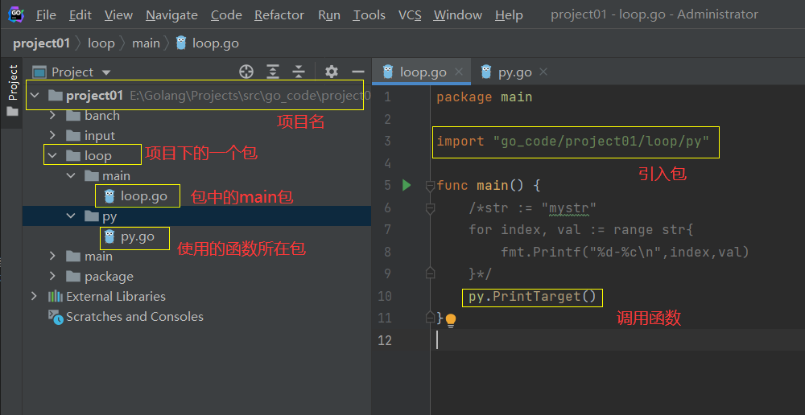
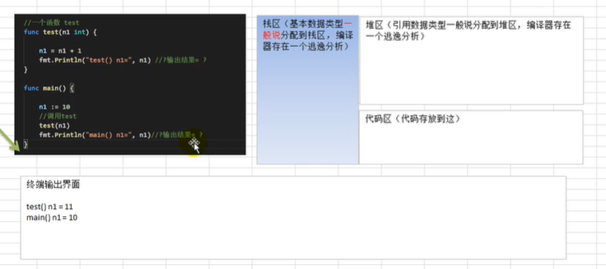

### 应用领域

1.区块链(分布式账本技术，让每个人均可参与数据库记录)研发工程师

2.Go服务器端/游戏软件工程师

3.Golang分布式/云计算软件工程师

优点：数据处理能力很强，能够处理高并发，计算能力强。Go语言保证了既能到达静态编译语言的安全和性能，又达到了动态语言开发维护的高效率。通俗的说，Go=C+Python。


ex：支撑美团后台流量、提供负载均衡、游戏服务端。


开发者：肯·汤普森，罗布·派克


泛用版本：1.9.2


特点：垃圾回收机制(自动回收垃圾，不需要开发人员管理)，**天然并发**(从语言层面支持并发，支持上千上万并发)，吸收了管道通信机制(可以实现不同的goroute之间的相互通信)，函数可以返回多个值，增加切片splice和延时defer等。


### 使用

使用VSCode或Goland等

安装SDK包(软件开发工具包，有开发使用的工具：编译、运行等)

下载：linux32位——386.tar.gz，linux64位——amd.tar.g

windows64——amd64.zip

#### 配置环境变量

系统变量中：

1. 添加GOROOT，值为“go”文件夹的位置(包括自己)
2. 在已有的Path后面加上    ==(相应的位置)\go\bin==
3. 新建GOPATH，值为自己以后的项目放的位置

#### 快速入门

1.目录结构：

projects

- src
  - go_code
    - project01
      - main
        - ==hello.go[某一个go文件，在这里写我们的代码]==
      - package
    - project02
    - …………


2.编译

写完代码后，在代码所在的包中的命令行执行==go  build  [-o  想要编译成的文件名.exe]  文件名==进行编译，若没有出错，就会得到一个exe文件，输入名字即可运行。

通过==go  run  文件名==也可以直接运行。同样会有编译过程只是会隐藏起来。

#### 执行流程

源代码.go文件进行编译，编译成可执行文件.exe，在运行。

如果直接执行go run指令，就直接编译运行成结果。

##### 区别

如果编译生成了可执行文件，在没有go开发环境的机器上也可以运行。如果直接go run，在没有go开发环境的机器上就无法直接运行。


#### 注意事项

go语言每一条语句后面不需要分号，不要把多条语句写在同一行。

go语言定义的变量或者import的包如果没有使用到，代码就不能编译通过。


----

### Go语法

---

#### 转义

\t：制表符

\n：换行符

\ \：表示一个\

\ "：表示双引号

\r：代表一个回车，会在当前行的最前面开始输出，覆盖掉以前的内容。


#### 常见错误

1.同一个文件夹下的同一个package里有两个main函数会有重复定义的错误。go语言要求main函数必须在main包里。

2.提示找不到文件或者说*.exe不是可运行的程序，是因为源文件不存在或者路径写错。

3.语法错误：<span style="color:yellow">逆天</span>。


#### 注释

行注释：//

块注释：/**/


#### 编程规范和代码风格

正确的缩进：

​		格式化：gofmt  xxx.go

​		格式化后的内容重写入文件：gofmt  -w  xxx.go

不允许换行左大括号

一行最长不超过80个字符，超过的使用换行展示(逗号隔开字符串)


#### Dos常用指令

dos：磁盘操作系统，简单说就是windows的目录结构。

| 命令                        | 功能                           |
| --------------------------- | ------------------------------ |
| dir                         | 查看当前目录是什么             |
| cd  /d  [盘]:               | 切换到其他盘                   |
| cd  \                       | 切换到根目录                   |
| md  [目录名]  ([目录名])    | 新建一个或多个目录             |
| rd  [目录名]                | 删除空目录                     |
| rd  /q/s  [目录名]          | 删除目录和所有内容，不询问     |
| rd  /s  [目录名]            | 删除目录和所有内容，询问       |
| echo  [内容]  >  [文件位置] | 新建或追加内容到文件(二次操作) |
| copy  [文件名]  [位置]      | 复制文件                       |
| move  [文件名]  [位置]      | 移动文件                       |
| del  [文件名]               | 删除文件                       |
| 清屏                        | cls                            |
| 退出dos                     | exit                           |


---


----

# Go基础语法

## 变量

声明：`var [变量名] [变量类型] = xxx`

使用的方式：

1. 声明一个变量，包括类型，该变量若不赋值，会有一个默认值。
2. 类型推导：根据值自行判定变量类型(`var num = 10.11`会自动把`num`变成小数类型)。
3. 不使用`var`，此时等号变成`:=`，依然可以声明该变量。
4. 一次性声明多个变量：`var [变量1],[变量2],[变量3] [类型]`或者`var [变量1],[变量2],[变量3] = [值1],[值2],[值3]`，类型推导和`:=`同样可用。
5. 一次性声明:`var([变量1] = [值1] [变量2]=[值2] [变量3] =[值3])`。


### 查看变量的字节大小和数据声明

数据类型：输出时使用%T

大小：`unsafe.Sizeof([变量名])` (unsafe包，需引入)

---

## 数据类型

### 基本数据类型

#### 整数

使用int表示整数类型

int的类型又分为：int8，int16，int32，int64

| 类型  | 有无符号 | 占用存储空间 | 表数范围     |
| ----- | -------- | ------------ | ------------ |
| int8  | 有       | 1字节        | -128~127     |
| int16 | 有       | 2字节        | -2^15~2^15-1 |
| int32 | 有       | 4字节        | -2^31~2^31-1 |
| int64 | 有       | 8字节        | -1^63~2^63-1 |

第一位用来表示符号位，其他位用来表示具体的值。

无符号整数：uint8、uint16、uint32、uint64。它们的第一位也表示数字。因此相比于有符号的整数，范围**都是正数**。

int(==golang整形默认声明==)：后面不带数字，有符号，占用空间和表述范围与系统有关。32位系统就表示4个字节，范围是-2^31~2^31-1，64位自然就翻倍了。

uint：同int。

rune：等价于int32

byte：等价于uint8。**==同时byte可以用来存储字符==**。


整形变量使用时遵守保小不保大原则：在程序正确运行下，尽量使用占用空间小的数据类型。

---

#### 小数类型/浮点型

| 类型          | 占用存储空间 | 表数范围             |
| ------------- | ------------ | -------------------- |
| 单精度float32 | 4字节        | -3.403E38~3.403E38   |
| 双精度float64 | 8字节        | -1.798E308~1.798E308 |

浮点数=符号位+指数位+尾数位


尾数部分可能丢失，造成精度损失。

浮点数有固定的范围和字段长度，不受OS影响。

==浮点型默认声明为float64位==。

float常量表示：.123等价于0.123，小数点前只有0可以把0去掉。

支持科学计数法：5.1234e2(e2等价于10的2次方，E大写也可以)

通常开发情况下推荐使用64位，更加精准。

---

#### 字符类型

<span style="color:red">字符的本质是一个整数。因此字符也可以进行运算(按照对应的Unicode)</span>。

Golang中没有专门的字符类型，一般用==byte==来保存单个字符。如果字符的码值大于255，可以使用int来保存。一个英文字母占一个字节，==一个汉字占3个字节==。

字符串是由单个==字节==组成的。

如果直接输出字符，输出的是字符的码值。如果想要输出相应的字符，应该使用格式化`%c`输出。

字符单引号中允许使用转义字符。

##### 字符类型的本质

字符型存储到计算机中，需要将字符对应的码值找出来

存储：字符→码值→二进制→存储

读取：二进制→码值→字符→读取

Go语言的编码是统一utf-8的，非常方便。

---

#### 布尔类型

bool类型，占一个字节。

---

#### String类型

一串固定长度的字符连接起来的字符序列。<span style="color:red">Go语言的字符串是由单个字节连接起来的</span>。字符串使用utf-8编码标识Unicode文本。

表示形式：①双引号 ②反引号(可以输出特殊字符，不会因为内容有特殊字符报错)

拼接：+号。拼接很长时可以分行，<u>但是要把+保留在上一行</u>。


```go
//演示
func main(){
    var address string = "hahahahahaha"
    fmt.Println()
}
```

==**Go语言中的字符串是不可变的，一旦赋值了就不能再修改。但是可以修改指针引用**==。

---

#### 类型转换

Golang不能进行自动类型转换，需要显示转换(不同类型之间赋值编译不通过)。

语法：`类型[变量名]`。把变量转换为相应的类型，可以从范围大/小→转换为范围小/大。

==数据类型转换仅仅是再赋值时有用，变量自身不会发生变化==。

[^explain]: 类似于b  :=  int64(a)，a的类型不会发生变化，但是b会被赋值。

##### 基本数据类型和string的转换

> 基本类型→string

1. `fmt.Sprintf("%参数",变量名)`：根据format参数生成格式化的字符串并返回，参数就是变量的类型。
2. `strconv`包的函数：`strconv.FormatBool(变量) string `：其他基本类型其他函数，参数也会不一样，较麻烦。

> string→基本类型

* 使用`strconv`包的函数。

`strconv.Parse[类型]()`，参数至少有一个string，转换为不同的类型参数也不一样。

> 注意事项

要确保string能转换为有效的数据，如果数据无效，不会报错，但是会转化为默认值。

---


### 复杂数据类型

#### 指针

基本数据类型，变量存的就是值，也就是值类型。

指针变量存放的是一个地址，这个地址的实际空间里存放的才是值。

> 声明：`var 变量名 *类型` 

取址操作：&变量名。获得变量的地址。

取值操作：*指针变量名。获得指针所指向的地址存的值。

##### 使用细节

值类型都有对应的指针类型，形式为`*数据类型`，一般包括int、float、bool、string、数组和结构体。


### 值类型和引用类型

值类型：包括基本数据类型int系列，float系列、bool、string、数组和结构体。

引用类型：包括指针、slice切片、map、管道chan、interface等都是引用类型。

特点：值类型==通常==分配在栈中；引用类型存储的是一个地址，这个地址对应的空间才真正存储数据，通常分配在堆中。


### ~~标识符的命名规范(pass)~~

_是空标识符，仅仅用于占用位置，不能用于变量的标识符。

#### 注意事项

包名：保持package的名字和目录一致，尽量使用有意义的包名。

==golang没用public和private，只能通过变量的首字母来确定==。首字母大写就表示公开，首字母小写就表示私有(仅仅在本包使用)。


---


## 运算符

自增与自减：golang中的自增与自减不能赋值或比较使用，只能自己存在。且只有++和--跟在变量后面这种情况，不能跟在其前面。

非运算：！，如果是括号中的条件！要写在括号左边。

&& 和 || 两边的条件不需要加括号，加了也可以。


### 位运算符

&：==按位与==运算(二进制)。

|：按位或。

^：按位异或。

<<：左移若干位，高位丢弃低位补0。

`>>`：右移若干位，高位丢弃低位补0。


### 运算符优先级


### 键盘输入语句

`fmt`包的`fmt.Scanln()` 或者`fmt.Scanf()` 

`Scanln`会在换行时才停止扫描，最后一个条目必须有换行或者到达结束的位置。`Scanf`从标准输入扫描文本，根据format参数==指定的格式==将成功读取的空白分隔的值保存进成功传递给本函数的参数。返回成功扫描的条目个数和遇到的任何错误。

```go
//案例
func main(){
	var name string
	fmt.Println("请输入姓名:")
	fmt.Scanln(&name)

	fmt.Printf("%v",name)
}

func main(){
	var name string
	var age int
	var work string
	fmt.Println("请输入姓名,年龄，工作，用空格隔开")
	fmt.Scanf("%s %d %s",&name,&age,&work)

	fmt.Printf("姓名：%v \n年龄：%v \n工作：%v",name,age,work)
}
```


---


## 程序流程控制

### 条件语句

同java，唯一区别是if后括号可有可无，==但最好还是不写括号==，且==大括号必须有==。

go条件语句中else和else if==不能换行==，必须紧跟在大括号后面。


### switch分支语句

```go
//两种方式
switch 变量{
    case 值:
    	//操作，多个值用逗号隔开表示或,常量值不能重复
    	fallthrough //穿透，会继续执行下一个case，仅仅往下穿透一次
}

switch{
    case 表达式:
    	//操作，多个表达式用&& 或||
}
```

`fallthrough` 穿透，在case条件的执行语句中使用，会继续执行下一个case，仅仅往下穿透一次。


### for循环

同java，仅仅声明不一样(使用go的:=)，且没有括号。

另一种写法,声明和自增(自减)都不写在for的后面

```go
//声明
for 条件{
    //内部++或--
}

//无限循环
for{
    //TODO
}
```

#### for range 

自带index和val两个参数，表示字符的序号和值。

```go
func main() {
	str := "mystr"
	for index, val := range str{
		fmt.Printf("%d-%c\n",index,val)
	}
}
```

如果字符串中含有中文，就不能用上述的方法，因为一个汉字对应3个字节，如果按照上述方式遍历就是乱码。

解决：将`str`转成`[]rune`切片，直接遍历切片


### ~~while和do..while~~ 

~~还就那个没有，只能使用for+break实现~~ 


### 指定break&continue

break默认跳出最近的循环，但是有多层循环时，可以指定跳出那一层循环。对continue也同样生效。

```go
标签名://先在循环的上一行定义一个循环标签
for{
    for{
        break 标签名
    }
}
```


### 跳转语句goto

无条件转移到程序中指定的行，一般不主张使用，以免造成程序的混乱。

```go
//基本语法
goto 标签名
...
...
标签名:
	//语句块
```


---


## 函数

### 函数的定义

完成某一功能的程序指令的集合。

```go
//语法
func 函数名(参数列表，参数名写前面)(返回值列表，多个必须写括号){
    
}
```


### 包的概念

go以包的形式来管理文件和项目目录结构。

导入其他的包：从最开始定义的project里面的go_code开始写，如果使用其他包的函数，那个函数开始字母还==必须大写==，使用变量时，变量名也要大写。文件的包名通常和文件夹名保持一致。



调用函数：包名.函数

访问变量：包名.变量名

import包时，路径从gopath的src下开始，但是不用带src，编译器会自动从src下开始引入。


注意事项：

* ==同一个包下==不能有相同的函数名和全局变量名，否则就是重复定义。
* 可以通过`import 改名 "路径"`的方式给包换一个名字。
* `go build -o [要编译到的路径/名字] [源路径]`：可以把go文件编译到指定的目录下，还可以指定名字。
* main包以外的包会被编译成一个库文件，这个文件不可查看。
* 基本数据类型和数组默认都是值传递的，在函数内修改不会影响到原来的值。
* 如果希望函数内的变量能永久修改，在实参前加上&，形参的类型也要变成指针类型。


### 值类型和引用类型

* 值类型默认是值传递，变量直接存储，内存通常在栈中分配。
  * `基本数据类型int、float、bool、string、数组、结构体` 

* 引用类型默认是应用传递，变量存储的是一个地址，这个地址对应的空间才真正存储数据，内存通常在堆上分配，当没有任何变量引用这个地址的时候，该地址对应的数据空间就成为一个垃圾，由GC来回收。
  * `指针、切片、map、管道、interface `


### 函数调用机制



调用函数时会给该函数分配一个新的空间，编译器会通过自身的处理让这个新的空间和其他的栈空间区分开。

在每个函数对应的栈中，数据空间是空间的，不会混淆。

当一个函数执行完毕，程序会销毁这个函数对应的栈空间。


接收多个返回值函数的返回值，如果希望忽略某个返回值，则需要使用 _ 符号表示占位忽略。

`v1,v2,...,vn := function()` 

`_,v2,...,vn := function()` 


### 函数的使用细节

* 函数也是一种数据类型，可以赋值给一个变量，该变量就是一个函数类型的变量了。通过该变量可以对函数调用。

* 函数可以作为其他函数的形参并调用。

  ```go
  func myFun(形参名 func()){
      //形参名()，直接调用参数里的函数，c
  }
  ```

* go支持自定义类型，使用type

基本语法：`type 自定义数据类型 数据类型` 相当于是一个别名。go认为这两个类型仍是不同的类型。

* go支持对返回值命名，然后一次性返回

```go
func cal(n1 int ,n1 int)(sum int ,sub int){
    sum = n1+n2
    sub = n1-n2
    return
}
```

* 使用下划线_能够忽略返回值
* go支持可变参数，可变参数的访问通过`args[i]`，其本质是一个切片。==**可变参数要放在形参列表的最后**==。

```go
func sum(args... int) sum int{
    //
    for i := 0;i<len(args);i++{
        fmt.println(args[i])
    }
}
```

* 函数作为返回值的时候不要写形参和返回值的名字，只需要写好类型即可。


### `init()`函数

会在`main`函数执行之前工作，类似于`vue`的created()。

通常可以在init函数中完成==初始化==的操作。

注意事项：

* 执行流程：全局变量的==定义==→init→main。

* 如果引入的文件中也有变量的定义和init函数，那么会先执行被引入文件的。


### 匿名函数

某个函数只是希望使用一次，就可以使用匿名函数。

使用方式：

* 定义时直接使用

```go
res1 = func(n1 int,n2 int) int{
    return n1 + n2
}(10,12)//在定义时就调用
```

* 赋给一个变量使用

```go
a := func (n1 int,n2 int) int{//将匿名函数赋值给a，调用a就是调用匿名函数
    return n1 - n2
}
```

* 全局匿名函数，定义在全局变量中，变量名(函数类型)需要大写才能被调用。


### 闭包

一个函数与其相关的引用环境组合的一个整体(实体)

```go
//累加器的案例
func AddUpper() func (int) int{
    var n int = 10
    return func (x int) int{
        n = n+x
        return n
    }
}

func main(){
    f:=AddUpper()
    fmt.Println(f(1))//s11
    fmt.Println(f(2))//13
    fmt.Println(f(3))//16
}
```

* 闭包的说明：返回的是一个匿名函数，但是这个匿名函数引用到函数外的n，因此这个匿名函数就和n形成一个整体。
* 可以理解为：闭包是类，函数是操作，n是字段。函数和它使用到的n构成闭包。
* 闭包的关键：函数使用到的哪些哪些变量，因为函数和它引用的变量共同够成闭包。

* 使用闭包的好处：可以保留上次引用的值，因此传入一次值就可以反复使用。


### defer

一种延时机制。目的是能够在函数执行完成后即使释放资源(defer file的关闭或者数据库的连接关闭)。

使用：`defer 语句` 

```go
defer fmt.Println("ok")
```

当执行到defer时，会将defer后面的语句压入到==独立的栈中==，暂时不执行。

当**函数执行完毕后**，在从defer栈中按照==先入后出的方式==执行。

在defer将语句放入到栈中的时候，会同时将相应的值也压入栈中。即使这个值在后续的语句中被改变，压入栈的语句也会处理**原来的值**。


### 常见的字符串函数

| 函数                           | 说明                                                         |
| ------------------------------ | ------------------------------------------------------------ |
| `len(str)`                     | 获取字符串的长度，不止是字符串，按**字节**返回               |
| `[]rune(str)`                  | 字符串的转化，转化成切片，处理中文问题避免乱码               |
| `n,err:=strconv.Atoi(str)`     | 字符串转整数，转不成功会返回一个error                        |
| `str:=strconv.Itoa(n)`         | 整数转字符串                                                 |
| `var bytes = []byte(str)`      | 字符串转byte切片                                             |
| `str = string([]byte{...})`    | byte切片转字符串                                             |
| `strconv.FormatInt(n,level)`   | 十进制转其他进制(level)                                      |
| `strings.Contains(str1,str2)`  | 返回bool类型，查找字串str2是否在指定的字符串中               |
| `strings.Count(str1,str2)`     | 统计一个str1中含有多少个字串str2                             |
| `strings.EqualFold(str1,str2)` | 不区分字符串大小写的字符串比较                               |
| `strings.Index(str,s)`         | 返回字串在字符串第一次出现的index值，没出现就返回-1          |
| `strings.LastIndex(str,s)`     | 返回字串在字符串中最后一次出现的index，没有就返回-1          |
| ==tips==                       | ==string本身不会发生变化，仅仅是返回替换后的函数==           |
| `strings.Replace(str,s1,s2,n)` | 将字符串里的字串替换成另一个字串，n表示替换的数量，-1表示全部替换 |
| `strings.Split(str,s)`         | 按照某一个指定的字符串对字符串进行分割，分割成字符串数组。   |
| `strings.ToLower(str)`         | 小写转换                                                     |
| `strings.ToUpper(str)`         | 大写转换                                                     |
| `strings.TrimSpace(str)`       | 去空格                                                       |
| `strings.Trim(str,s)`          | 去掉字符串==左右两边==指定的字符串                           |
| `strings.TrimLeft(str,s)`      | 去掉字符串==左边==指定的字符串                               |
| `strings.TrimRight(str,s)`     | 去掉字符串==右边==指定的字符串                               |
| `strings.HasPrefix(str,s)`     | 判断字符串是否以指定字符串开头                               |
| `strings.HasSuffix(str,s)`     | 判断字符串是否以指定字符串结尾                               |


### 时间和日期函数

需要导入time包。

`time.Now()`获取当前时间，返回的类型是`time.Time` 结构体。

| `time.Time`函数的方法           | 说明                                                         |
| ------------------------------- | ------------------------------------------------------------ |
| `Year()`                        | 返回当前时间的年份                                           |
| `年月日时分秒如上行所示`        |                                                              |
| `Format("2006/01/02 15:04:05")` | 固定格式，==参数必须是==2006，但是各个数字可以是自由的组合，这样可以按需求来返回日期的格式 |
| `time`的**时间常量**            | **可以获得指定的时间单位**                                   |
| `Second`                        | 秒，其他的毫秒、微秒、纳秒等都是相应的英文字母               |
| `time.Time`**的时间戳**         |                                                              |
| `Unix`                          | 返回Unix秒                                                   |
| `UnixNano`                      | 返回Unix纳秒                                                 |


### 内置函数

len：用来求长度，比如字符串、数组等。

new：用来分配内存，一般是值类型(int、float等)，==返回指针类型==。

make：同用于分配内存，分配引用类型。

---


## 错误处理机制

默认情况下，发生错误(panic)，程序就会退出。go语言是不支持try-catch的。

异常处理方式：defer、panic、recover。

```go
//处理异常
defer func(){
    err := recover()//内置函数，用于捕获异常
    if err!= nil{
        fmt.Println(err)
        //在这里可以发送邮件或是一些消息给管理员，通知他系统出现了异常
    }
}()
//加了这一段代码后，即使出现了异常，代码也可以正常往下执行。
```


### 自定义错误

`errors.New(str)` 自己创建一个错误，会返回一个error类型的值，表示一个错误。

`panic()` 内置函数，接收一个interface{}类型的值(任何值)作为参数。可以接收error类型的变量，输出错误信息，然后==退出程序==。

---


## 数组和切片

Go语言中的数组是值类型。

**定义**：`var 数组名 [长度]类型` 中括号中一定==要写长度==，不写就是切片不是数组

**元素的赋值**：`数组名[下标] := xxx` 


内存布局：定义完一个数组后，数组名的地址就是数组的首地址，也就是第一个元素的地址。第二个元素的地址就是第一个元素的地址加上它占的字节数(与类型有关)。


初始化：四种方式(int)

`var numArr [3]int = [3]int{1,2,3}` 

`var numArr = [3]int{5,6,7}` 

`var numArr = [...]int{8,9,10}` 

`var numArr = [...]int{1:800,0:900,3:999}` 指定下标元素的写法。


### 数组的for-range遍历

```go
for index,value := range array{
    
}
//index是数组的下标
//value是下标对应的位置的值
//如果有某个不想使用，写为下划线_即可
```


### 数组注意事项和细节

数组的长度是数据类型的一部分，定义时一定要写上。`[3]int`和`[4]int`是两种不同的数据类型，尽管它们都是整形数组。

数组是值类型，在默认情况下是值传递，因此会进行值拷贝，数组间不会相互影响。要想原来的数组发生改变需要在形参加上*，变成指针类型，再进行修改。


#### 二维数组

声明：`var 数组名 [大小][大小]type` 

同样可以赋予初值。

**for-range遍历** 

对二维数组的遍历，需要用第一层的`value`作为第二层`range`后的数组。

---


### slice切片

切片是数组的一个引用，因此也是一个引用类型，在传递的时候遵守的也是引用传递。

使用与数组类似。

```go
//定义
var 切片名 []类型
//使用方式
//1.引用已有数组
//中括号中不需要写长度，写了长度就是数组类型了
var 数组名 [9]int = [...]i{1,2,3,4,5,6,7,8,9}
切片名 := 数组名[M:N]//左闭右开引用数组(也就是不包括右边界)
//2.make,一个切片如果只定义就是一个空[]，make会给一个初始容量和初始值
var 切片名 []type = make([]type,len,[cap])//cap可有可无
//3.直接指定具体数据
var 切片名 []type = []type{/}

//容量和长度
cap(slice)//一般是长度的2倍
len(slice)//元素个数
```


#### 切片的内存布局

切片的底层数据结构可以理解成是一个结构体struct。

切片由三个部分组成，第一个部分是切片引用的数组的==**引用到的第一个元素**==的地址(指针类型)，第二部分是切片的长度，第三部分是切片容量的大小。


#### 切片的细节说明

* 切片不能越界，但是动态增长后可以访问到原来访问不到的元素。
* 切片刚定义完，没有引用数组或make是不能使用的。
* 切片可以继续切。
* 切片和切片的切片指向的是同一块空间，一个改变，包括数组全会变。


#### 切片增长

使用内置函数`append`，可以对切片进行动态添加。

```go
//追加后返回新的切片，并不会直接修改原来的切片
slice = append(slice,100,200,...)//这里可以追加多个元素,也可以直接增加一个新的切片
//如果追加新的切片需要在后面加上...
slice = append(slice,slice...)
```

切片的本质是对数组的扩容，go底层会创建一个新的数组，将切片原来包含的元素拷贝到新的数组，并对切片进行重新的引用。


##### 切片的拷贝

使用内置函数`copy`完成

```go
copy(slice1,slice2)//两个参数都是切片类型，把后面的切片拷贝给前面的切片
//只会拷贝相同位置的元素。如果前面的切片还有多余的长度，则那些元素保持不变
//两个切片长度大小不同，不会报错
```


#### `string`和切片

string底层是一个byte类型的数组，因此string本质就是一个切片，也可以进行切片处理。

string不可变，但是切片过之后就可以修改。

```go
arr := []byte(str)
arr[0] = 'z'
str = string(arr)
//修改str的第一个字符，但是该方法不能处理中文,如果想要处理中文需要转化为rune[]
```


---


## Map

**声明**：`var 名称 map[key类型]value类型` 

==map声明是不会分配内存的，需要进行make才会分配内存。== 

~map一定要make~ 

**put赋值**：`名称[key] = value` 

```go
//声明时直接make
map1 := make(map[string]string)
//声明时直接赋初值
map2 := map[string]string{
    "key1":"value1",
    "key2":"value2"
}
```

**删除**：`delete(map1,key)` 。其中key要存在才会删除。

一次性删除：遍历所有的key逐一删除或者make一个新的空间。

**查找**：`value,isFound := map1[key]` ,如果找到，value就是值，isFound就是true。


#### map的遍历

map的遍历只能使用for-range的方式来进行遍历。

```go
for k,v := range map1{
    
}

//map的长度
len(map1)
```


#### map切片

通过使用map切片，map的个数可以动态增加。切片要make，map同样需要make。

```go
var myMap []map[string]string

myMap = make([]map[string]string,2)

myMap[0] = make(map[string]string,2)
myMap[0]["name"] = ""
```


#### Map使用细节

* map是一个引用类型
* map能自动扩容
* value可以使用结构体类型


---


## 结构体

Golang支持面向对象编程的特性，但是并不是纯粹的面向对象语言。Golang去掉了传统面向对象语言的继承、方法重构、构造函数、析构函数等等。

Golang任然有面向对象编程的继承、封装、多态的特性，只是实现的方式不太一样。

```go
//定义
type 结构体名 struct{
    属性名 类型
    ...
}
//实例化
var 对象名 结构体名
var 对象名 结构体名 = 结构体名{}//大括号中可以直接写一个属性的初始值
*对象名 := new{结构体名}//new得到的是一个指向对象的指针，对象指针给属性赋值可以不加*，底层会进行自动处理。
*对象名 := &结构体名{}
//赋值
对象名.属性名=xxx

```

内存布局：结构体有一个自己的地址，指向自己的首地址。

结构体中的属性如果是引用类型，使用需要make！！！

==结构体是值类型，默认是值拷贝==。

如果是指向结构体的指针，取属性的时候要加上括号`(*p).name`，原因是.的优先级高于*取值运算符的优先级。


### 结构体使用注意事项

* 结构体各个字段的地址是连续的。字段指向的值的地址不一定是连续的。
* 结构体和其他类型进行转换时需要有完全相同的字段(名字个数类型)。
* 用type重新定义结构体后会被认为是新的数据类型，不能直接赋值，需要强转才能直接赋值。
* struct的每个字段上可以写一个tag，该tag可以通过**反射机制**获取，常见的场景是序列化和反序列化。

```go
struct Champion{
    Name string `json:name`
    //该tag表示转化为json格式的时候用name小写表示
}
camille := Champion{"青钢影"}
jsonStr,err := json.Marshal(camille)
fmt.Println(string(jsonStr))//c
```


## 方法

方法不是结构体专用，只要是==自定义的类型都可以有方法==。方法是和数据类型绑定的。

**定义** 

```go
func (a A) test(){
    //xaksjdhasdkjasdh
}
a := A{}
a.test()
//表示A结构体有一个方法名为test，这个方法是和类型A绑定的，
//对象调用方法的时候会把自己传进去作为一个固有的新参
//结构体有String()方法，类似于Java的toString()可以b

type integer int
func (i *integer) print(){
    //...
}
```

通常情况下如果我们需要在方法中修改调用方法的对象，需要**==绑定指针类型==**。如果绑定了指针类型，正常情况下需要使用&取地址来调用方法，但是可以不加，底层会自动进行判断。


## goroutine

Go主线程：可以理解为进程(称为线程也行)，一个Go线程上可以起多个协程。

Go协程：协程是轻量级的线程[编译器做优化]。


协程的特点：

* 有独立的栈空间。
* 共享程序堆空间。
* **调度由用户控制**。
* 协程是轻量级线程。


开启：`go`

协程是从主线程开始的，是轻量级的线程，是逻辑态，资源消耗较少。

MPG模式：M操作系统主线程，P协程执行需要的上下文，G协程。


协程之间如何通信：

* 使用全局加锁`lock.Lock()` 
* 使用`channel` 


### Channel

channel的本质就是一个**队列**。本身**线程**安全，使用多个goroutine 访问/操作 的时候，不需要加锁。

channel自身有类型，只能存放一种类型。

```go
//声明
var 变量名 chan 数据类型

//需要make
变量名 = make(chan,类型,容量)

//向管道写入数据
管道名 <- 数据

//获取长度和容量
len(管道名)
cap(管道名)

//从管道取出数据
变量名 := <- 管道名

//关闭管道，关闭后不可以写入但可以读取
close(管道名)

//遍历管道，支持for-range遍历
//遍历需要关闭管道才行
for v := range 管道名 {
    //...............
}

```


管道阻塞：当管道为满时，写操作阻塞；当管道为空时，读操作阻塞。     


**协程配合channel** 

一个协程向一个channel写入，另一个协程向channel中读取。

可以用一个退出管道，管道里有没有内容标识工作的协程有没有工作结束。


**channel注意事项** 

* 管道可以声明为只读或只写。

  * ```go
    //只写
    var chan1 chan<- interface{}
    
    //只读
    var chan2 <-chan interface{}
    ```

* 可以使用select的方式读取，这样如果读取不到可以不阻塞，加入自己的逻辑。


---

---

---


# Go面向对象

抽象：把一类事物的共有的属性和行为提取出来，形成一个物理模型。

## 面向对象的三大特征

### 1 **封装** 

把抽象出的字段和对字段的操作封装在一起。外部(其他包程序)只有通过被授权的方法才能对字段进行操作。

实现：属性名小写，只能通过方法访问。给结构体所在包提供一个**工厂模式**的函数，类似于构造函数。提供一个首字母大写的Set方法和Get方法。

### 2 **继承** 

解决代码复用。继承父类只需**嵌入** **==匿名==** 结构体(类似于组合，不需要加对象)即可。在Golang中，如果一个struct嵌套了另一个匿名结构体，那么这个结构体可以直接访问匿名结构体的字段和方法，从而实现了继承特性。

细节说明：结构体可以使用嵌套结构体的所有字段和方法，无论大小写；匿名结构体字段的访问可以简化，不加上嵌套结构体；如果不是匿名结构体就是组合，就必须带上结构体变量名。

可以使用多重继承。

#### 接口interface

```go
type XXX interface{
    Start()
    Stop()
}

//使用
var x X//实现接口的类型，需要实现方法
var xxx XXX = x
xxx.Start()
xxx.Stop()
```

继承接口：只要实现接口的方法就行，**==没有特殊的字段==**。实现接口必须实现接口中的全部方法。实现方法也没有特殊的字段，只要方法名字和参数相同就行。

interface中可以定义一组方法，但是这些方法不需要实现。并且interface中不能包含任何变量。

只要是自定义的类型，都可以实现接口，不一定是**结构体**。一个自定义类型可以实现多个接口。

interface类型默认是一个指针(引用类型)，如果没有初始化就是用，就会输出nil。

空接口没有任何方法，**所有类型都实现了空接口**，可以把任何一个变量赋给空接口。


### 3 多态 

变量(实例)具有多种形态。在Golang中，多态特征是通过接口实现的。可以按照统一的接口来调用不同的实现，这时候接口变量就呈现不同的形态。


**类型断言**：

`b,ok := a.(Point)`就是类型断言，标识44表示判断a是否是指向Point类型的变量，如果是就转成Point类型并赋给b变量，否则**报错panic**。

加上ok(其他名字也行，是第二参数)，表示当前断言是带检测的类型断言，如果类型转换失败，不会直接panic，能够继续向下执行。


---

---

---


# Go文件操作

文件在程序中是以流的形式来操作的。

流：数据在数据源到程序(内存)之间经历的路径。

Golang中对文件的操作包：`os.File`结构体。

文件是一个**指针类型**。


## 基本操作

* 打开一个文件：`file,err := os.Open(文件路径)`，err表示打开文件是否成功，file是一个File结构体。
* 关闭文件：`err := file.Close()`。
* 创建一个reader读取文件：`reader := bufio.NewReader(file)`。
* 读取文件：`str,err := reader.ReadString(x)`，x表示读到x就结束一次，可以是换行符，表示读取一行。err可以等于io.EOF，表示读取到文件末尾。
* 一次读取整个文件：`cintent,err := ioutil.ReadFile(file)`，读取到的是一个byte数组。
* 写文件：需要使用`os.OpenFile(文件名,打开方式,权限)`


