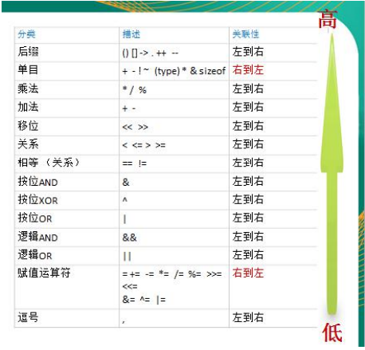

### 应用领域

1.区块链(分布式账本技术，让每个人均可参与数据库记录)研发工程师

2.Go服务器端/游戏软件工程师

3.Golang分布式/云计算软件工程师

优点：数据处理能力很强，能够处理高并发，计算能力强。Go语言保证了既能到达静态编译语言的安全和性能，又达到了动态语言开发维护的高效率。通俗的说，Go=C+Python。


ex：支撑美团后台流量、提供负载均衡、游戏服务端。


开发者：肯·汤普森，罗布·派克


泛用版本：1.9.2


特点：垃圾回收机制(自动回收垃圾，不需要开发人员管理)，**天然并发**(从语言层面支持并发，支持上千上万并发)，吸收了管道通信机制(可以实现不同的goroute之间的相互通信)，函数可以返回多个值，增加切片splice和延时defer等。


### 使用

使用VSCode或Goland等

安装SDK包(软件开发工具包，有开发使用的工具：编译、运行等)

下载：linux32位——386.tar.gz，linux64位——amd.tar.g

windows64——amd64.zip

#### 配置环境变量

系统变量中：

1. 添加GOROOT，值为“go”文件夹的位置(包括自己)
2. 在已有的Path后面加上    ==(相应的位置)\go\bin==
3. 新建GOPATH，值为自己以后的项目放的位置

#### 快速入门

1.目录结构：

projects

- src
  - go_code
    - project01
      - main
        - ==hello.go[某一个go文件，在这里写我们的代码]==
      - package
    - project02
    - …………


2.编译

写完代码后，在代码所在的包中的命令行执行==go  build  [-o  想要编译成的文件名.exe]  文件名==进行编译，若没有出错，就会得到一个exe文件，输入名字即可运行。

通过==go  run  文件名==也可以直接运行。同样会有编译过程只是会隐藏起来。

#### 执行流程

源代码.go文件进行编译，编译成可执行文件.exe，在运行。

如果直接执行go run指令，就直接编译运行成结果。

##### 区别

如果编译生成了可执行文件，在没有go开发环境的机器上也可以运行。如果直接go run，在没有go开发环境的机器上就无法直接运行。


#### 注意事项

go语言每一条语句后面不需要分号，不要把多条语句写在同一行。

go语言定义的变量或者import的包如果没有使用到，代码就不能编译通过。


----

### Go语法

---

#### 转义

\t：制表符

\n：换行符

\ \：表示一个\

\ "：表示双引号

\r：代表一个回车，会在当前行的最前面开始输出，覆盖掉以前的内容。


#### 常见错误

1.同一个文件夹下的同一个package里有两个main函数会有重复定义的错误。go语言要求main函数必须在main包里。

2.提示找不到文件或者说*.exe不是可运行的程序，是因为源文件不存在或者路径写错。

3.语法错误：<span style="color:yellow">逆天</span>。


#### 注释

行注释：//

块注释：/**/


#### 编程规范和代码风格

正确的缩进：

​		格式化：gofmt  xxx.go

​		格式化后的内容重写入文件：gofmt  -w  xxx.go

不允许换行左大括号

一行最长不超过80个字符，超过的使用换行展示(逗号隔开字符串)


#### Dos常用指令

dos：磁盘操作系统，简单说就是windows的目录结构。

| 命令                        | 功能                           |
| --------------------------- | ------------------------------ |
| dir                         | 查看当前目录是什么             |
| cd  /d  [盘]:               | 切换到其他盘                   |
| cd  \                       | 切换到根目录                   |
| md  [目录名]  ([目录名])    | 新建一个或多个目录             |
| rd  [目录名]                | 删除空目录                     |
| rd  /q/s  [目录名]          | 删除目录和所有内容，不询问     |
| rd  /s  [目录名]            | 删除目录和所有内容，询问       |
| echo  [内容]  >  [文件位置] | 新建或追加内容到文件(二次操作) |
| copy  [文件名]  [位置]      | 复制文件                       |
| move  [文件名]  [位置]      | 移动文件                       |
| del  [文件名]               | 删除文件                       |
| 清屏                        | cls                            |
| 退出dos                     | exit                           |


---


----

# go正片

## 变量

声明：`var [变量名] [变量类型] = xxx`

使用的方式：

1. 声明一个变量，包括类型，该变量若不赋值，会有一个默认值。
2. 类型推导：根据值自行判定变量类型(`var num = 10.11`会自动把`num`变成小数类型)。
3. 不使用`var`，此时等号变成`:=`，依然可以声明该变量。
4. 一次性声明多个变量：`var [变量1],[变量2],[变量3] [类型]`或者`var [变量1],[变量2],[变量3] = [值1],[值2],[值3]`，类型推导和`:=`同样可用。
5. 一次性声明:`var([变量1] = [值1] [变量2]=[值2] [变量3] =[值3])`。


### 查看变量的字节大小和数据声明

数据类型：输出时使用%T

大小：`unsafe.Sizeof([变量名])` (unsafe包，需引入)

---

## 数据类型

### 基本数据类型

#### 整数

使用int表示整数类型

int的类型又分为：int8，int16，int32，int64

| 类型  | 有无符号 | 占用存储空间 | 表数范围     |
| ----- | -------- | ------------ | ------------ |
| int8  | 有       | 1字节        | -128~127     |
| int16 | 有       | 2字节        | -2^15~2^15-1 |
| int32 | 有       | 4字节        | -2^31~2^31-1 |
| int64 | 有       | 8字节        | -1^63~2^63-1 |

第一位用来表示符号位，其他位用来表示具体的值。

无符号整数：uint8、uint16、uint32、uint64。它们的第一位也表示数字。因此相比于有符号的整数，范围**都是正数**。

int(==golang整形默认声明==)：后面不带数字，有符号，占用空间和表述范围与系统有关。32位系统就表示4个字节，范围是-2^31~2^31-1，64位自然就翻倍了。

uint：同int。

rune：等价于int32

byte：等价于uint8。**==同时byte可以用来存储字符==**。


整形变量使用时遵守保小不保大原则：在程序正确运行下，尽量使用占用空间小的数据类型。

---

#### 小数类型/浮点型

| 类型          | 占用存储空间 | 表数范围             |
| ------------- | ------------ | -------------------- |
| 单精度float32 | 4字节        | -3.403E38~3.403E38   |
| 双精度float64 | 8字节        | -1.798E308~1.798E308 |

浮点数=符号位+指数位+尾数位


尾数部分可能丢失，造成精度损失。

浮点数有固定的范围和字段长度，不受OS影响。

==浮点型默认声明为float64位==。

float常量表示：.123等价于0.123，小数点前只有0可以把0去掉。

支持科学计数法：5.1234e2(e2等价于10的2次方，E大写也可以)

通常开发情况下推荐使用64位，更加精准。

---

#### 字符类型

<span style="color:red">字符的本质是一个整数。因此字符也可以进行运算(按照对应的Unicode)</span>。

Golang中没有专门的字符类型，一般用==byte==来保存单个字符。如果字符的码值大于255，可以使用int来保存。一个英文字母占一个字节，一个汉字占3个字节。

字符串是由单个==字节==组成的。

如果直接输出字符，输出的是字符的码值。如果想要输出相应的字符，应该使用格式化`%c`输出。

字符单引号中允许使用转义字符。

##### 字符类型的本质

字符型存储到计算机中，需要将字符对应的码值找出来

存储：字符→码值→二进制→存储

读取：二进制→码值→字符→读取

Go语言的编码是统一utf-8的，非常方便。

---

#### 布尔类型

bool类型，占一个字节。

---

#### String类型

一串固定长度的字符连接起来的字符序列。<span style="color:red">Go语言的字符串是由单个字节连接起来的</span>。字符串使用utf-8编码标识Unicode文本。

表示形式：①双引号 ②反引号(可以输出特殊字符，不会因为内容有特殊字符报错)

拼接：+号。拼接很长时可以分行，<u>但是要把+保留在上一行</u>。


```go
//演示
func main(){
    var address string = "hahahahahaha"
    fmt.Println()
}
```

==**Go语言中的字符串是不可变的，一旦赋值了就不能再修改。但是可以修改指针引用**==。

---

#### 类型转换

Golang不能进行自动类型转换，需要显示转换(不同类型之间赋值编译不通过)。

语法：`类型[变量名]`。把变量转换为相应的类型，可以从范围大/小→转换为范围小/大。

==数据类型转换仅仅是再赋值时有用，变量自身不会发生变化==。

[^explain]: 类似于b  :=  int64(a)，a的类型不会发生变化，但是b会被赋值。

##### 基本数据类型和string的转换

> 基本类型→string

1. `fmt.Sprintf("%参数",变量名)`：根据format参数生成格式化的字符串并返回，参数就是变量的类型。
2. `strconv`包的函数：`strconv.FormatBool(变量) string `：其他基本类型其他函数，参数也会不一样，较麻烦。

> string→基本类型

* 使用`strconv`包的函数。

`strconv.Parse[类型]()`，参数至少有一个string，转换为不同的类型参数也不一样。

> 注意事项

要确保string能转换为有效的数据，如果数据无效，不会报错，但是会转化为默认值。

---


### 复杂数据类型

#### 指针

基本数据类型，变量存的就是值，也就是值类型。

指针变量存放的是一个地址，这个地址的实际空间里存放的才是值。

> 声明：`var 变量名 *类型` 

取址操作：&变量名。获得变量的地址。

取值操作：*指针变量名。获得指针所指向的地址存的值。

##### 使用细节

值类型都有对应的指针类型，形式为`*数据类型`，一般包括int、float、bool、string、数组和结构体。


### 值类型和引用类型

值类型：包括基本数据类型int系列，float系列、bool、string、数组和结构体。

引用类型：包括指针、slice切片、map、管道chan、interface等都是引用类型。

特点：值类型==通常==分配在栈中；引用类型存储的是一个地址，这个地址对应的空间才真正存储数据，通常分配在堆中。


### ~~标识符的命名规范(pass)~~

_是空标识符，仅仅用于占用位置，不能用于变量的标识符。

#### 注意事项

包名：保持package的名字和目录一致，尽量使用有意义的包名。

==golang没用public和private，只能通过变量的首字母来确定==。首字母大写就表示公开，首字母小写就表示私有(仅仅在本包使用)。


---


## 运算符

自增与自减：golang中的自增与自减不能赋值或比较使用，只能自己存在。且只有++和--跟在变量后面这种情况，不能跟在其前面。

非运算：！，如果是括号中的条件！要写在括号左边。

&& 和 || 两边的条件不需要加括号，加了也可以。


### 位运算符

&：==按位与==运算(二进制)。

|：按位或。

^：按位异或。

<<：左移若干位，高位丢弃低位补0。

`>>`：右移若干位，高位丢弃低位补0。


### 运算符优先级




### 键盘输入语句

`fmt`包的`fmt.Scanln()` 或者`fmt.Scanf()` 

`Scanln`会在换行时才停止扫描，最后一个条目必须有换行或者到达结束的位置。`Scanf`从标准输入扫描文本，根据format参数==指定的格式==将成功读取的空白分隔的值保存进成功传递给本函数的参数。返回成功扫描的条目个数和遇到的任何错误。

```go
//案例
func main(){
	var name string
	fmt.Println("请输入姓名:")
	fmt.Scanln(&name)

	fmt.Printf("%v",name)
}

func main(){
	var name string
	var age int
	var work string
	fmt.Println("请输入姓名,年龄，工作，用空格隔开")
	fmt.Scanf("%s %d %s",&name,&age,&work)

	fmt.Printf("姓名：%v \n年龄：%v \n工作：%v",name,age,work)
}
```


---


## 程序流程控制

### 条件语句

同java，唯一区别是if后括号可有可无，==但最好还是不写括号==，且==大括号必须有==。

go条件语句中else和else if==不能换行==，必须紧跟在大括号后面。


### switch分支语句


