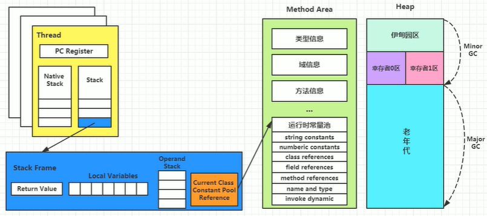
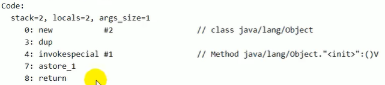
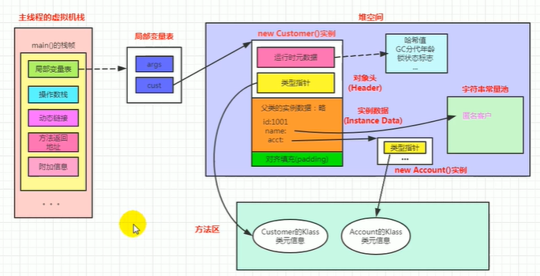
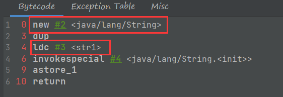

## 1 类加载子系统


三个阶段：Loading(加载)、Linking(链接)、Initialization(初始化)。

==**总体作用**==：负责从文件系统或者网络中加载Class文件，class文件在文件开头有特定的文件标识。

只负责class文件的加载，class文件是否可以运行由执行引擎决定。


### 2.1类加载过程

#### 2.1.1 Loading

1.通过一个类的全限定名获取定义此类的二进制字节流。

2.将这个字节流所代表的静态存储结构转化为方法区的运行时数据结构。

3.**==在内存中生成一个代表这个类的java.lang.class对象(实例)==**，作为方法区这个类的各种数据路口。

加载方式有：从本地文件中直接加载、通过网络读取、从zip压缩包中读取、运行时计算生成、有其他文件生成、从专有数据库或加密文件中提取等。


#### 2.1.2 Linking

三个阶段

##### 1 验证(Verify)

字节码文件起始的内容是**CAFEBABE(也称为魔数)**，所有能被java虚拟机识别的字节码文件起始都是它。

验证的目的在于确保Class文件的字节流中包含信息符合当前虚拟机要求，保证被加载类的正确性，不会危害虚拟机自身的安全。

##### 2 准备(Prepare)

为**类变量**(static)分配内存并设置该变量的默认初始值(零值)。

[^类变量]: 这里==不包含final关键字修饰的static==，因为final在编译的时候就会分配，这里会==显示==初始化。

==不会为实例变量分配初始化==，实例变量会随着对象一起分配到Java堆中。

##### 3 解析(Resolve)

将常量池内的符号引用转换为直接引用。

事实上，解析操作往往会伴随着JVM在执行完初始化后在执行。


#### 2.1.3 Initialization

类变量再上一个阶段具有零值，而会在这里初始化。

初始化阶段就是执行类构造器方法<clinit>()的过程。这个方法不需要定义，是javac编译器自动收集类中的所有==**类变量**的赋值动作==和==静态代码块==中的语句合并而来。

<clinit>()不同于类的构造器。构造器在虚拟机的视角下是<init>

如果当前类具有父类，JVM会保证字类的clinit执行之前，父类的clinit已经执行完毕。

虚拟机必须保证一个类的<clinit>()方法在多线程下被同步加锁(一个类不能同时被多个线程加载)。


### 2.2 类加载器分类

JVM支持两种类型的类加载器，<u>引导类加载器</u>和<u>自定义类加载器</u>。

Java虚拟机将所有派生于抽象类ClassLoader的类加载器都划分为自定义加载器。

Java的核心类库都是使用引导类加载器进行加载的。


#### 2.2.1 系统自带加载器

1.启动类加载器(引导类加载器，Bootstrap ClassLoader)

==不能直接获取到==。

使用C/C++来编写，用来加载Java的核心类库。并不继承自java.lang.ClassLoader，即没有父加载器。

能够加载**扩展类**和**应用程序类加载器**，并指定它们的父类加载器。

2.扩展类加载器(Extension ClassLoader)

使用java编写。继承自ClassLoader类，父类加载器为启动类加载器。从**java.ext.dirs系统属性所指定的目录**中加载类库，或从jdk的安装目录的扩展目录下加载类库。用户创建的JAR放在此目录下，也会自动由扩展类加载器加载。

3.应用程序类加载器(系统类加载器，AppClassLoader)

使用java编写。派生于ClassLoader类，父类加载器为扩展类加载器。负责加载**环境变量classpath或系统属性java.class.path指定路径下的类库**。

是程序的默认加载器，一般java应用的类都是由它进行加载。

4.用户自定义类加载器

为什么需要自定义类加载器：隔离加载类、修改类加载的方式、扩展加载源、防止源码泄露。

实现步骤：继承ClassLoader类并重写<u> loadClass() </u>  ` jdk1.2之前` 方法或  <u>findClass()</u> `jdk1.2之后`方法。如果没有特别复杂的需求，只需继承URLClassLoader类即可。


#### 2.2.2 关于ClassLoader

是一个抽象类，其后所有的类加载器都继承自ClassLoader(不包括启动类加载器)。

一些方法

| 方法名称                                          | 描述                                                         |
| ------------------------------------------------- | ------------------------------------------------------------ |
| getParent()                                       | 返回该类加载器的父类加载器                                   |
| loadClass(String name)                            | 加载名为name的类，返回结果为java.lang.Class的类的实例        |
| findClass(String name)                            | 查找名为name的类，返回结果为java.lang.Class的类的实例        |
| findLoadedClass(String name)                      | 查找名为name的已经被加载过的类，返回结果为java.lang.Class的类的实例 |
| defineClass(String name,byte[] b,int off,int len) | 把字节数组b中的内容转换为一个Java类，返回结果为java.lang.Class类的实例 |
| resolveClass(Class<?> c)                          | 连接指定的一个Java类                                         |

获取ClassLoader的途径

- 方式一:获取当前类的ClassLoader
  class.getClassLoader()
- 方式二:获取当前线程上下文的ClassLoader
  Thread.currentThread().getContextClassLoader()
- 方式三:获取系统的ClassLoader
  ClassLoader.getSystemClassLoader()
- 方式四:获取调用者的ClassLoader
  DriverManager.getCallerClassLoader()


### ==2.3 双亲委派机制==

Java虚拟机对class文件采用的是按需加载的方式，当需要使用该类时才会对它的class文件加载到内存生成class对象。

加载某个类的class文件，JVM采用的是双亲委派模式：把请求交由父类处理。它是一种任务委派模式。

工作原理：如果一个类加载器收到了类加载请求，他并不会自己先去加载，而是把这个请求委托给父类的加载器去执行；父类加载器如果还有父类，**也向上委托**，直到顶层的启动类加载器。如果**父类加载器可以完成任务，就完成并直接返回**，否则就交给子类去完成。

```java
public class String{
    //核心API的String没有main方法，运行时会去找那个类的加载器。所以会报错：找不到java.lang.S
    static{
        System.out.println("我是自定义的String类的静态代码块");
    }
    public static void main(String[] args){
        System.out.println("hello,String");
    }
}
```


优势：避免类的重复加载，保护程序安全防止核心API被随意篡改。

<p style="background:aqua;">示例：在java.lang包下定义不重名的自己的类。运行这个类的main方法会报一个安全性问题的错，原因是管理该包的引导类加载器访问java.lang包是需要权限的。</p>


#### 2.3.1 沙箱安全机制

加载自定义的重名类的时候会率先使用引导类加载器进行加载，而引导类加载器在加载的过程中==会先加载jdk自带的文件==。这样可以保证对java核心源码的保护，这就是<span style="color:red">沙箱安全机制</span>。

> 比如自定义的String类，在加载过程中会先加载java.lang包下的String。


### 2.4 其他

1.在jvm中表示两个class对象是否为同一个类存在两个必要条件：完整类名是否一致、加载这个类的类加载器实例对象是否相同。

2.jvm必须知道一个类型是由启动类加载器加载的还是由用户类加载器加载的。如果是由用户类加载器加载的，那么jvm会<span style="color:red">将这个类加载器的一个引用作为类型信息的一部分保存在方法区中</span>。当解析一个类型到另一个类型的引用的时候，JVM需要保证这两个类型的类加载器是相同的。

3.Java程序对类的使用方式分为：主动使用和被动使用。

主动使用分为七种情况：

- 创建类的实例。
- 访问某个类或接口的静态变量，或者对该静态变量赋值。
- 调用类的静态方法。
- 反射(比如``Class.forName("com.atguigu.Test")``)。
- 初始化一个类的子类。
- Java虚拟机启动时被标明为启动类的类。
- java.lang.invoke.MethodHandle实例的解析结果REF_getStatic、REF_putStatic、REF_invokeStatic句柄对应的类没有初始化，则初始化。

除此之外，其他使用Java类的方式都被看做是<span style="color:red">对类的被动使用</span>，<span style="color:red">不会导致类的初始化</span>。


## 2 运行时数据区

完成类的加载后，在内存的方法区中保存类实例，此时就开始使用运行时数据区。整个执行引擎在执行的过程中，都需要使用到运行时数据区。

JVM内存布局规定了Java在运行过程中内存申请、分配、管理的策略，保证了JVM的高效稳定运行。不同的JVM对于内存的划分方式和管理机制存在部分差异。

运行时数据区包括方法区、程序计数器、本地方法栈、堆、虚拟机栈。

**==运行时数据区中的方法区和堆是对应于进程(虚拟机)的(随着进程启动而创建，退出而销毁)，而程序计数器、本地方法栈、虚拟机栈是对应于线程的。==**


### 线程的说明

JVM允许一个应用有多个线程并发执行。在HotSpotJVM里，每个线程都与操作系统的本地线程直接映射。

一个Java线程准备好执行以后，一个操作系统的本地线程也同时创建。一旦本地线程初始化成功，就会调用Java线程中的run()方法。java线程执行终止后，本地线程也会回收。

一个Java程序也有很多的线程，这些线程在JVM里主要是：虚拟机线程、周期任务线程、GC线程、编译线程、信号调度线程。


### 程序计数器(PC寄存器)

命名源于CPU中的寄存器。是对物理PC寄存器的一种抽象模拟。

是很小的内存空间，几乎可以忽略不计，也是允许速度最快的存储区域。是程序控制流的指示器，分支、循环、跳转、异常处理、线程恢复等基础功能都需要依赖这个计数器来完成。字节码解释器工作时就是通过改变这个计数器的值来选取下一条需要执行的字节码指令。

==JVM中唯一一个没有GC和OOM的区域==。

任何时间一个线程只有一个方法执行，也就是所谓的==当前方法==。程序计数器会**存储当前线程正在执行的Java方法的JVM指令地址**；或者，如果是在执行native方法，则是未指定值(undefined)。

**作用**：用来存储指向下一条指令的地址，也即将要执行的指令代码。由执行引擎读取下一条指令。


示例：


+++++

#### 两个常见问题

1.使用PC寄存器存储字节码指令地址有什么用(为什么使用PC寄存器记录当前线程的执行地址)？

答：因为CPU需要不停的切换各个线程，这时候切换回来以后，就得知道接着从哪开始继续执行；JVM字节码解释器需要通过改变PC寄存器的值来明确下一条应该执行什么样的字节码指令。

2.PC寄存器为什么被设定为线程私有？

答：为了能够准确的记录各个线程正在执行的当前字节码指令地址，最好的方法就是为每一个线程都分配一个PC寄存器。<span style="color:red">如果不是线程私有就会出现相互干扰的情况(线程1的代码执行到x行但是线程2不是，切换到线程2的时候会从x开始执行，这样会造成干扰)</span>。

---


### 虚拟机栈

背景：由于跨平台的设计，Java的指令都是根据栈来设计的。不同平台CPU架构不同，所以不能设计成基于寄存器的。优点是跨平台，指令集小，编译器容易实现，缺点是性能下降，实现同样的功能需要更多的指令。

在内存中，**栈是运行时的单位，而堆是存储的单位**。

Java虚拟机栈，早期也叫Java栈。每个线程在创建时都会创建一个虚拟机栈，其内部保存一个个的**栈帧(Stack  Frame)**，对应着一次次的Java方法调用。

<span style="background:#33a3dc">一个栈帧对应着一次方法的调用</span>。

**Java虚拟机栈是线程私有的**，其生命周期和线程一致。主管Java程序的运行，保存方法的局部变量、部分结果，并参与方法的调用和返回。


特点：访问速度非常快；JVM对于栈的操作只有进栈和出栈，很便捷；不存在垃圾回收问题，但是存在OOM(OutOfMemory)的问题。


栈中可能出现的异常：

1.Java虚拟机规范允许Java栈的大小是动态或固定的。

- 如果是固定大小的栈，线程请求分配的栈容量**超过Java虚拟机允许的最大容量**，Java虚拟机就会抛出一个<u>StackOverflowError</u>异常。
- 如果是动态扩展的虚拟机栈，并且在尝试扩展的时候无法申请到足够的内存，或者在创建新的线程时**没有足够的<span style="color:red">内存</span>**去创建对应的虚拟机栈，那Java虚拟机将会抛出一个<u>OutOfMemoryError</u>异常。


设置栈的大小

使用参数-Xss来设置线程的最大栈空间。

`-Xss大小`。

---


#### 栈的存储单位

每个线程都有自己的栈(不同线程中所包含的栈帧不允许相互引用)，而栈中的数据都是以==栈帧==的格式存在的。线程上正在**执行的每个方法都对应着一个栈帧**。

栈帧是一个内存区块，是一个数据集，维系着方法执行过程中的各种数据信息。

一条活动线程在一个时间点上，只会有一个活动的栈帧。(只有当前正在执行的方法的栈帧<span style="font-size:9px">栈顶栈帧</span>是有效的，称为==**当前栈帧**==)对应的方法和类就是当前方法和当前类。

执行引擎运行的所有字节码指令只针对当前栈帧进行操作。


方法的结束方式：第一种是以return为代表；第二种是方法执行中出现未捕获处理的异常，以抛出异常的方式结束。不管是用哪种方式结束，都会导致栈帧被弹出，如果存在异常且没有被处理，该异常还会被抛给当前栈帧(方法)的调用者。


#### 栈帧的内部结构

每个栈帧中存储着五个部分：

- **<span style="color:red">局部变量表(Local  Variables)</span>** 
- **<span style="color:red">操作数栈(Operand  Stack)(或表达式栈)</span>** 
- 动态链接(Dynamic  Linking)(或指向运行时常量池的方法引用)
- 方法返回地址(return  address)(或方法正常退出或者异常退出的定义)
- 一些附加信息


##### 1.局部变量表

也称为局部变量数组或本地变量表。在栈帧中，与性能调优关系最密切的部分就是局部变量表。虚拟机使用局部变量表完成方法的传递。

<span style="background:#33a3dc">定义为一个==数字**数组**==，主要用于存储**方法参数**和定义在方法体内的**局部变量**以及方法的**返回值**。</span>这些变量的类型包括各种基本数据类型、对象引用，以及返回地址类型。

局部变量表建立在线程的栈上，是线程的私有数据，因此<u>不存在数据安全问题</u>。

==局部变量表所需的容量大小是在编译期就确定下来的==，并保存在方法的Code属性的maximum local variables数据项中。在方法运行期间是不会改变局部变量的大小的。

<span style="color:red">局部变量表的变量也是重要的垃圾回收根节点，只要被局部变量表中直接引用或间接引用的对象都不会被回收。(啥时候这个指针不存在了，这个变量就会被垃圾回收)</span>。


###### 变量回顾

变量的分类：

​		按照数据类型分为：①基本数据类型  ②引用数据类型

​		按照在类中声明的位置分为：①成员变量：在使用前都经历过默认初始化赋值

​																			类变量：linking的prepare阶段：给类变量默认赋值   --->  initial阶段：给类变量显式赋值。

​																			实例变量：随着对象的创建会在对空间中分配实例变量空间，并进行默认赋值。

​		                                                  ②局部变量：在使用前必须要进行显式赋值，否则编译不通过。


###### jclasslib演示实例

方法如下：

```java
public static void testStatic(){
    LocalVariablesTest test = new LocalVariablesTest();
    Date date = new Date();
    int count = 10;
    System.out.println(count);
}
```

总体区域：方法大致介绍。

<init>：表示构造器。


Code区域：方法的字节码指令。

- LineNumberTable：字节码行号与实际代码行号的对应关系


- LocalVariableTable：局部变量表


###### 关于Slot的理解

参数值的存放总是在局部变量数组的index0开始，到数组长度-1的索引结束。

在局部变量表中<span style="color:red">最基本的存储单元是Slot(变量槽)</span>。


在局部变量表中，32位及以内的类型只占用一个slot(包括returnAddress类型)，**64位的类型(主要是long和double)占用两个slot**。

byte、short、char在存储前被转换为int，boolean也会被转化为int(0→F，1→T)。

**每个slot都会被分配一个访问索引**，通过这个索引可以访问局部变量表中的具体的局部变量值。访问64位的类型的槽时，访问的是起始的索引。其他方法在slot中的顺序就是代码中声明的顺序。


当前帧如果是由构造方法或者实例方法(非静态)，那么它们的内部会有一个`this`变量。这个this变量在slot中的索引index为0。其余的参数按照参数表的顺序继续排列。


==栈帧中的局部变量表中的槽位是可以重用的==，如果一个局部变量过了它的作用域，那么在其作用域之后申明的新的局部变量就有可能会复用过期局部变量的槽位，达到节省资源的目的。

---

##### 2.操作数栈(Operand Stack)

`JVM的解释引擎是基于栈的执行引擎`  其中的栈指的就是操作数栈。

每一个栈帧除了包含局部变量表，还包含一个后进先出的**操作数栈**，也可以称之为表达式栈。

操作数栈在方法执行的过程中，往栈中写入或者提取数据(入栈/出栈)。与一般的栈一样，操作数栈只能通过入栈出栈来进行数据访问，==不能通过索引==。

<div style="border:solid;border-width:1px;background:#F2F5A9">
    操作数栈，主要用于<span style="font-weight:bold">保存计算过程的中间结果</span>，同时作为计算过程中变量的临时的存储空间。被调用的方法如果有返回值，其返回值也会被压入当前栈帧的操作数栈中，同时更新PC寄存器中下一条需要执行的字节码指令。                     

与局部变量表一致，每一个操作数栈的长度(深度)在编译期就能确定好。`保存在方法的Code属性中，为max_stack的值`。

与局部变量表一致，32bit的类型占用一个栈深度，64bit的类型占用两个栈深度。


具体指令含义

`ipush`：操作数栈进栈

`iload`：操作数栈出栈

`istore`：局部变量表存入

`aload_0`：在非静态方法中，表示对**this**的操作，在static 方法中，aload_0表示对方法的**第一参数**的操作。


栈顶缓存技术：操作数栈是存储在内存当中的，因此频繁的读写会影响执行速度。因此JVM设计者提出，将栈顶的元素全部缓存在物理CPU的寄存器中，用来降低对内存的读写次数，提升执行引擎的执行效率。

---

##### 3.动态链接(指向运行时常量池的方法引用)

每一个栈帧内部都包含一个指向==**运行时常量池中**==该栈帧所属方法的引用。包含这个引用的目的就是为了支持当前方法的代码能够实现<u>动态链接</u>，比如invokedynamic指令。

在Java源文件被编译到字节码文件中时，所有的变量和方法引用都作为符号引用保存在==class文件到常量池里==。<span style="color:red">动态链接的作用就是为了将这些符号引用转换为方法的直接引用</span>。


常量池的作用：提供一些符号和常量，便于指令的识别。同时还能使得调用起来比较方便。

---

##### ？3.5 方法的==调用== 

在JVM中，将符号引用转换为方法的直接引用与方法的绑定机制相关。

静态链接：被调用的方法在编译器就能够确定下来。

动态链接：被调用的方法在编译器不能确定下来，只能在程序运行期间转换为直接引用。


**绑定**：一个字段、方法或类在符号引用被替换为直接引用的过程。

早期绑定：对应静态连接。

晚期绑定：对应动态链接(比如接口和父类调用方法)。

具备多态特性的编程语言，自然具备早期绑定和晚期绑定的方式。


**虚方法和非虚方法**

非虚方法：在编译器就确定了具体的调用版本。

静态方法、私有方法、final方法、实例构造器、父类方法都是非虚方法。

<u>几条方法调用指令</u>

1. `invokestatic`调用静态方法，解析阶段确定唯一方法版本。(非虚方法)
2. `invokespecial`调用<init>方法、私有及父类方法，解析阶段确定唯一方法版本。(非虚方法)
3. `invokevirtual`调用所有虚方法。(不明确的final修饰的方法和虚方法)
4. `invokeinterface`调用接口方法。(虚方法)
5. 动态调用方法：`invokedynamic`动态解析出需要调用的方法，然后执行(λ表达式代表的函数在执行过程就会使用该指令)。

虚方法：编译器不能确定的方法，不包括final修饰的方法。


**虚方法表**

JVM采用在类的方法区建立，使用索引表来代替查找。

虚方法表会在类加载的链接阶段被创建并开始实例化。

---

##### 4.方法返回地址

方法返回地址、动态链接、一些附加信息，这三个部分也称为帧数据区。

==存放的是该方法的PC寄存器的值==，也就是下一条指令的值。如果方法==异常退出，就不存放==信息了。

方法在退出后都要返回到该方法被调用的位置，此时需要恢复上层方法的局部变量表...等，让上层方法继续执行下去。方法正常退出时调用者的PC寄存器的值就作为返回地址；方法通过异常退出时，返回地址要通过异常表来确定。


执行引擎遇到任意一个方法返回的字节码指令(return，根据返回类型又有ireturn、lreturn等，return对应的是返回值为空的方法和构造方法)，会有返回值传递给上层的调用者，简称**正常完成出口**。

如果遇到了异常，且没有在方法内进行处理，就会导致方法的退出，简称**异常完成出口**，这种退出**不会给上层方法产生返回值**。抛出异常的异常处理会存储在一个异常处理表中，方便找到处理异常的代码。

---

##### ~~5.一些附加信息~~ 

栈帧中携带的与Java虚拟机实现相关的一些附加信息。例如对程序调试提供支持的信息。

---


### 本地方法栈

##### 本地方法接口

本地方法(`native`修饰)指的是一个Java调用非Java代码的接口。定义一个本地方法时，并不提供实现体，因为其实现体是由非Java语言在外面实现的。

本地接口的作用是融合不同编程语言为Java所用。

**使用本地方法的原因**：有时Java应用需要与Java外面的环境进行交互；需要实现jre与底层操作系统的交互，需要本地方法；sun's Java的解释器是使用来实现的，这样它能够像一些普通的c一样与外部进行交互。


##### 本地方法栈

用于管理本地方法的调用。

==是线程私有的==。

基本的属性，如可扩展、最大容量等同虚拟机栈，

某个线程调用一个本地方法时，它就进入了一个不受虚拟机限制的空间，这个空间和虚拟机拥有同样的权限：

* 本地方法可以通过本地接口来访问虚拟机内部的运行时数据区
* 直接使用本地处理器中的寄存器
* 直接从本地内存中分配任意数量的内存


不是所有的虚拟机都支持本地方法。Hotspot JVM中，直接将本地方法栈和虚拟机栈合二为一。

---


### ==堆(线程共享)== 

一个JVM实例只存在一个堆内存，是JVM管理的最大一块内存空间。

堆可以处于物理上不连续的内存空间中，但是在逻辑上它应该被视为是连续的。

堆空间是被线程共享的，但是堆空间中有一小部分TLAB是各个线程独自拥有的。


数组和对象实例几乎全部分配在堆上。一部分可能会在栈上分配。

方法执行完后，栈中的引用会被删除，但是堆上对应的实例不会被立即删除，只有在垃圾回收的时候才会被删除。


#### 堆的核心概述

现代的垃圾收集器大部分都基于==分代(细分内存)==收集理论设计

Java7之前，堆内存在逻辑上分为新生区、养老区、永久区。

Java8之后，堆内存在逻辑上分为新生区、养老区、元空间(与方法区有关)(Java8内存结构的变化)。

新生区↔新生代↔年轻代

养老区↔老年区↔老年代

其中新生代分为Eden、S0、S1三个区，两个幸存者区只有一个会存放对象，另一个会显示与前一个大小一致，但是实际上是空的。

堆空间暂时只涉及到新生区和老年区，也就是说，给堆空间分配的内存大小是这两个区的内存大小的总和，==不涉及元空间==。


#### 堆空间大小设置

通过选项来进行设置

* `-Xms`用于表示堆区的起始内存，等价于`-XX:InitialHeapSize` 

`-Xms61440` `-Xms500m`  

* `-Xmx`则用于表示堆区的最大内存，等价于`-XX:MaxHeapSize` 

默认的大小：初始内存是电脑内存大小/64，最大内存是电脑内存大小/4。

开发中建议把初始内存和最大内存设置为一样大小。


查看设置的参数：方式1： `jps  /  jstat -gc 进程id`

​							方式2：`-XX:+PrintGCDetails`


#### OOM(OutOfMemoryError)

内存溢出错误。在堆空间中申请的内存如果占满了新生区和老年区就会出现此异常。


#### 年轻代和老年代

存储在JVM中的Java对象可以被划分为：生命周期较短的瞬时对象和生命周期非常长的对象。

Java堆也就相应的分为年轻代和老年代。其中年轻代又分为Eden、Suivivor0(from)和Suivivor1(to)。

**年轻代和老年代的堆结构占比** 

默认：`-XX:NewRatio=2`，表示新生代占1，老年代占2，所以新生代占1/3。

可以修改`NewRatio`的数字，它表示老年代的占比。

默认：`-XX:SurvivorRatio=8`，表示新生代中Eden占8，其他两个s各占1。但是一般查看的时候会采取内存自适应分配的策略，此时就不是8:1:1了。

同样可以修改新生代中Eden的占比。


#### 对象分配的一般过程

一个新的对象一般会存在在Eden区。如果Eden区的空间被填满了，程序还创建对象的时候，GC会先把Eden区中不被其他对象引用的对象进行销毁，然后把剩余的有引用的对象移动到幸存者0区。

再次处发垃圾回收的时候，上一次被放到S0区且没有被回收的对象，会被放到S1区。(如果再发生垃圾回收，就在S0和S1区反复横跳`from和to也会不断互换，产生交换时，谁空谁是to`，直到到达最大次数`可以自己设置大小`，就会放入养老区)。

养老区的内存不足时，再次处发GC(Major GC)，进行养老区的内存清理，老年代的垃圾回收很少发生，元空间的垃圾回收几乎不发生。

养老区执行了GC后发现依然无法进行对象的存放就会产生OOM异常。


#### Minor GC、Major GC、Full GC

JVM进行GC时，大部分时候回收的都是指新生代。

* Partical GC:部分收集，不是完整收集整个Java堆的垃圾收集
  * ==Minor GC==/Young GC :只是新生代的垃圾收集。
  * ==Major GC==/Old GC:只是老年代的垃圾收集。
    * 目前只有CMS GC会有单独收集老年代的行为。
    * 很多时候MajorGC会和FullGC混淆使用，需要具体分辨是老年代回收还是整堆回收。
  * 混合收集(Mixed GC)：收集整个新生代以及部分老年代的垃圾收集。目前只有G1 GC会有这种行为。
* 整堆收集(==Full GC==)：收集整个java堆和方法区的垃圾收集。


1.Minor GC

当年轻代空间(==仅仅指Eden，S区满不引发GC==)不足时触发，非常频繁，回收速度也比较快。

会引发STW，暂停其他用户线程，等垃圾回收结束后，用户线程才恢复运行。

2.Major GC(Full GC)

发生在老年代的GC，对象从老年代消失时，就是MajorGC发生了。

经常伴随至少一次的Minor GC。也就是说老年代空间不足时，会先尝试Minor GC。如果之后空间还是不足，则触发Major GC。

速度比MinorGC慢10倍以上，STW的时间更长。

MajorGC之后空间依然不足，就会报OOM。

3.Full GC

执行情况：调用`System.gc()`时系统建议执行；老年代空间不足；方法区空间不足；通过Minor GC后进入老年代的平均大小大于老年代的可用内存；对象存入新生代，新生代内存不足→存入老年代，老年代空间也不足。

开发中要尽量避免。


#### 内存分配策略

* 优先分到Eden区
* 大对象直接分到老年代
* 动态对象年龄判断：如果S区中相同年龄的所有对象大小的总和大于S区空间的一半，年龄大于或等于该年龄的对象可直接进入老年代，无需等到特定的年龄。
* 空间分配担保：`-XX:HandlePromotionFailure` 


#### 对象分配过程：TLAB

TLAB：Thread Local Allocation Buffer，指每个线程单独分配的缓冲区。

为什么有TLAB：堆是线程共享区域，在并发环境下多个线程操纵堆是线程不安全的。多线程同时分配内存时，使用TLAB可以避免一系列的线程安全问题，还能提升内存分配吞吐量，这种内存分配方式称为**快速分配策略**。

TLAB从内存模型的角度来进行划分，对Eden其余继续进行划分，==JVM为每个线程分配了一个私有缓存区域==，包含在Eden空间内。

默认是开启的，设置是否开启TLAB：`-XX:UserTLAB` 

默认情况下TLAB仅占Eden空间的1%，可以通过选项`-XX:TLABWasteTargetPercent`设置TLAB占的百分比。

对象在TLAB空间分配内存失败时，JVM会尝试使用加锁机制确保数据操作的原子性。


#### 参数设置小结

```c
/*
-XX:+PrintFlagsInitial查看所有参数的默认初始值
-XX:+PrintFlagsFinal查看所有参数最终值
-Xms初始堆空间内存
-Xmx最大堆空间内存
-Xmn设置新生代大小
-XX:NewRatio设置新生代与老年代在堆结构中的占比
-XX:SurvivorRatio设置新生代Eden占比
-XX:MaxTenuringThreshold设置新生代垃圾的最大年龄
-XX:+PrintGCDetails输出详细GC处理日志
打印GC详细信息：①：-XX:+PrintGC  ②-verbose:gc
-XX:HandlePromotionFailure是否设置空间分配担保(jdk7之后失效)
*/
```


#### 逃逸分析

将堆上的对象分配到栈，需要使用到逃逸分析。一种可以有效减少Java程序中同步负载和内存分配压力的跨函数全局数据流分析算法。

开启：`-XX:+DoEscapeAnalysis` 

基本行为：分析对象动态作用域

> 对象==实体==在方法中被定义后只在方法内部使用，认为没有发生逃逸，否则认为发生了逃逸。

没有发生逃逸的对象，就可以分配到栈上，方法结束就移除。

结论：开发中能使用局部变量的，就不要在方法外定义。

##### 代码优化

一、栈上分配

将堆分配转化为栈分配。JIT编译器在编译期间如果发现一个对象没有逃逸出方法的话，就可能把他优化成栈上分配。栈空间被回收时对象也被回收，这样就==无需进行GC==了。

> 逃逸出方法的例子：给成员变量赋值、方法返回值、实例引用传递等。

二、同步省略

也叫做锁消除。如果一个对象被发现只能从一个线程被访问到，对于这个对象的操作可以==不同步==。

三、分离对象或标量替换

* 分离对象：有的对象可能不需要作为一个连续的内存结构存在也能被访问到，那么对象的部分或全部可以不存储在内存中，而是CPU寄存器中。
* 标量替换：标量是指一个无法再分解成更小的数据的数据。一个对象如果经过逃逸分析不会被外界访问，就会被拆解成若干个成员变量来代替。

---


### 方法区(线程共享)

> jdk7以前，习惯把方法区称为永久代，jdk8开始，使用元空间取代了永久代。
>
> 方法区和永久代并不等价，仅仅是对于hotspot而言的。
>
> 元空间与永久代的区别在于，元空间不在虚拟机设置的内存中，而是使用==本地内存==，因此更不容易出现OOM。

`Person(方法区) p(Java栈) = new Person();(Java堆)` 

在逻辑上是属于堆的一部分，但一些简单的实现可能不会选择去进行垃圾回收或者进行压缩。所以方法区看作是以块独立于Java堆的内存空间。

==存放类型信息==。在JVM启动的时候被创建，并且它的实际物理内存和Java堆区一样都可以是不连续的。

如果定义了太多的类导致方法区溢出，虚拟机同样会抛出OOM内存溢出错误。

#### 设置方法区内存大小

jdk7以前：

`-XX:PermSize` 设置永久代初始分配空间。默认值是20.75M。

`-XX:MaxPermSize` 设置最大永久代可分配空间。64位机器默认是82M。

jdk8及以后

`-XX:MetaspaceSize` windows下是21M。

`-XX:MaxMetaspaceSize` 值是-1，即没有限制。


#### 方法区的内部结构

存放类型信息、常量、静态变量、域信息、方法信息等。其中常量在运行时常量池中。


non-final的类变量，和类关联在一起，随着类的加载而加载，被类的所有实例共享。没有类实例的时候也能够被访问。

用final和static修饰的叫做==全局常量==，在准备期间就会被显示赋值。

##### 1.常量池(并不在方法区中)

有效的字节码文件中通常都会包含常量池表，表中包括了各种字面量和对类型、域和方法的==**符号引用**==。虚拟机根据这张表找到要执行的类、方法等类型(可通过索引访问)。

为什么需要常量池：编译后的字节码文件需要数据的支持，数据通常很大无法直接放到字节码中，通常就把它的==引用==存在常量池中。

一般在常量池中存储的数据类型包括：数量值、字符串量、类引用、字段引用、方法引用。

###### 1.5==运行时常量池== 

方法区的一部分，在加载类和接口到虚拟机后，就会创建。

运行时常量池包括编译期就明确的数值字面量，也包括到运行期解析后才能得到的方法或字段的引用，但此时不再是常量池中的符号地址，而是==**真实地址**==。

相比于常量池，运行时常量池具有动态性。运行过程中如果未发现某个常量(方法字段)的地址，就会动态进行增加。


#### 方法区的演变

jdk1.6时，静态变量和字符串常量池都存放在方法区中。而到了jdk1.7，静态变量和字符串常量池都被放到了堆空间中。

到了jdk8，方法区被元空间所实现(无永久代)，此时使用的是本地内存，而不是虚拟机的内存。类型信息、字段、方法、常量保存在本地内存的元空间，但是字符串常量池和静态变量仍在堆空间。

。。。

##### 字符串常量池为什么要调整位置

jdk7中将StringTable放到了堆空间中。因为永久代的回收效率很低，在full gc的时候才会被触发。而full gc是老年代的空间不足、永久代不足时才会触发。这导致字符串常量池回收效率不高，而我们开发中会有大量的字符串被创建，回收效率低，导致永久代内存不足。


#### 方法区的垃圾回收

java虚拟机规范对方法区的垃圾回收是比较宽松的。但是方法区的回收效果比较难令人满意，尤其是类型的卸载。方法区的内存回收目标主要是针对 **常量池的回收** 和 **对类型的卸载**。

对常量池的回收：只要常量池中的常量没有被任何地方引用，就可以被回收。而且必要的话，这个常量就会被系统“请”出常量池。

对类的回收：判定一个类是否属于不再被使用的类就比较苛刻了

* 该类的所有实例都被回收，包括派生子类的实例。
* 该类的类加载器已经被回收。
* 该类的Class对象没有在任何地方被引用，无法在任何地方通过反射访问该类的方法。


---


### 总结




---


## 3 对象的内存布局和访问定位

### 对象的实例化

**创建对象的方法**

* new(builder方法或工厂方法)。
* Class的newInstance():反射的方式，只能调用public空参构造器。
* Constructor的newInstance(Xxx)：反射的方式，可以调用空参或带参，且权限没有要求。
* 使用clone()
* 使用反序列化：从文件或网络中获取一个对象的二进制流。
* 第三方库Objenesis


**对象创建的步骤**

从字节码的角度来看，当一个对象被创建的时候



详细步骤：

1. 判断对象对应的类是否加载、链接、初始化
   - 虚拟机遇到new指令，就去检测这个指令的参数能不能在元空间定位到一个类的符号引用，检测类是否已被加载、解析和初始化。如果没有被加载还要对字节码文件查找，没有找到就会抛出异常。
2. 为对象分配内存。计算内存大小，划分一块内存并分配给对象。
   1. 如果内存规整，使用指针碰撞法。当前指针指向已经被分配区域的末尾。直接分配新的区域并把指针后移。
   2. 如果内存不规整，已用内存和未用内存事相互交错的。维护一个列表，记录哪些内存可用，哪些不可用。分配的时候从列表中找到一块足够大的空间分配给对象实例。这种方式称为空闲列表。
3. 处理并发安全问题
   1. 采用CAS，区域加锁保证更新的原子性。
   2. 线程预先分配TLAB。
4. 初始化分配到的空间，给对象的属性赋默认初始化值。
5. 设置对象的对象头。
6. 执行inti方法进行初始化。


### 对象的内存布局



对象在内存中有三部分：对象头、实例数据、对齐填充。

**1.对象头** 

包含两部分(数组还包含自己的长度)：运行时元数据和类型指针。运行时元数据存放哈希码、GC分代年龄、线程持有的锁等。类型指针则指向**方法区**中对象所属的类。

**2.实例数据** 

存放对象所持有的变量，包括父类变量。父类的变量会出现在子类之前。相同长度的变量会放在一起。

**3.对齐填充** 

占位符。


### 对象的访问定位

JVM通过栈帧中的对象引用访问到对象实例：通过栈上的引用访问。

对象的访问方式分为句柄访问和**直接指针**。

* 句柄访问：在堆空间开辟了一个句柄池，分别存有到对象实例数据的指针和到对象类型数据(方法区)的指针。
* 直接指针：栈空间的引用指向堆空间的对象实体。对象实体中有一个类型指针指向方法区中的对象类型数据。hospot虚拟机采用该方式。


---


## 4 直接内存

直接内存是Java堆外的，直接向系统申请的内存空间。通过存在堆中的`DirectByteBuffer`操作本地内存。

通常访问直接内存的速度优于Java堆。读写性能较高。


直接内存也有可能会出现OOM异常。

直接内存大小可以通过`MaxDirectMemorySize`设置。如果不指定，默认与堆的最大值`-Xmx`参数值一致。


---


## 5 执行引擎(pass)

Java虚拟机核心组成部分之一。虚拟机的执行引擎是由软件自行来实现的，因此可以不受物理条件的制约，执行不被硬件直接支持的格式。

JVM的主要任务是负责装载字节码到其内部。但字节码文件并不能直接在操作系统上加载。需要由==执行引擎==解释或者编译成机器指令，才能在操作系统上执行。

执行引擎需要执行什么样的字节码依赖于==PC寄存器==。方法在执行的过程中，执行引擎有可能会通过存储在局部变量表中的==对象引用==准确定位到存储在Java堆区中的对象实例信息，以及通过对象头中的==元数据指针==定位到目标对象的类型信息。


**Java代码编译和执行的过程** 寄 

机器码：采用二进制编码方式表示的指令。

指令：把机器码中对应的0和1序列转化为响应的指令。

字节码：一种中间状态的二进制代码，主要为了实现特定软件运行和软件环境、与硬件环境无关。实现方式是通过编译器和虚拟机器。


**解释器** 

解释器真正意义上所承担的角色就是一个运行时翻译者，将==字节码文件中的内容翻译为对应平台的本地机器指令执行==。

一条字节码指令被解释执行完成后，接着再根据PC寄存器中记录的下一条需要被执行的字节码文件执行解释操作。

**JIT编译器** 

。。。


---


## 6 ==StringTable==

String是声明为final的，不可被继承。 实现了Serializable接口，表示字符串支持序列化。实现了Compareable接口，表示字符串可以比较大小。

jdk8及以前内部定义为char[]用于存储数据，jdk9时改成byte[]。


String具有不可变的特性：

* 对字符串重新赋值时，需要重写指定内存区域赋值，不能使用原有的value进行赋值。
* 对现有的字符串进行连接操作时，也需要重新指定内存区域赋值，不能使用原有的value进行赋值。
* 调用String的replace()方法修改指定字符或字符串时时，也需要重新指定内存区域赋值，不能使用原有的value进行赋值。

通过==字面量的方式==给一个字符串赋值，此时的字符串值声明在字符串常量池中。

字符串常量池中是不会存储相同内容的字符串的。String Pool是一个固定大小的Hashtable，默认值大小长度是1009(jdk6)，在jdk7中默认长度为60013。jdk8开始，1009是可设置的最小值。

如果字符串常量池中的String非常多，就会造成Hash冲突严重，从而导致链表变长，使得String.intern()的调用性能大幅度下降。

修改：`-XX:StringTableSize=1009` 


### String的内存分配

字符串常量池有些特殊，主要使用的方法有两种。

1.直接使用双引号声明出来的String对象会**直接存储在常量池中**。

2.不是用双引号声明的String对象，可以使用String提供的intern()方法。

jdk6以前，字符串常量池放在永久代。jdk7及以后的字符串常量池放在堆空间。因为永久代的空间较小，容易产生OOM；同时永久代的垃圾回收频率也很低，不利于字符串的回收。


### ==字符串拼接操作==

* ==**常量**==与==**常量**==的拼接结果在常量池，原理是编译器优化。
* 只要其中有一个是变量，结果就在堆中(堆中非常量池的区域，此时即使是相同内容的字符串，他们的地址也不一样)。变量拼接的原理是StringBuilder。
* 如果拼接的结果调用intern()方法，则主动将==常量池中还没有的字符串对象==放入池中，并返回此对象地址(之后相同内容的字符串的地址都是这个)。

**拼接操作的底层原理**：从字节码的层面来看，字符串拼接的两边如果都是常量，就只是使用编译器优化，放入局部变量表。只要出现了变量(不被final修饰)，就会去new一个stringbuilder，把相应变量存储的字符串append进去，最后返回toString()，该方法不会在字符串常量池中放入拼接后的字符串。这个string是在堆中new的，所以它的地址和字符串常量池中的地址是不一样的。

建议：使用StringBuilder创建对象，再进行拼接；同时为了避免底层对StringBuilder进行多次扩容，可以在构造方法中就加上参数，指定初始大小。


### intern()的使用

​	如果不是用双引号声明的String对象，可以使用String提供的intern方法：intern方法会从字符串常量池中查询当前字符串是否存在，若不存在就会在常量池中创建当前字符串。存在就会返回当前字符串常量池中相应的字符串对应的地址。

#### Interview1：new String()到底创建了几个对象

​	new String("abc") 将会创建两个对象。从==字节码==的角度来查看，调用new的时候会在堆空间创建第一个对象；随后在常量池中会放入"abc"。



**Extend：new String("str1")+new String("str2") 创建了几个对象** 

2+2+1(拼接的StringBuilder)+1(StringBuilder的toString方法还有个new String)

#### Interview2

```java
String s = new String("1");//堆空间和常量池都有一个"1"，对应不同的地址。
s.intern();//常量池中已有，所以什么也不做，返回已有的常量池中的地址。
String s2 = "1";//常量池中的地址
System.out.println(s==s2);//常量池中的地址，不等于堆空间中的地址
//////////////////////////////////////
String s3 = new String("1") + new String("1");//生成的拼接字符串不放入常量池
s3.intern();//常量池中没有。因此这里会放入常量池中
String s4 = "11";//常量池中的地址
System.out.println(s3==s4);//jdk6的字符串常量池还在元空间，intern只是创建一个新的对象，两个地址还是不一样。jdk7/8中的字符串常量池在堆空间，常量池中放的就是调用intern()的对象的地址的引用，不是真正创建一个对象。
```

在jdk6中，两个输出都是false。；jdk7/8中，前者为false，后者为true。


### StringTable的垃圾回收

**G1中String的去重操作** 

去重操作指的是底层char型数组的去重，而不是常量池与堆空间的去重。

很多Java应用里面，Java堆中存活的数据集合差不多25%是String对象。其中，差不多一半String对象是重复的(equals)。这个项目将在G1垃圾收集器中实现自动持续对重复的String对象进行去重，这样就能避免浪费内存。

垃圾收集器工作的时候，访问堆上存活的对象，对每一个访问的对象都会检查是否要去重。要去重对象的引用放进队列中等待后续处理。使用hashtable来记录所有的被string对象使用的==不重复的char数组==，当去重的时候，会检查这个hashtable，查看堆上是否已经存在一个一模一样的char数组。存在就会释放对原来数组的引用，不存在就把数组插入到hashtable中。


---

---


## 7 垃圾回收

垃圾：运行程序中没有任何指针指向的对象。


早期垃圾回收：早期的c/c++时代，垃圾回收基本上是手工进行的。这种方式可以灵活控制内存释放的时间，但是会给开发人员带来频繁申请和释放内存的管理负担。如果有一处内存区间由于程序员编码的问题忘记被回收，那么会产生==内存泄漏==。

[^内存泄漏]: 对象本身不使用了，但是还有指向它的指针，导致其无法被回收。

GC主要关注方法区和堆区的垃圾回收。


### 对象的`finalization`机制

Java提供的对象终止机制。垃圾回收一个对象之前，总会调用这个对象的`finalize()`方法，可以实现一些自定义的逻辑。

`finalize()`方法允许在子类中被重写，这个方法永远不要主动的去调用它，可能会导致对象复活，且它的执行时间是没有保障的。

`finalize()`方法类似于c++中的析构函数，但是本质上不同。


==由于finalize()的存在，虚拟机中的对象一般处于三种可能的状态==：

* 可触及的：从根节点开始可以到达这个对象。
* 可复活的：对象的所有引用都被释放(不可达)，但是对象有可能在finalize()中复活。
* 不可触及的：对象的finalize()被调用，并且没有复活。~这个状态就死透了~，因为== `finalize()`只会被调用一次==。


判断一个对象objA是否可回收，至少要经历两次标记过程：

1. 如果对象objA到GC Roots==没有引用链==，则进行第一次标记。
2. 进行筛选判断对象有没有必要执行finalize()
   1. 如果该方法没有被重写或者已经调用过了，就没有必要执行~(直接寄)~。
   2. 如果**重写了finalize()方法而且没有被调用过**，就要进行调用。objA插入到F-Queue队列中，由一个虚拟机自动创建的、低优先级的Finalizer线程触发其finalize()方法执行。
      1. 稍后GC会对F-Queue队列中的对象进行第二次标记。如果objA在finalize()方法中与引用链上的任何一个对象建立了联系，第二次标记的时候就会被移出该集合。之后如果对象又没有引用了，==**不会再执行finalize()方法了**==~直接寄~。


### MAT

Memory Analyzer


### ==垃圾回收相关算法==  

GC的过程分为两个阶段：标记阶段(标记需要回收的垃圾)和清除阶段(进行垃圾的回收)。

#### 1 标记阶段：引用计数算法(未被Java选用)

**基本思路**：判断对象存活的方式，对每个对象==保留一个整型的引用计数器==，用于记录对象被引用的情况。只要对象的被引用数达到0，就可以进行回收。

优点：实现简单，垃圾对象便于标识；判定效率高，回收没有延迟性。

缺点：需要单独的字段存储计数，这样的作法增加了存储空间的开销。计数器的加减增加了时间开销。**无法处理循环引用**的情况(**严重**)。


#### 2 标记阶段：可达性分析算法(根搜索算法)

相比于引用计数算法，可达性分析算法不仅具有实现简单和执行高效等特点，更重要的是该算法可以有效的解决在引用计数算法中循环引用的问题，防止内存泄漏的发生。

**基本思路**：可达性分析算法以**根对象集合(GC Roots)**为起始点，按照从上至下的方式搜索**==根对象集合所连接的目标对象是否可达==**。

* 使用可达性分析算法之后，内存中的存活对象都会被根对象集合直接或间接连接着。搜索走过的路径称为引用链。
* 如果对象**没有任何引用链连接，就是不可达**，对象可以标记为垃圾对象。


GC Roots包括：

* ==虚拟机栈中引用的对象== 
* ==本地方法引用的对象== 
* ==方法区中静态属性引用的对象== 
* ==方法区中常量引用的对象== 
* 所有被`synchronized`持有的对象
* Java虚拟机内部的引用
* 反映java虚拟机内部情况的JMXBean、JVMTI中注册的回调、本地代码缓存等

还有可能把其他对象临时性加入GC Roots，比如分代收集和垃圾回收。

如果一个指针，他保存了堆内存里面的对象，但是自己又不存放在堆内存里面，那么他就是一个root。


#### 3 清除阶段：标记-清除(Mark-Sweep)算法

1. 标记：从**引用根节点**开始遍历，标记所有被引用的对象(**不是垃圾的对象**)，记录在对象头Header中。
2. 清除：对**堆内存从头到尾**进行线性遍历，如果发现对象在Header中没有标记为可达对象，将其置空(并不是真的置空，而是把地址保存在空闲列表中，下次覆盖)。

缺点：效率低；在GC的时候需要停止整个应用程序，用户体验不好；这种方式清理出来的空闲内存是不连续的，会产生碎片，需要一个空闲列表(也要占据空间)。


#### 4 清除阶段：复制算法

为了解决标记清除算法效率方面的缺陷。避免了问题，运行高效。

**思想**：把活着的内存空间分为两块，每次使用其中一块，在垃圾回收时将正在使用的内存中存活对象==复制到未被使用的内存块中==，之后清除正在使用的内存块中的**所有对象**，**交换两个内存的角色**，最后完成垃圾回收。有点类似于S0和S1。

缺点：需要两倍的内存空间；对于G1这种分拆成大量region的GC，赋值而不是移动，意味着GC需要维护region之间的对象引用关系，不管是内存占用或者时间开销也不小；如果系统中的存活对象很多，复制算法就要无偿复制很多对象，浪费资源。


#### 5 清除阶段：标记-压缩(Mark-Compact)算法

复制算法的高效是建立在垃圾对象多的前提下的。基于老年代垃圾回收的特性，需要使用其他的算法。

1. 标记：和标记-清除算法一样。
2. 压缩：将所有的存活对象压缩到内存的一端，按顺序排放。之后**清理边界外的所有空间**。


#### 6 比较

| 算法     | 标记-清除    | 复制           | 标记-压缩                           |
| -------- | ------------ | -------------- | ----------------------------------- |
| 速度     | 中等         | 最慢           | 最快                                |
| 空间     | 少(堆积碎片) | 少(不堆积碎片) | 通常需要活对象的2倍大小(不堆积碎片) |
| 移动对象 | 否           | 是             | 是                                  |


---


### 分代收集算法

目前几乎所有的GC都是采用分代收集算法执行垃圾回收的。

**年轻代**：生命周期短，存活率低，回收频繁。适用==复制算法==。

**老年代**：对象声明周期长，区域大，存活率高。一般是==标记-清除==或者是==标记-清除与标记-压缩的混合实现==。


### 其他算法

#### 增量收集算法

使用上述算法，应用将处于一种进程挂起的状态，用户会有卡顿的感觉(stop the word)。增量收集算法能够解决这个问题。

**基本思想**：如果一次性将所有垃圾处理，会造成系统长时间卡顿。因此可以==让垃圾收集线程和应用线程**交替**执行==。每次垃圾收集线程**只收集一小片区域**的内存空间，接着切换到应用程序线程。反复直到垃圾收集完成。这样间断性执行应用程序代码，能减少系统的停顿时间。

**缺点**：进程的切换和上下文转换的消耗，会使得垃圾回收的总体成本上升，造成**系统吞吐量下降**。

#### 分区算法

把**大的内存区域分割成多个小块(region)**，根据目标停顿时间，每次合理的回收若干个区间，而不是整个堆空间，从而减少一次GC产生的停顿。


---


### 垃圾回收的概念

#### `System.gc()`的理解

`System.gc()`会去调用`Runtime.getRuntime().gc()`。**提醒**JVM的垃圾回收器执行gc。触发Full GC，同时对老年代和新生代进行回收，尝试释放被丢弃对象占用的内存。

但是`System.gc()`不能保证垃圾收集器执行的时间(不保证马上执行)。

一般用的很少，因为Java的垃圾回收是自动进行的。


#### 内存溢出与内存泄漏

##### 内存溢出(OOM)

==没有空闲内存，并且垃圾收集器也无法提供更多内存==。

大多数情况下，GC会进行各种年龄段的垃圾回收，实在不行就来一次Full GC，这时候会回收大量的内存，供应用程序继续使用。

原因：

* Java虚拟机的堆内存设置不够：可能存在内存泄露问题；也有可能是堆的大小不合理。
* 代码中创建了大量的大对象，并且长时间不能被垃圾收集器收集：JVM对永久代垃圾回收非常不积极，很有可能会出现OOM。

在抛出OOM之前，通常垃圾收集器会被触发，尽可能清理出空间。如果清理后还不够，就会抛出OOM。

##### 内存泄漏(Memory Leak)

**严格上**：==对象不会再被程序用到，但是GC又不能将他们回收，这就是内存泄漏==。

**宽泛意义上**：很多时候一些疏忽会导致对象的生命周期变得很长甚至导致OOM，也可以叫做宽泛意义上的内存泄漏。

内存泄露不会引起程序崩溃，但会使得程序中的可用内存被逐步蚕食，最终出现OOM。

**举例**：

1. ==单例模式==：单例的生命周期和应用程序是一样长的，所以单例模式中，如果持有对外部对象的引用，那么这个外部对象是不能被回收的，则会导致内存泄漏的产生。
2. ==一些提供close的资源未关闭导致内存泄漏==：数据库连接，网络连接等。


#### Stop the word

STW，指的是GC发生的过程中，会产生应用程序的停顿。停顿时整个应用程序线程都会被暂停，没有任何响应，有点像卡死的感觉。

可达性分析算法中枚举根节点会导致所有的Java执行线程停顿：分析期间整个系统看起来像被冻结的某个时间点上。

`System.gc()`会导致STW的发生。


#### 垃圾回收的并行与并发

并行：多条垃圾收集线程并行工作，此时用户线程仍处于等待状态。比如：ParNew、Parallel Scavenge、Parallel Old。

串行：相比较于并行的概念，单线程执行。

并发：用户线程和垃圾回收线程同时交替执行。如CMS、G1。


#### 安全点和安全区域

安全点：特定的可以让用户线程停下来执行GC的点。安全点太少会导致GC等待时间太长。太多会导致运行时的性能问题。一般选择一些执行时间较长的指令作为安全点。

<u>*如何在GC发生时，检查所有线程都跑到最近的安全点停顿下来*</u>。

* 抢先式中断(不采用)：中断所有线程，恢复不在安全点的线程让其跑到安全点。
* 主动式中断：设置一个中断标志，各个线程运行到Safe Point的时候主动轮询这个标志，如果中断标志位真，将自己中断挂起。

安全区域：被扩展的安全点。


#### 四种引用

##### 强引用

一般被new的对象就是一个强引用。

最常见的引用类型。**只要强引用对象是可触及的，就永远不会被回收**。

强引用是造成内存泄漏的主要原因之一。

##### 软引用

用来描述一些还有用，但非必须的对象。

在可触及的情况下，回收不可触及的对象之后发现内存还是不够，就会把**软引用对象进行第二次回收**，如果还不够，**才**会报OOM。

高速缓存有用到软引用，如果有空闲内存就保存，没有就清理掉。

JDK1.2之后提供了`java.lang.ref.SoftReference`包实现软引用`SoftReference<T>`。

##### 弱引用

描述非必需对象。

只被弱引用关联的对象只能生存到下一次垃圾收集发生为止。也就是说，**发现直接回收，不管空间够不够**。

软引用和弱引用都非常适合来保存那些可有可无的缓存数据。如果这么做，当系统内存不足时，这些缓存数据又可以存在相当长的时间，从而起到系统加速的作用。

JDK1.2之后提供了`java.lang.ref.SoftReference`包实现软引用`WeakReference<T>`。

##### 虚引用-对象回收跟踪

所有引用里最弱的一个。

一个对象是否有虚引用的存在，完全不会决定对象的生命周期。如果一个对象仅持有虚引用，那么它和没有引用几乎是一样的，随时可能被垃圾回收器回收。

虚引用不能单独使用。对一个虚引用对象使用`.get()`甚至获取不到对象。

**为一个对象设置虚引用的关联的唯一目的在于跟踪垃圾回收过程**：被GC的虚引用会被放入到一个引用队列中。比如：能在这个对象被收集器回收时收到一个系统通知。

##### ~~终结器引用~~ 

~~用以实现`finalize()`方法，在GC时，终结器引用同样会入队~~。


---

---

---


### 垃圾收集器

#### 1.Serial收集器

最基本、历史最悠久的垃圾收集器。是一个单线程收集器，但是在执行垃圾回收的时候必须暂停其他所有的工作线程。

新生代采用**标记-复制算法**，老年代采用**标记-整理**算法。没有线程交互的开销，对于运行在 Client 模式下的虚拟机来说是个不错的选择。

#### 2.ParNew收集器

Serial收集器的多线程版本，使用多线程进行垃圾收集。是许多运行在 Server 模式下的虚拟机的首要选择。

#### 3.Parallel Scavenge 收集器

使用**标记-复制**算法的多线程收集器，看上去几乎和ParNew一样。

#### 4.Serial Old 收集器

Serial收集器的老年代版本，同样是一个单线程收集器


