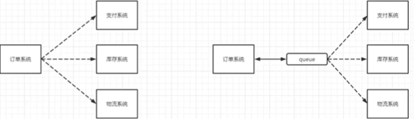
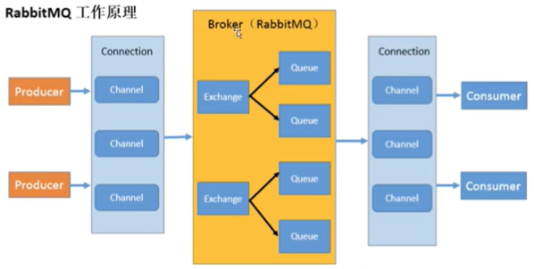

## 概念

什么是MQ：从字面意义上看，MQ:message queue，本质上是一个队列，FIFO先进先出。队列中存放的内容是一段可以用于通信的==消息==，用于**上下游传递**消息。

### MQ三大功能

#### 1.流量消峰

举例：订单系统最多只能处理1万条订单，但是可以使用消息队列做缓冲，把这些请求放到消息队列中，从而打破这个限制。有些请求可能会过一段时间才能被处理。

#### 2.应用解耦

直接调用某个子系统很容易出现故障，订单系统中的任何一个子系统出现了故障，都会造成下单操作异常。转变为基于消息队列的方式后，系统间调用的问题就会减少很多。

#### 3.异步处理

部分服务之间的调用是异步的。被调用者可能需要花费很长的时间去执行api，但是调用方需要知道什么时候可以执行完。使用消息总线可以很方便解决这个问题，A调用B后只需要监听B处理完的消息，B处理完后发送消息给MQ，MQ将此消息转发给A服务。这样A就可以先做其他事，而不用循环调用B的查询API或者callback api。A还能够及时得到异步处理成功的消息。

### MQ分类

1.ActiveMQ：最早的MQ之一，吞吐量和时效性都很高。

2.Kafka：为大数据而生的消息中间件。单机写入TPS约在百万条/秒。

3.RocketMQ：单机吞吐量很高，可用性非常高，分布式架构，消息可以做到0丢失。天生为金融互联网领域而生。

4.RabbitMQ↓

### RabbitMQ

功能：接收、存储和转发消息数据。

#### 四大核心概念

生产者：产生消息数据的程序。

交换机：交换机与队列是1对多绑定的关系；接收来自生产者的消息，并推送到队列中。是将消息推送到**一至多**个队列中还是丢弃，有交换机**自己决定**。

队列：每一个队列对应一个消费者，也就是说队列和消费者是一对一的关系；消息只能存储在队列中，队列仅仅受到主机内存和磁盘的约束，本质上是一个大的消息缓冲区。

消费者：处理消息数据的程序。

#### Rabbit的六大模式(核心部分)

1.HellowWorld简单模式

2.Work queues工作模式

3.Publish/Subscribe发布订阅模式

4.Routing路由模式

5.Topics主题模式

6.PublisherConfirms发布确认模式

工作原理：

* Broker：RabbitMQ的实体，表示接收和分发消息的应用。
* 链接Connection：发送者/接收者与Broker之间的TCP连接。
* Channel：信道，发送消息的通道。信道是在Connection连接内部建立的逻辑连接。一个连接中会包含多个信道。每一次发送消息只会占用连接中的一个信道而不会占用整个连接。
* Binding：交换机与队列之间的虚拟连接。

