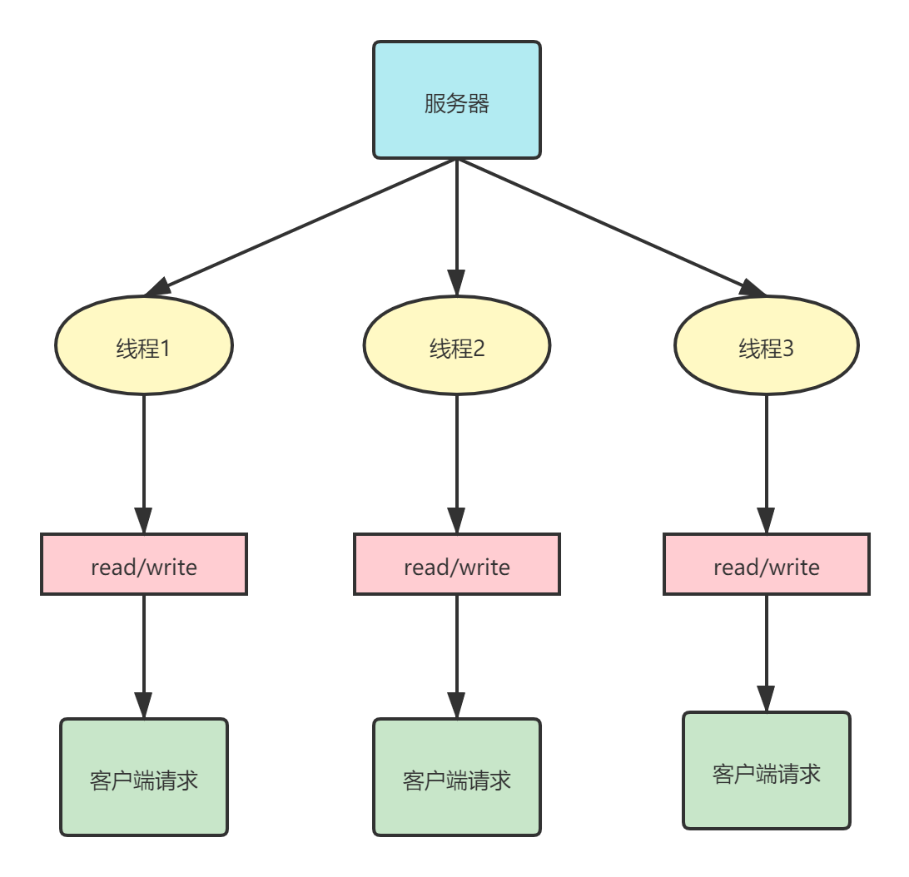
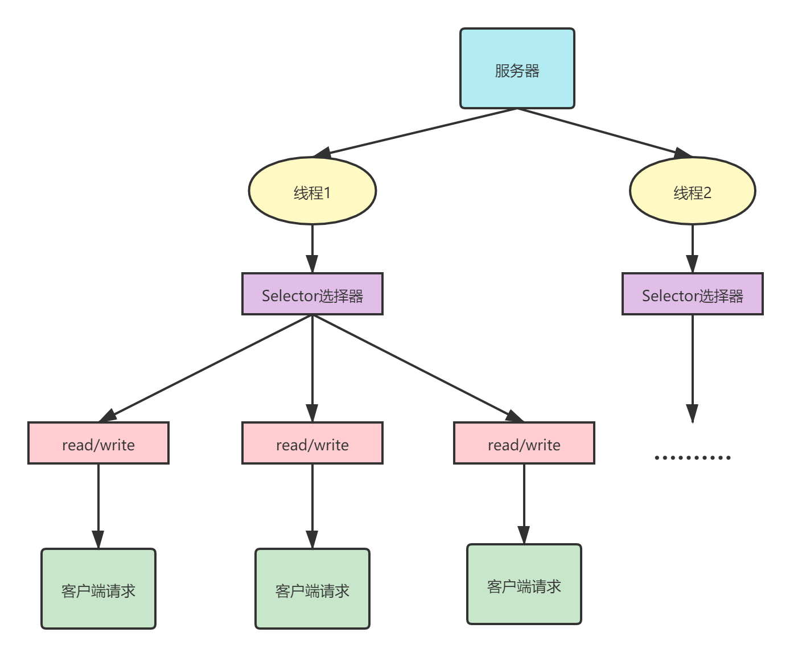
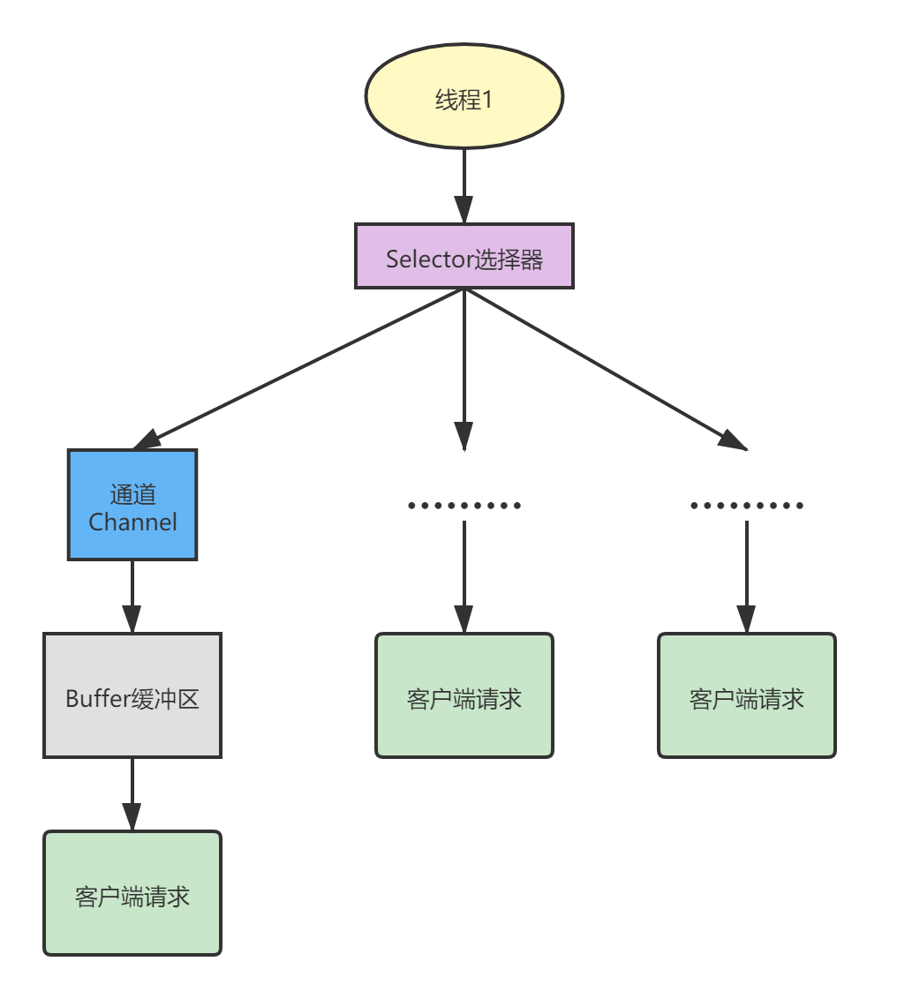
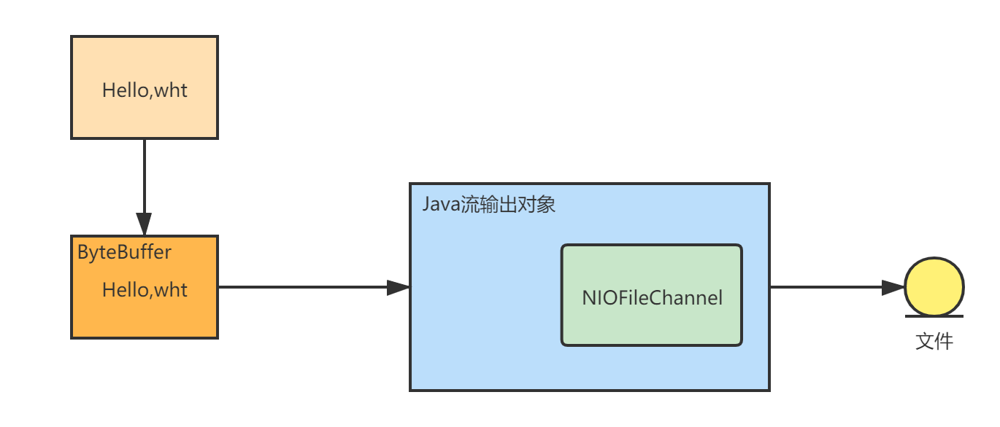

# Netty的介绍

Netty是一个异步的、基于事件驱动的网络应用框架，用以快速开发高性能、高可靠性的网络**IO**程序。

Netty主要针对在**TCP**协议下，面对客户端的高并发应用。

**==本质是一个NIO框架==**，适用于服务器通讯相关的多种应用场景。


应用场景：分布式系统中，各个节点之间需要远程服务调用，高性能的RPC框架必不可少。Netty往往作为基础通信组件。


# IO模型

也叫网络编程模型。

简单理解就是用**==什么样的通道==**进行数据的发送和接收。这很大程度上决定了程序通信的性能。

## BIO

原生Java IO，**传统阻塞型**。就是传统的java IO编程。服务器实现模式为**一个连接对应一个线程**，即客户端有连接请求的时候服务器端要启动一个线程进行处理，如果这个连接不做任何事情就会造成不必要的开销。而且如果有多个请求，服务器还要创建多个线程，并且每个线程有可能会长时间阻塞，特别占用CPU资源。



**使用场景**：连接数目小且固定的架构，这种方式对服务器资源要求比较高，并局限于应用中。

**简单流程**：

1. 服务器端启动一个Server Socket。
2. 客户端启动Socket对服务器进行通信，默认情况下服务器端需要对每个客户建立一个线程与之通信。
3. 客户端发出请求后，先咨询服务器是否有线程响应，如果没有则会等待，或者被拒绝。
4. 如果有响应，客户端线程会等待请求结束后，再继续进行。

**示例代码** 

```java
public class BIOServer {
    public static void main(String[] args) throws IOException {
        //1.创建一个线程池
        //2.如果有客户端连接就创建一个线程与之通信
        ExecutorService threadPool = Executors.newCachedThreadPool();

        //创建ServerSocket
        ServerSocket serverSocket = new ServerSocket(6666);
        System.out.println("Server init......");

        while(true){
            //监听等待客户端连接，只要没有客户端连接就会一直在这里阻塞
            final Socket socket = serverSocket.accept();
            System.out.println("someone client is connecting......");

            //创建一个线程池通信
            threadPool.execute(new Runnable() {
                @Override
                public void run() {
                    handler(socket);
                }
            });
        }
    }

    //handler方法和客户端通讯
    public static void handler(Socket socket){
        try {
            System.out.println("线程信息 id="+Thread.currentThread().getId() + " 名字="+
                    Thread.currentThread().getName());
            byte[] bytes = new byte[1024];
            //获取输入流
            InputStream inputStream = socket.getInputStream();

            //循环读取客户端发送的数据
            while (true){
                //客户端如果不发送数据就会一直阻塞
                int read = inputStream.read(bytes);
                if(read!=-1){
                    //输出客户端的数据
                    System.out.println(new String(bytes,0,read));
                }else{
                    break;
                }
            }

        }catch (Exception e){
            e.printStackTrace();
        }finally {
            System.out.println("connection closed......");
            try {
                socket.close();
            } catch (IOException e) {
                e.printStackTrace();
            }
        }
    }
}
```


## ==NIO== 

全称为Java non-blocking IO，是同步非阻塞的。NIO是**面向缓冲区，或者面向块**编程的，块的效率比流I/O高很多。数据读取到一个它稍后处理的缓冲区，需要时可在缓冲区中前后移动，这就增加了处理过程中的灵活性，使用它可以提供非阻塞式的高伸缩性网络。

**同步非阻塞**，服务器实现模式为一个线程处理多个请求(连接)，即客户端发送的连接请求都会**注册到多路复用器上**，多路复用器**轮询**到连接有IO请求就进行处理。

Selector选择器用于监听==多个通道的事件==(连接请求、数据到达等)，因此使用单个线程就可以监听多个客户端通道。

**==~~与Linux的select有一定区别，NIO中服务端也有一个channel，需要注册到select中~~==**。



使用场景：适用于连接数目多并且连接比较短的架构，比如聊天服务器，弹幕等。


三大核心部分：==**Channel(通道)**==、==**Buffer(缓冲区)**==、==**Selector(选择器)**==。

每一个Channel对应一个Buffer；Selector对应一个线程，一个线程对应多个Channel(连接)。

**切换到哪个Channel是由事件决定的**。

Buffer就是一个内存块，底层是一个数组。

数据的读取写入是通过Buffer，这个和BIO(要么输入要么输出，不能双向)不同，可以读也可以写，需要flip切换。

Channel是双向的，可以返回底层操作系统的情况，比如Linux，底层的操作系统通道就是双向的。



NIO的非阻塞模式，使一个线程从某**通道**发送请求或者读取数据，但是它仅能得到目前可用的数据，如果目前没有数据可用，**也不会阻塞**。可用做其他的事情：其它通道数据进行发送或接收，甚至其他活。NIO做到了用一个线程来处理多个操作。


### 缓冲区Buffer

本质是一个可以**读写数据的内存块**，可以理解成是一个容器对象(含数组)，该对象提供了一组方法可以更轻松的使用内存块，缓冲区对象内置了一些机制，能够跟踪和记录缓冲区的状态变化情况。Channel提供从文件、网络读取数据的渠道，但是读取或写入数据都必须经有Buffer。

**Buffer**类定义了所有的缓冲区都具有的四个属性来提供关于其所包含的数据元素的信息：

* Capacity：容量，即可以容纳的最大数据量。Buffer创建时被设定并且不能改变。
* Limit：缓冲区的当前终点，不能对缓冲区超过极限的位置进行读写操作。可以被修改。`intBuffer.limit(i)`表示不能超过i个。
* Position：下一个要被读或写的元素的索引，每次读写缓冲区数据时都会改变值，为下一次读写做准备。变成读的话Position会回到起点。可以手动设置，`intBuffer.Position(i)`。
* Mark：标记。

类型化：放入的是什么类型，取出就要是什么类型。

转换为只读：`ByteBuffer buffer1 = buffer.asReadOnlyBuffer();`  对buffer1放入数据就会报错。

#### 分散和聚合

使用多个Buffer完成数据的读写，可以存储更多数据。

Scattering分散：将数据写入到buffer时，可以采用buffer数组，依次写入。

Gathering聚合：从buffer读取数据时，可以采用buffer数组依次读。


### 通道Channel

类似于流，但是又有不同点。是NIO中的一个接口。

* 通道可以同时读写，流只能读或写。
* 通道可以异步读取。
* 通道可以对缓冲区进行读写。

常用的有：FileChannel、DatagramChannel、ServerSocketChannel。

案例：




### Selector选择器

能够检测多个注册的通道上是否有事件发生。多个Channel以事件的方式可以注册到同一个Selector，如果有事件发生，便获取事件然后针对每个事件进行处理。这样就可以只用一个单线程去管理多个通道，也就是管理多个连接和请求。

当线程从客户端Socket通道进行读写数据时，若没有数据可用，该线程可以进行**其他任务**。

**SelectionKey** ：Channel在Selector上注册后会返回一个SelectionKey，由Selector进行保存。Selector使用`select()`方法来监听有事件发生的通道的个数。有事件发生时，Selector能进一步得到相应发生事件的channel的SelectionKey，由SelectionKey的`cahnnel()`方法反向获取到channel，完成业务处理。

## AIO(NIO.2)

使用场景：连接数目多且连接比较长的架构，比如相册服务器，充分调用OS参与并发操作。


# Netty

## Netty的线程模型

* Netty首先抽象出两组线程池(可以认为是NIOEventLoopGroup)：BossGroup负责接收客户端的连接，Worker Group专门负责网络的读写。
* NIOEventLoopGroup相当于是一个事件循环组，这个组中**==含有多个事件循环==**，每一个事件循环都是一个NIOEventLoop。
* NIOEventLoop表示一个不断循环的执行处理任务的线程，**==每个NIOEventLoop都有一个Selector==**，用于监听绑定在其上的socket的网络通讯。
* 每一个Boss NioEventLoop轮询并处理accept事件，与client建立连接、建立NioSocketChannel并将其注册到某个worker NIOEventLoop上的selector。执行完这两步之后还可以执行其他任务。
* 每一个Worker NioEventLoop轮询read/write事件并处理IO事件，在对应的NioSocketChannel处理。处理完后在同一个循环中还可以处理其他任务。
* **每一个Worker NioEventLoop处理业务时，会使用pipeline(管道)**，pipeline包含了channel，通过pipeline可以获取到对应的通道，管道中维护了很多的处理器，可以用来处理各种数据。


### pipeline的原理

在Netty中每一个Channel都有且仅有一个ChannelPipeline与之对应。一个Channel 包含了一个ChannelPipeline ， 而ChannelPipeline 中又维护了一个由ChannelHandlerContext 组成的双向链表。


## Demo

1.初始化一个服务端

```java
public class NettyServer {
    public static void main(String[] args) throws Exception {
        //创建两个Group
        //两个都是无限循环
        NioEventLoopGroup bossGroup = new NioEventLoopGroup();
        NioEventLoopGroup workerGroup = new NioEventLoopGroup();

        //创建服务器端的启动对象，配置参数
        ServerBootstrap bootstrap = new ServerBootstrap();
        bootstrap.group(bossGroup,workerGroup)//两个线程组
                .channel(NioServerSocketChannel.class)//使用的服务器通道
                .option(ChannelOption.SO_BACKLOG,128)//设置线程队列得到连接个数
                .childOption(ChannelOption.SO_KEEPALIVE,true)//设置保持活动连接状态(长连接？)
                .childHandler(new ChannelInitializer<SocketChannel>() {//创建一个通道测试对象(匿名对象)
                    //给pipeline设置处理器
                    @Override
                    protected void initChannel(SocketChannel ch)throws Exception {
                        ch.pipeline().addLast(null);
                    }
                });//给我们worker的EventLoop对应的管道设置处理器
        System.out.println("Server is ready...");
        ChannelFuture cf = bootstrap.bind(6668).sync();

        //对关闭通道进行监听
        cf.channel().closeFuture().sync();
    }
}
```

2.服务端绑定的handler

```java
//自定义一个handler，需要继承netty规定好的某个HandlerAdapter
public class NettyServerHandler extends ChannelInboundHandlerAdapter {
    //重写一些方法

    //读取客户端发送的消息
    //ChannelHandlerContext上下文对象，包含pipeline，channel，地址等
    //msg：客户端发送的数据，默认Object
    @Override
    public void channelRead(ChannelHandlerContext ctx, Object msg) throws Exception {
        System.out.println("server ctx = "+ctx);
        //将msg转成bytebuffer处理,Netty提供的ByteBuf性能更高
        ByteBuf buf = (ByteBuf) msg;
        System.out.println("From client "+ctx.channel().remoteAddress()+":"+buf.toString(CharsetUtil.UTF_8));
    }

    //数据读取完毕
    @Override
    public void channelReadComplete(ChannelHandlerContext ctx) throws Exception {
        //write+flush
        //将数据写入到缓存并刷新
        //对发送的数据进行编码
        ctx.writeAndFlush(Unpooled.copiedBuffer("hello,client~",CharsetUtil.UTF_8));
    }

    //处理异常，一般是关闭通道
    @Override
    public void exceptionCaught(ChannelHandlerContext ctx, Throwable cause) throws Exception {
        ctx.close();
    }
}
```

3.客户端，类似于服务端，在socket上需要一点小改动

```java
public class NettyClient {
    public static void main(String[] args) throws Exception {
        //客户端只需要一个事件循环组
        NioEventLoopGroup eventLoopGroup = new NioEventLoopGroup();

        try{
            //创建客户端启动对象
            //这里不是ServerBootStrap是BootStrap
            Bootstrap bootstrap = new Bootstrap();

            //同服务器，设置参数
            bootstrap.group(eventLoopGroup)
                    .channel(NioSocketChannel.class)
                    .handler(new ChannelInitializer<SocketChannel>() {
                        @Override
                        protected void initChannel(SocketChannel ch) throws Exception {
                            ch.pipeline().addLast(new NettyClientHandler());
                        }
                    });
            System.out.println("client is ready...");

            //启动客户端连接服务器端
            //关于channelFuture涉及到netty的异步模型
            ChannelFuture channelFuture = bootstrap.connect("127.0.0.1", 6668).sync();

            //给关闭通道进行监听
            channelFuture.channel().closeFuture().sync();
        }finally {
            eventLoopGroup.shutdownGracefully();
        }
    }
}
```

4.客户端绑定的handler，用于处理服务端发送过来的消息

```java
public class NettyClientHandler extends ChannelInboundHandlerAdapter {
    //通道就绪时触发
    @Override
    public void channelActive(ChannelHandlerContext ctx) throws Exception {
        System.out.println("client "+ctx);
        ctx.writeAndFlush(Unpooled.copiedBuffer("hello,this is client", CharsetUtil.UTF_8));
    }

    @Override
    public void channelRead(ChannelHandlerContext ctx, Object msg) throws Exception {
        ByteBuf buf = (ByteBuf) msg;
        System.out.println("From server "+ctx.channel().remoteAddress()+":"+buf.toString(CharsetUtil.UTF_8));
    }

    @Override
    public void exceptionCaught(ChannelHandlerContext ctx, Throwable cause) throws Exception {
        cause.printStackTrace();
        ctx.close();
    }
}
```

`ChannelHandlerContext`：包含了很多信息，包括当前handler、前一个/后一个上下文、pipeline、通信的地址等，还能反向获取自己所属的eventloop。

pipeline中的inbound和outbound：表示pipeline的事件的种类，inbound表示事件从外部传入ChannelPipeline，outbound则表示传出。

- Inbound事件和Outbound事件是两种类型的事件，根据**触发事件的源头**进行区分。**由外部触发的事件是Inbound事件**。外部是指应用程序之外，因此，Inbound事件就是 **非应用程序请求** 而触发的事件，比如某个socket上有数据读取进来了（注意是“读完了”这个事件，而不是“读取”这个操作），再比如某个socket连接了上来并被注册到了某个EventLoop。
- Outbound事件是由应用程序主动请求而触发的事件，可以认为，Outbound是指应用程序发起了某个操作。比如向socket写入数据，再比如从socket读取数据（注意是“读取”这个操作请求，而非“读完了”这个事件），这也解释了为什么ChannelOutboundHandler中会有read方法。


## taskQueue

每个NioEventGroup中含有一个taskQueue任务队列，非常耗时间的业务可以放入channel对应的任务队列中异步执行，而不用等待他执行完成。

提交到任务队列中的任务的执行顺序按照提交的顺序，只有前一个任务被执行完了，后一个任务才能继续执行。也就是说，执行任务队列中任务的线程是**同一个线程**。

Task有三种使用的场景：taskQueue可以用于执行普通的任务，依次执行，只要队列中有任务就会执行；用户自定义的定时执行的任务提交到scheduledTaskQueue中


**ChannelFuture** ：Netty中的IO操作是异步的，包括Bind、Write等操作会返回一个ChannelFuture，用户可以通过其方便的获取IO操作结果。

Future-Listener机制：当Future对象刚刚创建时，处于非完成状态，调用者可以通过返回的ChannelFuture来获取操作执行的状态，注册监听函数来执行完成后的操作。


## EventLoop组件

ChannelHandlerContext：保存channel的所有上下文信息，同时关联一个ChannelHandler对象，同时也绑定了对应的pipeline和channel的信息，方便对handler进行调用。

ChannelOption：供Netty设置参数。


EventLoopGroup是一组EventLoop的抽象，一般会有多个EventLoop同时工作，每个维护一个selector实例。

BossEventLoopGroup通常是一个单线程的EventLoop，EventLoop维护了一个注册了ServerSocketChannel的Selector实例。


## Unpooled

Netty提供一个专门用来操作缓冲区的工具类Unpooled，可以获取Netty数据容器的ByteBuf对象。

`public static ByteBuf copiedBuffer(CharSequence string，Charset charset)` 

```java
//创建对象
//该对象包含一个数组arr，是一个byte[10]
ByteBuf buffer = Unpooled.buffer(10);//还可以使用Unpolled.copiedBuffer("hello",Charset.forName("u"))
for(int i = 0;i<10;i++){
    buffer.writeByte(i);
}
for(int i = 0;i<buffer.capacity();i++){
    System.out.println(buffer.readByte());
}
//底层维护了readIndex和writeIndex，不需要使用flip进行反转
```


## Netty的心跳检测机制

```java
bootstarp.childHandler(new ChannelInitializer<SocketChannel>() {
    @Override
    protected void initChannel(SocketChannel socketChannel) throws Exception {
        ChannelPipeline pipeline = socketChannel.pipeline();
        //加入一个netty提供的IdleStateHandler(检测空闲状态)
        /*
        * 3个数字参数：表示多长事件没有 读/写/读写 ，就会发送一个心跳检测包检查是否存活
        * 当IdleStateEvent触发后，就会传递给管道的下一个handler去处理，通过调用下一个handler的userEventTriggered去处理。
        * */
        pipeline.addLast(new IdleStateHandler(3,5,7, TimeUnit.SECONDS));
        //加入一个处理空闲状态的自定义处理器
        pipeline.addLast(new HeartBeatServerHandler());
    }
});
```

`IdleStateHandler`用于检测空闲状态，一旦发现处于空闲状态，就会发送心跳检测包查看对方是否存活。

在自定义的handler中，可以拿到相应的事件(读/写/读写)，并做出进一步的处理。

```java
@Override
public void userEventTriggered(ChannelHandlerContext ctx, Object evt) throws Exception {
    //evt:事件
    if(evt instanceof IdleStateEvent){
        IdleStateEvent event = (IdleStateEvent) evt;
        String eventType = null;
        switch (event.state()){
            case READER_IDLE:
                eventType = "读空闲";
                break;
            case WRITER_IDLE:
                eventType = "写空闲";
                break;
            case ALL_IDLE:
                eventType = "读写空闲";
        }
        System.out.println(ctx.channel().remoteAddress()+"--"+eventType);
        //服务器相应处理
    }
}
```


## Netty的入站与出站机制

出站：事件的运动方向是从当前应用程序到对方的，称为出站。反之称为入站。

从socket中读取数据到真正的客户端之间要经过解码，如果是出站消息，也一样要被编码为字节。所以解码器是一个`InboundHandler`，编码器是一个`OutbhoudHandler`。

 数据在入站的时候被解码，完后放入到一个list中，传给下一个handler处理。

在解码器进行数据解码时，需要判断缓存区(ByteBuf)的数据是否足够，否则接收到的结果和期望的结果可能会不一致。不够的数据可能会被丢弃或做一些其他的操作。


## TCP粘包和拆包

TCP粘包：为了更有效的发送信息，将多次间隔较小且数据量较小的数据，合并成一个大的数据块，然后进行封包发送。这样做虽然提高了效率，但是**接收端就难以分辨出完整的数据包了**。

TCP拆包：把一个~~大的~~数据包拆分成小的数据包并发送。同样，接收端难以分辨出完整的数据包。


出现TCP粘包的案例：在客户端的handler中，向服务器中使用for循环发送10条数据。服务器不一定能收到10次消息，可能会出现粘包，导致收到的数量小于10。


解决方案：关键是要解决服务器端每次读取数据长度的问题。可以**使用自定义协议+编解码器**来解决。

* 自己定义一个消息协议类`MessageProtocol.java`。包括**消息的长度**和消息具体内容两个属性。

 简单来说就是把长度和ByteBuf里的数据封装成一个对象发送，仅仅在编码后和解码前的分属性发送/接收。

==疑问：在编码器中`out.write`依然是分开发送的。为什么不会粘包==。


---


# Netty源码

## 1.启动流程

在主方法中调用了bind方法就算整个netty启动。

bind方法包含3个流程：`init`创建`NioServerSocketChannel`并添加初始化handler，`register`会将channel注册到selector并初始化handler，最后`doBind0`绑定channel并触发`channelActive`事件。


### init

先是`initAndRegister()`，在这个方法中首先会使用`channel = this.channelFactory.newChannel();`方法来创建一个channel。

```java
final ChannelFuture initAndRegister() {
    Channel channel = null;

    try {
        //创建一个channel
        channel = this.channelFactory.newChannel();
        this.init(channel);
    } catch (Throwable var3) {
        if (channel != null) {
            channel.unsafe().closeForcibly();
            return (new DefaultChannelPromise(channel, GlobalEventExecutor.INSTANCE)).setFailure(var3);
        }

        return (new DefaultChannelPromise(new FailedChannel(), GlobalEventExecutor.INSTANCE)).setFailure(var3);
    }

    ChannelFuture regFuture = this.config().group().register(channel);
    if (regFuture.cause() != null) {
        if (channel.isRegistered()) {
            channel.close();
        } else {
            channel.unsafe().closeForcibly();
        }
    }

    return regFuture;
}
```

这里的`channelFactory`是一个`ReflectiveChannelFactory`类型。

```java
public T newChannel() {
        try {
            return (Channel)this.constructor.newInstance();
        } catch (Throwable var2) {
            throw new ChannelException("Unable to create Channel from class " + this.constructor.getDeclaringClass(), var2);
        }
    }
```

这里使用了反射的机制来创建一个channel。`newInstance()`调用`ServerSocketChannel`的open方法，创建这个channel。


后续执行`init()`方法，执行一些初始化操作，并向channel的pipeline中添加一个初始化的handler(这里并不会立刻执行)。

```java
p.addLast(new ChannelHandler[]{new ChannelInitializer<Channel>() {
    public void initChannel(final Channel ch) {
        final ChannelPipeline pipeline = ch.pipeline();
        ChannelHandler handler = ServerBootstrap.this.config.handler();
        if (handler != null) {
            pipeline.addLast(new ChannelHandler[]{handler});
        }

        ch.eventLoop().execute(new Runnable() {
            public void run() {
                pipeline.addLast(new ChannelHandler[]{new ServerBootstrap.ServerBootstrapAcceptor(ch, currentChildGroup, currentChildHandler, currentChildOptions, currentChildAttrs)});
            }
        });
    }
}});
```


### register

在`initAndRegister()`中被调用，这个方法里会进行线程切换→会开启一个`eventLoop`线程来执行后续的register操作。

```java
if (eventLoop.inEventLoop()) {
    this.register0(promise);
} else {
    try {
        eventLoop.execute(new Runnable() {
            public void run() {
                AbstractUnsafe.this.register0(promise);
            }
        });
        //......
    }
```

`register0()`会去：

* 调用`AbstractChannel.this.doRegister();`方法：拿到原生的`ServerSocketChannel`，让它调用register方法，注册到`enentLoop`的selector方法(调原生库)。

* 调用`pipeline.invokeHandlerAddedIfNeed()`，此时会回去调用初始化handler的方法`public void initChannel(final Channel ch)`。
* `safeSetSuccess(promise)`给异步调用`initRegister()`设置一个成功的结果，以便主线程进行后续的操作。


### bind

在`doBind()`方法中，添加一个监听器来监听`initRegister()`方法的异步执行(后半过程切换了线程执行)结果，一旦有了结果就会去执行方法。

```java
regFuture.addListener(new ChannelFutureListener() {
    @Override
    public void operationComplete(ChannelFuture future) throws Exception {
        Throwable cause = future.cause();
        if (cause != null) {
            promise.setFailure(cause);
        } else {
            promise.registered();
            AbstractBootstrap.doBind0(regFuture, channel, localAddress, promise);
        }

    }
});
```

`doBind0()`会开启一个新的线程来完成绑定。

```java
//保证这段代码在NIO线程中执行
channel.eventLoop().execute(new Runnable() {
    public void run() {
        if (regFuture.isSuccess()) {
            channel.bind(localAddress, promise).addListener(ChannelFutureListener.CLOSE_ON_FAILURE);
        } else {
            promise.setFailure(regFuture.cause());
        }
    }
});
```

经过较长的调用链，在`AbstractChannel.bind()`中((这里会确保是一个NIO线程))调用`NioServerSocketChannel.doBind()`方法会使用Java原生`ServerSocketChannel`的绑定方法完成绑定。

完成绑定后，如果channel处于active状态，`AbstractChannel.bind()`会调用`pipeline.fireChannelActive()`方法触发`NioServerSocketChannel`的active事件。


触发之后，channel的active状态就会有一系列的handler去处理它，`HeadContext`会在当前channel的`SelectionKey`上关注ACCEPT事件。


## NioEventLoop

核心成员：

* selector：选择器。
* 线程thread：当前eventloop处理IO事件的线程。
* executor：可以理解成是一个单线程的线程池，和thread其实是同一个线程。但是可以进行一些额外的功能。
* 任务队列taskQueue：由于是单个线程，同一时间只能处理一个任务。多余提交的任务会缓存在这里。
* scheduledTaskQueue：定时执行任务的队列。


### selector何时被创建 

在构造方法中，执行如下：

```java
NioEventLoop.SelectorTuple selectorTuple = this.openSelector();
this.selector = selectorTuple.selector;
```

其中，`this.openSelector()`会调用`unwrappedSelector = this.provider.openSelector()`，与NIO原生Selector的`open()`方法一致。

```java
public static Selector open() throws IOException {
    return SelectorProvider.provider().openSelector();
}
```


### 为什么有两个selector

一个eventloop对象含有`unwrappedSelector`和`selector`两个selector。其中`unwrappedSelector`是NIO底层的selector，`selector`的selectedKeys被改成了数组的形式而不是set集合，遍历起来效率更高。

构造方法中调用`NioEventLoop.SelectorTuple selectorTuple = this.openSelector()`初始化selector时，最开始获得的selector会被先赋值给`unwrappedSelector`。然后通过反射的方式把原始的selector替换成自己实现的selector，**==selectedKeys优化，提升性能==**。


### EventLoop中的线程何时启动

**==首次调用==**EventLoop的executor方法。

首先判断当前线程是否是executor线程，如果不是(`thread`为null也是)，则要进行executor线程的启动。

先把表示当前线程的属性`state`设置为2(**==保证其只会启动一次==**)，再调用`doStartThread()`。


`doStartThread()`使用eventloop执行一个任务：把`thread`属性赋值成执行任务的线程(也就是executor)，然后执行当前eventloop的`run()`方法(在一个死循环中不断监听并执行任务)。一个线程就这样启动起来，并开始监听任务了。


### `wakeup`方法

Nio线程的`run()`方法中，如果满足<font color=red>**一定条件**</font>(当前没有任务等)，当前的线程就会阻塞。

```java
try {
    if (!this.hasTasks()) {
        strategy = this.select(curDeadlineNanos);
    }
    break;
} finally {
    this.nextWakeupNanos.lazySet(-1L);
}
```

调用`NioEventLoop.execute()`时，如果当前线程的selector处于阻塞的状态，就会调用`wakeup()`唤醒selector，让它去执行任务。

```java
protected void wakeup(boolean inEventLoop) {
//nextWakeupNanos的作用是确保多个线程同时提交任务时，selector只会被wakeup一次
    if (!inEventLoop && this.nextWakeupNanos.getAndSet(-1L) != -1L) {
        this.selector.wakeup();
    }
}
```


`run()`方法进入select分支的条件：

`strategy = this.selectStrategy.calculateStrategy(this.selectNowSupplier, this.hasTasks());` 当strategy为-1时(没有任务)，进入select。

```java
//DefaultSelectStrategy.class
public int calculateStrategy(IntSupplier selectSupplier, boolean hasTasks) throws Exception {
    //没有任务时，返回-1(阻塞)
    //有任务时，调用selectNowc
    return hasTasks ? selectSupplier.get() : -1;
}
```


