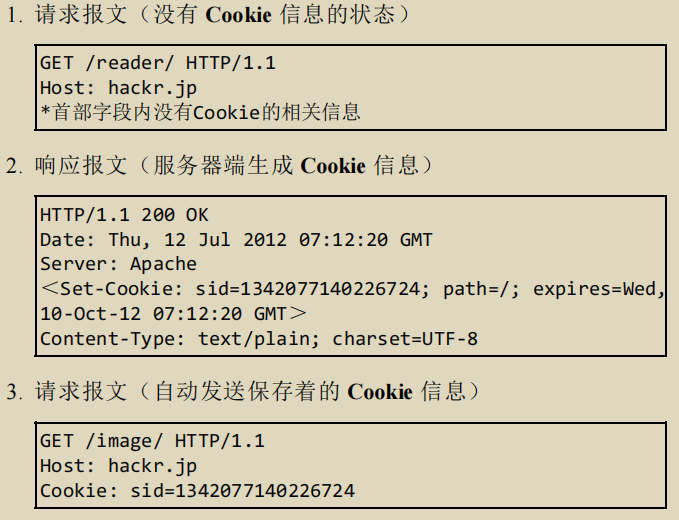

## http

HTTP是一种不保存状态的协议，自身不对请求和响应之间的通信状态进行保存。如果需要保存用户的状态，可以使用cookie或是session。

## http报文

指的是==用于HTTP协议交互的信息，本身由多行数据够成的字符串文本==。分为请求报文和响应报文。

组成：报文首部、空行(CR+LF)、报文主体三部分。通常不一定要有保报文主体。可能包含未定义的首部(Cookie等)。

**报文首部**：

* 请求报文的第一行是请求行，包含用于请求的方法，请求 URI 和 HTTP 版本。

* 响应报文的第一行是响应行，包含表明响应结果的状态码，原因短语和 HTTP 版本。
* 第一行之后是首部字段，一般有四种首部字段：通用首部、请求首部、响应首部、实体首部。

### 请求报文

请求报文由请求方法、请求URI、协议版本、可选的请求首部字段和内容实体构成。客户端发送请求时，URI需要将作为请求报文中的请求URI包含在内。

如果是对服务器本身发起请求，可以用*来代替URI。

**请求的方法** 

请求的方法有GET(获取资源)、POST(传输实体主体)、PUT(传输文件)、HEAD(获得响应报文首部)、DELETE(删除文件)、OPTIONS(询问请求指定URI时支持的方法)、TRACE(让Web服务器端将之前的请求通信环回给客户端)、CONNECT(要求与代理服务器通信时，建立隧道，用隧道协议~(SSL和TCS把内容加密后传输)~进行TCP通信)。

~~HTTP1.0还支持LINK和UNLINK，建立/断开和资源之间的关系，但是HTTP1.1已经将其废弃。~~ 

PUT方法和DELETE方法本身都不带有验证机制，一般仅仅配合Web应用程序的验证机制使用。TRACE方法容易引发跨站追踪攻击，也不怎么使用。

**持久连接** 

HTTP/1.1和部分HTTP/1.0想出的连接，也成为HTTP keep-alive。不同于之前的一次HTTP请求对应一次TCP连接，只要任意一端没有明确提出断开连接，保持TCP连接状态。建立一次连接可以发起多次HTTP请求。

管线化发送方式：不需要等待响应就能直接发送下一个请求。持久连接使得管线化称为可能。

**Cookie** 

通过在请求和响应==报文中写入Cookie信息==来控制客户端的状态。

根据从服务器端发送的响应报文内一个叫做Set-Cookie的首部字段信息通知客户端保存Cookie。

### 响应报文

响应报文由协议版本、状态码、用以解释状态码的原因短语、可选的响应首部字段以及实体主体构成。

### 编码提升传输速率

在传输时编码，能够有效地处理大量地访问请求。

HTTP报文地主体用于传输请求或响应地实体主体，通常二者相等，只有传输中进行编码操作时，实体主体地内容发生变化，两者才有差异。

**编码的类型** 

* 压缩传输<u>内容编码</u>：把实体压缩后发送。

* 分割发送的<u>分块传输编码</u>：把实体数据分块，一块一块传输(最后一块用0(CR+LF)标记)。接收端进行解码，HTTP1.1有一种传输编码的机制，可以在通信的时候按照某种编码方式传输。

### 发送多种数据多部份对象集合

HTTP协议中，发送的一份报文主体内可含有多类型实体，比如文件或图片。

使用时需加上首部字段`Content-type`。同时使用`boundary`字符串来划分多部份对象集合指明的各类实体(起始行和最后都要插入--标记)。

### 获取范围请求

只请求特定范围内的资源。

需要使用首部字段`Range` | 比如 `Range: bytes=5001-10000` 

针对范围请求，响应会返回状态码为 206 Partial Content 的响应报文。

## HTTP状态码

作用：告知从服务端返回的请求结果

|      | 类别             | 原因               |
| ---- | ---------------- | ------------------ |
| 1XX  | 信息性状态码     | 接收的请求正在处理 |
| 2XX  | 成功状态码       | 处理正常请求完毕   |
| 3XX  | 重定向状态码     | 需要附加操作       |
| 4XX  | 客户端错误状态码 | 服务器无法处理     |
| 5XX  | 服务器错误状态码 | 服务器处理出错     |

2XX：表明请求被正常处理

* 200 OK：正常处理。
* 204 No Content：正常处理，但响应报文不含实体的主体部分。
* 206 Partical Content：客户端进行了范围请求。

3XX：重定向

* 301 Moved Permanently：请求的资源被永久分配了新的URI。
* 302 Found：请求的资源被暂时分配了新的URI。可能还会改变。
* 303 See Other：请求对应的资源存在着另一个URI，但是应使用GET方法定向获取。
* 304 Not Modified：和重定向没有关系，表示未满足访问条件，返回不包含任何响应的主体部分。
  * 该状态码表示客户端发送附带条件的请求 （ If-Match， If-ModifiedSince， If-None-Match， If-Range， If-Unmodified-Since ） 时， 服务器端允许请求访问资源， 但未满足条件的情况。 304 状态码返回时， 不包含任何响应的主体部分。 304 虽然被划分在 3XX 类别中， 但是和重定向没有关系。
* 307 Temporary Redirect：临时重定向，与302相同，但是不会从POST变成GET。~302也禁止，但是都在用~。

4XX：客户端错误

* 400：请求报文语法错误。
* 401 Unauthorized：表示发送的请求需要由通过HTTP认证的认证信息。
* 403 Forbidden：请求资源的访问被服务器拒绝。
* 404：服务器找不到请求的资源。

5XX：服务器错误

* 500：服务器端在执行请求时发生错误。
* 503 Service Unavailable：服务器处于超负载或停机维护。

## HTTP协作的Web服务器

应用程序：代理、网关、隧道。

- 代理：扮演了服务器和客户端的中间人的角色。基本行为就是接收客户端请求后转发给服务器。每次通过代理服务器转发请求或响应时，会追加写入Via首部信息。
  - 缓存代理：转发时会预先将资源的副本保存在代理服务器上，代理再收到对相同资源的请求时，就可以直接返回。
  - 透明代理：不对报文做任何加工的代理类型。
- 网关：转发其他服务器通信数据的服务器，接收从客户端发送来的请求，并对其进行处理。利用网关可以由HTTP请求转化为其他协议通信。
- 隧道：在客户端和服务器之间进行中转，并保持双方通信连接。可以按要求连接通信线路，使用SSL等加密手段进行通信。==本身不会去解析HTTP请求，目的是确保客户端与服务器进行安全的通信==。通过隧道可以和远距离的服务器安全通信。

### 缓存

指代理服务器或客户端本地磁盘内保存的资源样本。缓存服务器是代理服务器的一种。

优势：可避免多次从源服务器转发资源。

有效期限：缓存服务器会根据客户端的要求和自身的有效期等因素，向源服务器确认资源的有效性。若判断失效，将会再次从源服务器上获取新资源。

## HTTP首部

HTTP首部为客户端和服务器分别处理请求和响应提供所需要的信息。

在请求报文中，首部由方法、URI、HTTP版本、HTTP首部字段组成。

在响应报文中，HTTP报文由HTTP版本、状态码、HTTP首部字段3部分够成。

### HTTP首部字段

HTTP首部字段是由首部字段名和字段值构成的，中间用冒号`:`分隔。

字段值对应单个HTTP首部字段可以有多个值：`Keep-Alive: timeout=15, max=100` 

四种类型：

* 通用首部字段：请求报文和响应报文两方都会使用的首部。
* 请求首部字段：从客户端向服务器端发送请求报文时使用的首部。补充了请求的附加内容、客户端信息、响应内容相关优先级等信息。 
* 响应首部字段：从服务器端向客户端返回响应报文时使用的首部。补充了响应的附加内容，也会要求客户端附加额外的内容信息。 
* 实体首部字段：针对请求报文和响应报文的实体部分使用的首部。补充了资源内容更新时间等与实体有关的信息。

#### HTTP首部字段一览

TODO

#### HTTP/1.1通用首部字段

请求报文和响应报文双方都会使用的首部。

==**Cache-Control**==：通过该字段的指令能够操作缓存。比如响应的最大Age值，期望在指定时间内的响应仍有效等。

* public指令表示其他用户也可以利用缓存。
* private指令表示响应只以特定的用户作为对象，只会对特定用户提供资源缓存。
* no-cache指令：不缓存**过期的资源**，缓存会向源服务器进行有效期确认后处理资源。
  * 客户端：表示自己不要缓存过的资源，就要服务器里的。
  * 服务器：缓存服务器不能对该资源进行缓存，源服务器也不再对缓存服务器请求中提出的资源有效性进行确认。
  * 如果no-cache指定了参数名，客户端就只是不能对指定参数值的首部字段对应的响应报文的资源进行缓存。
* no-store指令：规定缓存不能在本地存储请求或响应的任一部分。
* s-maxage=[]：设置缓存期限(秒)，只适用于供多位用户使用的公共缓存服务器。
* max-age=[]：设置缓存期限(秒)
* 。。。

==**Connection**==：控制不再转发给代理的首部字段、管理持久连接

* `Connection: 不再转发的首部字段名` ，代理服务器会把这个首部字段删除在传给目标服务器。
* `Connection:close`，明确表示自己要断开连接
* `Connection:Keep-Alive`，维持持续连接

**Date**：表明创建HTTP报文的日期和时间。

* `Date: Tue, 03 Jul 2012 04:40:59 GMT` 

**Pragma**：作为HTTP/1.1和HTTP/1.0的向后兼容而定义

* `Cache-Control: no-cache`

  `Pragma: no-cache`

**Trailer**：事先说明报文**主体后**记录了哪些首部字段

**Trailer-Encoding**：传输报文主体采用的编码方式

Upgrade：检测HTTP协议以及其他协议是否可使用更高的版本进行通信。其参数值可以用来指定一个完全不同的通信协议。`Upgrade: TLS/1.0，HTTP/1.1`

**Via**：为了追踪客户端与服务器之间的请求和响应报文的传输路径。报文经过代理或网关时，会先在首部字段 Via 中附加该服务器的信息，然后再进行转发。

**Warning**：告知用户一些与缓存相关的问题的警告。

#### 请求首部字段

#### 响应首部字段

#### 实体首部字段

#### 为Cookie服务的首部字段

#### 其他首部字段

----

## ==HTTPS== 

HTTP的缺点：

* 通信使用明文（不加密），内容可能会被窃听。
  * HTTP本身不具备加密的功能，无法做到对通信整体进行加密。

* 不验证通信方的身份，因此有可能遭遇伪装。

* 无法证明报文的完整性，所以有可能已遭篡改。请求或响应在传输途中，遭攻击者拦截并篡改内容的攻击称为中间人攻击(Man-in-the-Middle attack，MITM)。

处理方式：

1.加密处理防止被偷听

* 通信的加密：HTTP可以通过和SSL安全套接层或TLS安全层传输协议的组合使用，来加密HTTP的通信内容。与SSL组合使用的HTTP被称为HTTPS。
* 内容的加密：客户端需要对HTTP报文进行加密处理后再发送请求。

2.查明对手的证书

* 使用SSL，SSL提供了一种被称为证书的手段，可用于确定通信方就是意料中的服务器。

3.使用MD5和SHA-1等散列值校验的方法，以及用来确认文件的数字签名方法。

### HTTPS的形成

HTTP加上加密处理和认证以及完整性保护后即是HTTPS。

HTTPS只是HTTP通信==**接口部分**==用SSL和TLS协议代替。采用SSL后，HTTP就拥有了HTTPS的加密、证书和完整性保护这些功能。

#### ==**相互交换密钥的公开密钥加密技术**== 

SSL采用一种公开密钥加密的加密处理方式，加密算法公开，而密钥是保密的。只要持有密钥就能够对密码进行解密。

* **共享密钥加密**：加密和解密通用一个密钥的方式，也叫**对称密钥加密**。这种方式下，密钥也要发给对方，如果被监听密钥可能会落入攻击者之手。加解密速度快，典型的对称加密算法有DES、AES等。

* **使用两把密钥的公开密钥加密**：使用一对**非对称的密钥**：私有密钥和公开密钥。==公开密钥任何人都可以获得，私有密钥不能让其他任何人知道==。**发送方使用对方的公开密钥加密并发送，接收方使用自己的私有密钥解密**。运算速度慢。典型的非对称加密算法有RSA、DSA等。
* ==**HTTPS采用混合加密机制**==：HTTPS 采用共享密钥加密和公开密钥加密两者并用的混合加密机制。
  * 使用公开密钥(**非对称**)加密方式安全的交换在稍后的共享密钥加密中要使用的密钥，可用**服务器方的证书**进行非对称加密。
  * 确保交换的密钥是安全的前提下，使用共享密钥(**对称**)加密方式进行通信。

#### 证明公开密钥正确性的证书

公开密钥加密(非对称加密)方式还是存在一些问题的。无法证明公开密钥本身**就是货真价实的公开密钥**。或许在公开密钥传输途中，真正的公开密钥已经被攻击者替换掉了。 

可以使用由数字证书认证机构CA和其相关机关颁发的公开密钥证书。数字证书认证机构在判明提出申请者的身份之后，会对已申请的公开密钥做数字签名，然后分配这个已签名的公开密钥，并将该公开密钥放入公钥证书后绑定在一起。服务器会将这份**由数字证书认证机构颁发的公钥证书**发送给客户端，以进行公开密钥加密方式通信。公钥证书也可叫做数字证书或直接称为证书。

接到证书的客户端可使用数字证书认证机构的公开密钥，对那张证书上的**数字签名进行验证**，一旦验证通过，客户端便可明确两件事： 一，认证服务器的公开密钥的是真实有效的数字证书认证机构。二，服务器的公开密钥是值得信赖的。

#### HTTPS的通信步骤

步骤**1**：客户端通过发送 Client Hello 报文开始 SSL通信。报文中包含客户端支持的 SSL的指定版本、加密组件（Cipher Suite）列表（所使用的加密算法及密钥长度等）。 

步骤**2**：服务器可进行 SSL通信时，会以 Server Hello 报文作为应答。和客户端一样，在报文中包含 SSL版本以及加密组件。服务器的加密组件内容是从接收到的客户端加密组件内**筛选出来的**。

步骤**3**：之后服务器发送 Certificate 报文。报文中包含公开密钥**证书**。

步骤**4**：最后服务器发送 Server Hello Done 报文通知客户端，最初阶段的 SSL握手协商部分结束。

步骤**5**：SSL第一次握手结束之后，客户端以 **Client Key Exchange** 报文作为回应。报文中包含通信加密中使用的一种被称为 Pre-master secret 的随机密码串。该报文已用步骤 3 中的公开密钥进行加密。

步骤**6**：接着客户端继续发送 Change Cipher Spec 报文。该报文会提示服务器，在此报文之后的通信会采用 Pre-master secret 密钥加密。

步骤**7**：客户端发送 Finished 报文。该报文包含连接至今全部报文的整体校验值。这次握手协商是否能够成功，要以服务器是否能够正确解密该报文作为判定标准。 

步骤**8**：服务器同样发送 Change Cipher Spec 报文。

步骤**9**：服务器同样发送 Finished 报文。

步骤**10**：服务器和客户端的 Finished 报文交换完毕之后，SSL连接就算建立完成。当然，通信会受到 SSL的保护。从此处开始进行应用层协议的通信，即发送 HTTP 请求。

步骤**11**：应用层协议通信，即发送 HTTP 响应。

步骤**12**：最后由客户端断开连接。断开连接时，发送 close_notify 报文。上图做了一些省略，这步之后再发送 TCP FIN 报文来关闭与 TCP的通信。

在以上流程中，应用层发送数据时会附加一种叫做 MAC（Message Authentication Code）的报文摘要。MAC 能够查知报文是否遭到篡改，从而保护报文的完整性。

