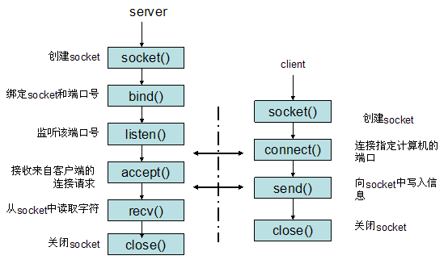
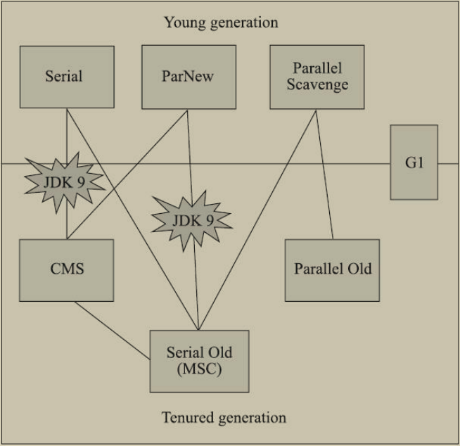

## 操作系统

### 文件描述符fd

文件可以分为普通文件、目录文件、链接文件、设备文件等。Linux规定每一个文件对应一个"索引"，通常是一个非负小整数。

内核维护一个**==文件描述符表格==**(键值对)，存储了每个文件描述符作为索引与一个打开文件的指针相对应的关系。

**实际上关于文件描述符，Linux内核维护了3个数据结构**：

- 进程级的文件描述符表
- 系统级的打开文件描述符表
- 文件系统的`i-node`表

一个进程的PCB中有一个文件描述符表，记录当前进程所有可用的文件描述符，也即当前进程所有打开的文件。

### 进程间的通信方式？

每个进程各自有不同的用户地址空间,任何一个进程的全局变量在另一个进程中都看不到，所以进程之间要交换数据必须通过内核,在内核中开辟一块缓冲区,进程A把数据从用户空间拷到内核缓冲区,进程B再从内核缓冲区把数据读走,内核提供的这种机制称为进程间通信。

通信的本质是进程之间的公共资源，根据==资源的形式和提供者不同==，造成了通信方式的不同。

#### 管道？

* 匿名管道：父进程创建管道(内核缓冲区)，得到两个fd指向管道的两端；父进程fork出子进程，子进程也有两个一样的fd；父进程关闭fd[0]即读端，子进程关闭fd[1]写端，然后父进程写，子进程读。
  * 匿名管道的特点：只允许具有血缘关系进程的通信，随进程的关闭而关闭/消失。

* 有名管道FIFO：以文件的形式存在于文件系统中，提供了一个路径名与之关联。即使与FIFO的创建进程不存在亲缘关系，只要可以访问路径，就能够通过FIFO相互通信。
  * 当使用FIFO的进程退出后，FIFO文件将继续保存在文件系统中以便以后使用。
  * open()以只读方式打开 FIFO 时，要阻塞到某个进程为写而打开此 FIFO。
  * open()以只写方式打开 FIFO 时，要阻塞到某个进程为读而打开此 FIFO。

#### socket？

socket是`打开→读/写→关闭`模式的实现。

1. 服务器根据地址类型（ipv4,ipv6）、socket类型、协议**创建socket**。
2. 服务器为socket绑定ip地址和端口号。
3. 服务器socket**监听端口号请求**，随时准备接收客户端发来的连接，这时候服务器的socket并没有被打开。
4. 客户端**创建socket**。
5. 客户端打开socket，根据服务器ip地址和端口号试图**连接服务器socket**。
6. 服务器socket接收到客户端socket请求，被动打开，开始接收客户端请求，直到客户端返回连接信息。这时候socket进入阻塞状态，所谓阻塞即accept()方法一直到客户端返回连接信息后才返回，开始接收下一个客户端谅解请求。
7. 客户端连接成功，向服务器发送连接状态信息。
8. 服务器accept方法返回，连接成功。
9. 客户端向socket写入信息。
10. 服务器读取信息。
11. 客户端关闭。
12. 服务器端关闭。

socket主要分为流套接字和数据报套接字。流套接字提供的是一个有序、可靠、双向字节流的连接。

### 写时复制copy on write

原理：父进程使用fork创建子进程的时候，子进程与父进程共享内存空间。只有子进程对自己的内存空间进行写入，才分配数据给子进程。

实现原理：fork()之后，kernel把父进程中所有的内存页的权限都设为read-only，然后子进程的地址空间指向父进程。当父子进程都只读内存时，相安无事。当其中某个进程写内存时，CPU硬件检测到内存页是read-only的，于是触发页异常中断（page-fault），陷入kernel的一个中断例程。中断例程中，kernel就会**把触发的异常的页复制一份**，于是父子进程各自持有独立的一份。

优点：COW技术可以减少分配和复制大量资源时带来的瞬间延时，可以减少不必要的资源分配。

## 计算机网络

### Cookie和Session的区别？

**Cookie**：cookie实际上是一小段的文本信息。如果服务器需要记录该用户状态，就向客户端浏览器发送一个cookie，客户端浏览器把cookie保存起来。客户端再次请求网站时，浏览器把请求的网址连同该cookie一同交给服务器，服务器检查cookie来辨认用户状态。

**Session**：客户端访问服务器某个网页的时候，会在服务器端的内存里开辟一块内存，这块内存叫做session，跟浏览器关联在一起，这个浏览器指的是浏览器窗口，意思是，只允许当前这个session对应的浏览器访问。

**Session可以通过cookie(session的id放在cookie中)和url重写(URL后面加入sessionID)来实现**。

结论：两者都是用来跟踪浏览器用户身份的会话方式。

Cookie数据保存在客户端，session的数据保存在服务器端；

cookie只能报关ASCII字符串，而Session能够存储任何的数据类型；

单个cookie在客户端的限制是4K，而session在服务端的大小理论上没有限制；

cookie对客户端是可见的，可以进行cookie欺骗，因此是不安全的，而session在服务器上，对客户端是透明的，不存在敏感信息泄漏的风险；

cookie可以通过设置属性达到长期有效的结果，而session依赖名为JSESSIONID的cookie，默认过期时间为-1，只要窗口关闭，session就会失效，不能达到长期有效的结果。

### 针对Web的攻击技术

从整体上看，HTTP 就是一个通用的单纯协议机制。因此它具备较多优势，但是在安全性方面则呈劣势。

在客户端篡改请求：在 HTTP 请求报文内加载攻击代码，就能发起对 Web 应用的攻击。通过 URL查询字段或表单、HTTP 首部、Cookie 等途径把攻击代码传入，若这时 Web 应用存在安全漏洞，那内部信息就会遭到窃取，或被攻击者拿到管理权限。

#### XSS攻击

XSS即跨站脚本攻击。原理是攻击者在web页面中插入一些恶意的script代码。当用户浏览该页面的时候，**嵌入到web页面中的script代码会执行**，达到恶意攻击用户的目的。

分为一下几类：

* 反射型XSS：攻击者在**url后面的参数中加入恶意攻击代码**。受害者点击恶意url，恶意代码会直接在受害者的主机上的浏览器上运行，窃取受害者的登录信息、cookie等。
* TODO

#### SQL注入攻击

针对Web应用的数据库，**运行非法的SQL**而产生的攻击。

sql被攻击的原因是：sql语句伪造参数，然后对参数进行拼接后形成xss攻击的sql语句。最后会导致数据库被攻击了。

SQL注入攻击产生的影响：非法查看或篡改数据库内的数据；规避认证；执行和数据库服务器业务关联的程序。

------

例：输入密码时输入类似于 'or '123' = '123 ，拼接后的sql语句就是：
**select \* from user where username = '' and password = ' ' or '123' = '123 '**，这样即使密码错误也能判断通过。

比如还有密码比如是这样的：'; drop table user;, 这样的话，那么sql命令就变成了：**select \* from user where username = '' and password = ''; drop table user;'** , 那么这个时候我们会把user表直接删除了。

---

**防范的方法：**

* 我们可以使用预编译语句(PreparedStatement，这样的话即使我们使用sql语句伪造成参数，到了服务端的时候，这个伪造sql语句的参数也只是简单的字符，并不能起到攻击的作用。
*  数据库中密码不应明文存储的，可以对密码使用md5进行加密，为了加大破解成本，所以可以采用加盐的方式。

#### CSRF攻击

CSRF，跨站点请求伪造，简要来说就是通过诱骗用户点击URL，以用户的身份发送合法请求。过程如下：

1. 用户打开浏览器并==登录==被攻击的网站A。登陆后A返回Cookie给浏览器。
2. 用户未退出登录之前，在==同一浏览器中打开一个新的页面==——不安全的网站B。
3. B收到请求后，返回一些攻击性代码，并发出一个请求==要求访问第三方站点A==。
4. 浏览器收到攻击性代码后，根据B的请求，在用户不知情的情况下==携带Cookie向A发出请求==。
5. 由于具有Cookie，A会==根据用户的权限处理请求==，导致来自网站B的恶意代码被执行。

CSRF漏洞检测：最简单的方法就是抓取一个正常请求的数据包，去掉Referer字段后重新提交，如果提交还有效，基本可以确定存在CSRF漏洞。

防御CSRF攻击：

* HTTP头部有一个字段Referer，记录了该HTTP请求的==来源地址==。例如银行网站，进行转账操作时，转账请求的Referer通常是按钮所在页面的地址。如果黑客要对网站实施CSRF攻击，只能在自己的网站构造请求。此时的<u>Referer指向黑客自己的网站</u>。所以只需验证Referer是不是以自己的网站开头的域名即可。
  * 局限：某些旧的浏览器可以篡改Referer。且部分用户可能会禁止Referer，这样访问可能会被拒绝。
* 在请求地址中添加token并验证。==token可以在登录后产生并放在session中==，每次请求时浏览器把token加入，服务器收到请求后拿出token进行比对，相同则接受请求。
  * token难以保证安全。如果使用js遍历dom树，在所有的请求后加token。对于论坛类网站，黑客可以评论发布自己的网站(请求url)，这样也会被加上token。如果url被点击，黑客就能获取到token。即使token不以参数的形式附加，黑客的网站也可以通过Referer得到token。
* 在HTTP头中自定义属性并验证。基于token，把token放到HTTP请求头中自定义的属性里。这样不用担心token会透过referer泄漏到其他网站(局限性非常大)。通过 XMLHttpRequest 这个类，可以一次性给所有该类请求加上 csrftoken 这个 HTTP 头属性，并把 token 值放入其中。
  *  然而这种方法的局限性非常大。XMLHttpRequest 请求通常用于 Ajax 方法中对于页面局部的异步刷新，并非所有的请求都适合用这个类来发起，而且通过该类请求得到的页面不能被浏览器所记录下，从而进行前进，后退，刷新，收藏等操作，给用户带来不便。另外，对于没有进行 CSRF 防护的遗留系统来说，要采用这种方法来进行防护，要把所有请求都改为 XMLHttpRequest 请求，这样几乎是要重写整个网站，这代价无疑是不能接受的。

### 如何保证Cookie的安全

1. 设置Cookie的HttpOnly属性为true，不允许嵌在网页中的js脚本去读取用户的cookie。
2. 设置cookie的secure属性为true，使得cookie只能在https的协议下装载到请求数据包中，在http协议下不会发送给服务端，防止被抓包。
3. 设置cookie的samesite属性为strict或lax，限制第三方cookie，从而防御CSRF攻击。
4. 设置cookie的expire，让cookie及时过期。

### 访问的网站是如何自动切换到HTTPS的

第一次访问时，服务端返回的响应会附带一个响应头`Strict-Transport-Security`，告诉浏览器，该站点只能通过HTTPS访问。浏览器会将所有尝试使用HTTP访问站点的尝试转换为HTTPS请求。

属性：`max-age=31536000; includeSubDomains`，标识所有现在和将来的子域名都是HTTPS，最大年龄为1年。这会阻止访问只能通过HTTP提供服务的页面子域。

### TCP为什么是三次握手

* 假设A、B双方欲建立TCP连接。
  * 首先，由操作系统随机选取一个32位序列号，假设A的初始序列号为1000，接着对所要发送的数据进行编号，1001,1002,1003...
  * A会把初始序列号ISN告诉给B，让B知道，什么样的编号数据是合法的，什么样的编号数据是非法的，比如接收到一个编号999的数据，那就是非法的。
  * B也会对A每一个编号数据进行确认，如果收到编号为2001，1001-2000说明有1000个字节已经安全到达。
  * 同理，B也会进行类似的操作。

==**TCP协议握手的本质是通信双方数据原点的序列号，从而实现可靠性**==。a→b、b→a本来是四次，中间的两个过程合在一起就成了三次，效率更高。

### TCP滑动窗口

“窗口”对应的是一段可以被发送的字节序列，其连续的范围称为窗口；“滑动”则是指这段“允许发送的范围”是可以随着发送的过程而变化的，方式就是按顺序“滑动”。

* 发送窗口相关的四个概念：已发送并**收到确认**的数据（不在发送窗口和发送缓冲区之内）；已发送但**未收到确认**的数据（位于发送窗口之中）；**允许发送**但尚未发送的数据；发送窗口外**发送缓冲区内**暂时不需要发送的数据。

* 每次成功发送数据之后，发送窗口就会在发送缓冲区中按顺序移动，将新的数据包含到窗口中准备发送。
* 只有当发送方成功发送了数据，并且需要得到接收方的确认（ACK）之后，才会移动滑动窗口离开已发送的数据；同时接收方则**==确认连续的数据分组（只有这样窗口才能移动）==**，对于乱序的分组则先接受下来，避免网络重复传递。

#### 流量控制

TCP使用滑动窗口来实现流量控制机制：接收窗口通过返回的ACK，其中会包含自己的接受窗口的大小，并且利用大小来控制发送方的数据发送。

### DNS解析错误分析

使用ping和host、dig查询dns。

Dig是一个类Unix命令行模式下查询DNS包括NS记录，A记录，MX记录等相关信息的工具。

dig使用方法：continue。。。

### WebSocket和HTTP的区别

`HTTP`是单向的，**客户端发送请求，服务器发送响应**。举例来说，当客户端向服务器发送请求时，该请求以`HTTP`或`HTTPS`的形式发送，在接收到请求后，服务器会将响应发送给客户端。每个请求都与一个对应的响应相关联。

`WebSocket`是双向的，在客户端-服务器通信的场景中使用的全双工协议，与`HTTP`不同，它以`ws://`或`wss://`开头。它是一个有状态协议，这意味着客户端和服务器之间的连接将保持活动状态，直到被任何一方（客户端或服务器）终止。

### 服务器端为什么有大量的time_wait状态

原因：http连接中没有规定connection的属性为keep-alive，导致连接关闭的请求是==由服务器端发起的==，在高并发的情况下，服务器端就会维持大量处于time_wait状态的连接。导致端口被占用完，无法再接受TCP连接。

解决方法：客户端设置HTTP为长连接，这样time_wait状态由客户端保持；服务端设置socket在time_wait状态的时候可以被复用。

### TCP连接为什么出现大量close_wait

服务器端(被动关闭端)，在收到客户端的请求后，没有及时关闭socket，状态就不能由close_wait迁移到last_ack。同样会导致端口被占用完，无法再接受TCP连接。

原因：服务端的接口处理耗时过长，客户端直接==断开了连接==，此时服务器就处于close_wait的状态；或者是服务器端处理完请求未及时关闭连接。

解决：服务端处理完请求后要及时关闭连接；优化代码。

## MySQL

### 索引失效的情况

* 违反最左前缀原则：查询没有从最左前列开始或者跳过了中间的列。
* 在索引列上做操作：使用函数、计算等。
* 范围查询右边的全部失效。
* 使用不等号。
* like以通配符%开头。
* 字符串不加单引号。
* or连接(全部失效)。
* 进行了是否为空的判断：is null
* Order By的情况：
  * 无过滤条件(无where和limit)的order by必然会出现Using filesort(效率低下)。
  * 过滤条件中的字段和order by后跟的字段的顺序不一致，必然会出现Using filesort。
  * 不用where直接上手order by无法使用索引，但是group by可以使用到。

### MyISAM和InnoDB的区别？InnoDB的行锁什么时候升级为表锁？

- MyISAM只支持表锁，InnoDB还支持行锁。
- MyISAM不支持事务，InnoDB支持。
- MyISAM不支持外键，InnoDB支持。
- MyISAM不支持数据库异常崩溃后的安全恢复，InnoDB支持。

> InnoDB使用redo log(重做日志)保证事务的持久性，使用undo log(回滚日志)保证事务的原子性。

* MyISAM不支持MVCC，InnoDB支持。

InnoDB中，如果发生索引失效，行锁就会变成表锁**(记过的都能答不出来啊？)**。

### MySQL中事务的实现(保证)

* **原子性**的实现：在异常发生时，需要对已经执行的操作进行回滚。使用**undo log**来实现原子性。
* **持久性**的实现：如果数据被写入到数据库中，那么数据一定能被安全存储在磁盘上。事务提交后即使宕机，下次重启也能对已经提交但未来得及写的事务进行恢复。使用**redo log**来实现事务的持久性。
* **隔离性**的实现：当多个事务同时并发执行时，事务的隔离性可能就会被违反。使用SQL标准中定义的事务隔离级别来解决隔离性。
  * 读锁和写锁。
  * 时间戳：为每一条记录保留两个字段；**读时间戳**中包括了所有访问该记录的事务中的最大时间戳，**写时间戳**中保留了将记录改到当前值的事务的时间戳。使用时间戳实现事务的隔离性时，一般都会使用乐观锁(先对数据进行修改，写回去卡时判断当前值是否改变，未改变才进行修改)。
  * **MVCC**。
* **一致性**的实现：如果一个事务原子地在一个一致地数据库中独立运行，那么在它执行之后，数据库的状态一定是一致的。

### 索引为什么不用b树用b+树？

* b+树范围查询效率更高
* b+树在非叶子节点仅仅存放指针而不是数据(指针+数据更加占用空间)，因此b树存储会有更高的高度。

### SQL加锁(where的条件)

* 聚簇索引：对索引加x锁
* 唯一索引：需要加两个锁，一个对应唯一索引上的记录，一个对应聚簇索引(一级索引)上的记录。

### 分库分表

数据库的瓶颈：

* IO瓶颈：磁盘IO(查询数据库的次数过多)，网络IO(请求的次数过多)。
* CPU瓶颈：SQL问题，单表数据量过大。

分库：

* **水平分库**：将一个库中的数据拆分到数个库中，相当于对所有表水平拆分的同时分库。
  * 系统绝对并发量上来了，分表难以根本上解决问题，并且还没有明显的业务归属来垂直分库。
* **垂直分库**：将一个库中的==不同表==按照一定的规则分到不同库中，表中数据不拆分。
  * 系统绝对并发量上来了，并且可以抽象出单独的业务模块。

分表：

* **水平分表**：根据一定的规则(主键hash等)，把一个表拆成数个表，每个表的数据没有交集，并集等于原表。
  * 系统绝对并发量并没有上来，只是单表的数据量太多，影响了SQL效率。
* **垂直分表**：把表中的数据进行属性拆分，变成多个不同的表。
  * 表的字段多，并且热点数据和非热点数据在一起，单行数据所需的存储空间较大。这时可以垂直分表。

---

## Redis

### redis中的渐进式rehash

redis中的hash同时保存了两个哈希表：原表和新表，新表在触发rehash之前==处于null的状态==，只有开始rehash后，才会为他分配空间。rehash完成后，会把原表销毁，并创建一个null的新新表。

与hashmap相同，redis使用链地址法来解决键冲突，并且为了速度考虑，使用的头插法。

扩容(size/length过大)：扩大为大于原来size*2的第一个2^n^。

缩容(size/length<0.1)：变为大于size的第一个2^n^。

分配完新的hash表后，需要进行迁移，原来表上的元素要全部进行一次rehash。

**==渐进式rehash==**: rehash的动作不是一次性的、集中式地完成地，而是分多次、渐进式地完成的。

原因：如果保存的键值对数量太多，服务器如果一次性对这些键值对全部进行rehash，可能会在一小段时间内停止服务。

步骤：

1. 为新表`ht[1]`分配空间，让字典同时持有两个哈希表。
2. 在字典中维持一个索引计数器变量rehashidx，设置为0，表示rehash开始。
3. 在rehash过程中，每次进行增删改查操作，程序还会将原表在rehashidx索引上的所有键值对rehash，当前索引上的全部完成后，将 idx + 1。
4. 完成rehash后，程序将idx设置为-1，表示已完成。

渐进式rehash期间，字典的删除、查找、更新操作==会在两个哈希表上进行==。查找会现在原表查询，如果没查到，再去新表查询。==而新增键值对，只会在新表进行，确保原表中的元素只减不增==。

### redis哨兵机制

检测下线：哨兵节点监控主节点和从节点，某个哨兵发现主节点下线会联系其他哨兵，来获得其他哨兵对master的检测结果，如果有半数以上的哨兵认为主节点已经下线，主节点就会被标记为客观下线。

选举：哨兵的选举采用的是raft算法，将系统中的角色分为领导者、跟随着、候选者。

Leader：接受客户端请求，并向Follower同步请求日志，当日志同步到大多数节点上后告诉Follower提交日志。

Follower：接受并持久化Leader同步的日志，在Leader告知日志可以提交之后，提交日志。

Candidate ：Leader选举过程中的临时角色。

Term(任期)：为了识别过期事件，raft引入了term任期的概念。Raft将时间划分成任意不同长度的任期。使用连续的数字进行表示，**<u>每一个任期的开始都是一次选举</u>**，候选人会试图称为领导人。如果一个候选人赢得了选举，会在当前任期的剩余时间担任领导人；如果没有选出领导人，会开始另一个任期和新的选举。<u>Raft保证给定的一个任期内最多有一个是领导人</u>。

RPC ：Raft算法中服务器节点之间通信使用RPC。需要三种RPC ：

* RequestVote RPC用于候选人请求投票。
* AppendEntries RPC为领导人发起的一种心跳机制，复制日志也在该命令中完成。
* InstallSnapShot RPC为领导人用于发送快照给太落后的追随者。

##### redis选举流程

使用了类似于Raft算法term(任期)的概念称为epoch(纪元)，用来给时间增加版本号。主要有两种：

* currentEpoch：当集群的状态发生改变，某个节点为了执行一些动作需要寻求其他节点的统一时，就会增加currentEpoch的值。
* configEpoch：这是一个集群节点配置相关的概念，每个集群节点都有自己独一无二的configEpoch，所谓的节点配置，实际上是指节点所负责的槽位信息。每一个master在向其他节点发送包时，都会附带其configEpoch信息，以及一份表示它负责的slots信息。

Sentinel认定主节点客观下线后，会先查看自己有没有投过票，如果自己已经投过票了，在2倍的故障转移时间内自己不会成为Leader，相当于是一个Follower。

如果没有投过票，这个sentinel会成为candidate，需要做以下几件事：

* 更新故障转移状态为start。
* 当前epoch+1，等于进入一个新的任期。
* 更新自己的超时时间为当前时间随机加上一段时间，随机时间为1s内的随机毫秒数。
* 向其他节点发送is-master-down-by-addr命令请求投票，命令会带上自己的epoch。
* 给自己投一票😅。

其他sentinel收到投票命令后，如果当前sentinel的epoch和candidate传给他的跑epoch一样，说明它已经把票投给了candidate。

candidate会不断统计自己的票数，直到发现自己的票数超过自己配置的quorum的一半，就能成为Leader。否则在选举时间内没有获得足够的票数，那么等待2倍故障转移的超时时间后，candidate增加epoch重新投票。

与Raft不同，Leader不会把自己成为Leader的消息发送给其他Sentinel，其他Sentinel等待Leader从slave选出master后，检测到新的master正常工作后，就会去掉客观下线的标识，从而不需要进入故障转移流程。

主节点选举：新的Leader进行主节点的选举。选择健康状态的从节点，并选择最高优先级中复制偏移量最大(数据最接近主节点)的从机。如果不止一个，就选择ID最小的从节点作为新的主节点。

故障转移：Leader选举合适的从机，执行`slave of no one`，并更新应用程序段的链接到新的主节点，使其他的从节点的master为新选的节点，最后修复原来的master并将其设置为新的master的从机。

---

## Java

### JVM垃圾回收器

GCRoots一般包括：虚拟机栈中引用的对象(局部变量表)；本地方法引用的对象；方法区中静态属性引用的对象；方法区中常量引用的对象；被同步锁synchronized持有的对象等。

#### 记忆集与卡表

为了解决**对象跨代引用带来的问题**，垃圾收集器在新生代中建立了名为记忆集的数据结构。用以**避免把整个老年代加进GCRoots扫描范围**。

**记忆集**：一种用于<u>**==从非收集区域==指向收集区域的指针集合**</u>的抽象数据结构。最简单的实现可以用非收集区域中所有含跨代引用的**对象数组**来实现这个数据结构。

收集器**只需要判断非收集区域是否存在指向收集区域的指针**。因此记忆集可以选择更为粗犷的记录粒度来节省记忆集的存储和维护成本。

* 字长精度：每个记录精确到一个机器长，包含跨代指针。

* 对象精度：每个记录精确到一个对象，该对象里有字段含有跨代指针。

* 卡精度：每个记录精确到一块**内存区域，该区域内含有跨代指针**。

**卡表**：实现记忆集的一种方式，使用卡精度来实现。最简单的形式可以只是一个字节数组，数组的每一个元素都对应着其<u>标识的内存区域中一块特定大小的内存块</u>，内存块称为**卡页**。

卡页大小一般都是2的n次幂的字节数。一个卡页的内存通常包含不止一个对象，只要卡页内有对象存在跨代指针，那就将相应卡表的数组元素的值标识为1，没有则标识为0。**垃圾收集发生时，只要筛选出卡表中变脏的元素**，就能轻易得出哪些内存块中包含跨代指针，把它们加入GCRoots中一并扫描。**==G1收集器中的一个region通常是由多个卡页组成，每个卡页都对应一个卡表中的元素==**。

**维护卡表**——**写屏障**：可以看作在虚拟机层面对**引用字段赋值**这个动作的**==AOP切面==**，在引用对象赋值时会产生一个环形通知(更新卡表)。

写屏障的==并发性问题==：现代中央处理器的缓存系统中是以缓存行(Cache Line)为单位存储的。多线程修改互相**独立**的变量时，如果这些变量恰好共享**同一个缓存行**，就会彼此影响(同步等问题)而导致性能降低。==解决方式==：不采用无条件的写屏障，先检查卡表标记，只有当卡表元素未被标记过才将其标记变脏。

#### 可达性分析

可达性分析算法理论上要求全过程都基于一个能保障一致性的快照中才能够进行分析， 这意味着必须全程冻结用户线程的运行。

三色标记：

* 白色：表示对象尚未被垃圾收集器访问过。显然在可达性分析刚刚开始的阶段，所有的对象都是 白色的，若在分析结束的阶段，==仍然是白色的对象，即代表不可达==。 

* 黑色：表示对象已经被垃圾收集器访问过，且这个对象的==所有引用都已经扫描过==。黑色的对象代表已经扫描过，它是安全存活的，如果有其他对象引用指向了黑色对象，无须重新扫描一遍。 

* 灰色：表示对象已经被垃圾收集器访问过，但这个对象上至少存在一个引用还没有被扫描过。 

问题：当且仅当以下两个条件同时满足时，会产生“对象消失”的问题，即原本应该是黑色的对象被误标为白色： 

* 赋值器插入了一条或多条从黑色对象到白色对象的新引用； 
  * 解决(增量更新，如CMS)：记录这个插入，等扫描完后，再将这些记录过的引用关系中的**==黑色对象为根，重新扫描==**。

* 赋值器删除了全部从灰色对象到该白色对象的直接或间接引用。
  * 解决(原始快照，如G1)：记录这个删除，等扫描完后，再将这些记录过的引用关系中的**==灰色对象为根，重新扫描==**。
  * G1的原始快照：G1为每一个Region设计了两个名为TAMS（Top at Mark Start）的指针，把Region中的一部分空间划分出来用于并发回收过程中的新对象分配，并发回收时新分配的对象地址都必须要在这两个指针位置以上。G1收集器默认在这个地址以上的对象是被隐式标记过的，即默认它们是存活的，不纳入回收范围。

#### Serial收集器

最基础的收集器。**新生代采取复制算法，老年代采取标记—整理算法**。每一次的GC都要暂停用户线程，即STW。

#### ParNew收集器

实质上是Serial收集器的多线程并行版本(**新生代的收集支持多线程并行收集**)。但是仍然需要STW，算法也和Serial相同。

#### Parallel Scavenge收集器

基于标记-**复制**算法实现的收集器，而且能够多个线程进行并行的回收。特性与ParNew非常相似。不同的点在于它的关注点不在于缩短用户线程的停顿时间，而在于达到一个可控制的吞吐量。

提供了两个参数：允许的最大垃圾收集停顿时间MaxGCPauseMills和直接设置的吞吐量大小GCTimeRatio。自身也支持自适应的一个调节。

#### Serial Old收集器

Serial收集器的老年代版本。

#### Parallel Old收集器

Parallel Scavenge收集器的老年代版本，支持多线程并发收集，并且基于标记-整理算法来实现。

#### CMS收集器

Concurrent-Mark-Sweep，hotspot第一款真正意义上的并发收集器。

关注点是==尽可能缩短垃圾收集时用户线程的停顿时间==。

采用标记-清除算法，并且也会有stw。

工作原理：

1. 进行垃圾回收时，首先会进行**初始标记**(仅仅标记GCRoots能直接关联到的对象)，这个阶段会有STW，这一阶段的速度非常快；
2. 第二阶段是**并发标记**(Concurrent-Mark)阶段，从前一阶段标记出的直接关联对象开始==遍历整个对象图==，这个过程耗时较长但是不需要停顿用户线程，可以和垃圾收集线程一起并发运行；
3. 第三阶段是**重新标记**阶段，为了==修正并发标记期间，因为用户线程继续运作而导致标记产生变动的那一部分对象的标记记录==，需要STW且停顿时间通常比初始标记阶段稍微长一些；
4. 最后一阶段，**并发清除**，清理掉标记阶段的已经死亡的对象，释放内存空间。这个阶段可以与用户线程同时并发。

优点：并发收集、低延迟

缺点：会产生内部碎片；对CPU资源非常敏感(并发阶段占用一部分线程导致应用程序变慢)；无法处理浮动垃圾(并发标记阶段新产生的垃圾)。

#### G1收集器(分区算法)

G1回收器：区域分代化

官方给G1设定的目标是在延迟可控的情况下**获取尽可能高的吞吐量**，所以才担当起“全功能收集器”的重任与期望。

G1是一个并行回收器，把堆内存分为很多不相关的区域**Region**。使用不同的Region来表示Eden、S0、S1、老年代等。G1==有计划地避免在整个Java堆中进行全区域地垃圾收集==。G1跟踪各个Region里面垃圾堆积的价值大小，在后台维护一个优先列表，每次根据允许的收集时间，==**优先回收价值最大Region**==。从整体上看，G1使用标记整理算法，在局部上又是基于标记-复制算法实现。因此G1不会产生内存空间碎片。

Region中还有一类特殊的Humongous区域用于存储**大对象**(大小超过了一个Region容量一半的对象)。G1中的大多数行为都把Humongous作为老年代的一部分来看待。

为了解决跨Region引用的问题，每个Region维护自己的记忆集，这些记忆集会**==记录别的Region(不同代)指向自己的指针==**，并标记指针分别在哪些卡页的范围之内。想要回收当前Region的时候，就可以在GC根节点的枚举范围内加入记忆集，就可以保证不进行全局扫描，也不会有遗漏。

空间整合：G1将内存划分为一个个的region。内存的回收是以region为基本单位的。**Region之间是复制算法**。整体上可以看成是标记-压缩算法。G1为每个Region设计了两个名为TAMS的指针，把region中的一部分空间划分出来用于并发回收过程中的**新对象分配**，并发回收时新分配的对象地址都必须要在这两个指针位置以上。这些对象不会纳入回收的范围。

大致回收过程：

1. 初始标记：仅仅标记GCRoots**直接关联到的对象**，并修改TAMS。这个过程需要STW但是很短。
2. 并发标记：从GCRoots开始对堆中对象进行**可达性分析**，找出所有要回收的对象，这个过程可与用户程序并发执行，当对象图扫描完成以后，还要处理SATB记录下的在并发时有引用变动的对象。
3. 最终标记：对用户线程做另一个暂停(STW)，处理上一阶段**遗留下来的最后少量**SATB记录。
4. 筛选回收：更新Region的统计数据，对各个Region的回收价值和成本进行排序，根据用户期望的停顿时间来指定回收计划，可以选择任意多个Region构成回收集，然后把决定回收的那一部分Region的**存活对象复制到空的Region**中，在清理掉整个旧Region。**==需要STW，由多条收集器线程并行完成==**。

**具体过程**：年轻代GC→年轻代GC+并发标记→混合(新生+老年)回收

> **一、年轻代GC** 

当**Eden**空间耗尽，G1会启动一次年轻代垃圾回收过程。

G1首先停止程序(**STW**)，创建**回收集**(需要被回收的内存分段的集合)。

然后开始如下回收过程：

* 扫描根(连同记忆集)

* 更新RSet，确保RSet可以准确反映老年代对内存分段中对象的引用

* 处理RSet，识别被老年代对象指向的Eden中的对象(被认为是存活对象)

* 复制对象(遍历对象树，把认为存活的对象复制到S区，如果S区内存不够，部分数据会直接晋升到老年代空间)

* 处理引用

> **二、并发标记过程(老年代)** 

* 初始标记(标记直达对象，**STW**)
* 根区域扫描(扫描S区直达的老年代对象并标记被引用的对象，这一过程必须在young GC之前完成)
* 并发标记
* 再次标记(修正)
* 独占清理：计算各个区域的存活对象和GC回收比例，并进行排序(**STW**)，不会做实际上的垃圾收集。
* 并发清理(识别并清理完全空闲的区域)

> **三、混合回收** 

越来越多的对象晋升到老年代old region时，为了避免堆内存被耗尽，虚拟机会触发一个混合的垃圾收集器Mixed GC。

Mixed GC主要是将Young Region中Eden里==存活下来的对象==移动到S区，进行S0↔S1的移动，以及S进入Old Region。并清理被移动的对象所在的区。

Mixed GC除了回收整个Young Region，还会回收**一部分**Old Region。

> **四、可选的过程：Full GC** 

G1的初衷就是要避免FULL GC的出现。如果上述不能正常工作，G1会STW并单线程进行Full GC，性能非常差，应用停顿的时间很长。

## Linux

查看进程：`ps`(process state)。 

查看所有监听的端口：`netstat -nap | grep 1095` 配合grep来使用。

查看系统调用：`strace`(systemcall trace)。

`fork()`：创建一个子进程，作为一个函数被调用，会有两次返回：将子进程的PID返回给父进程，0返回给子进程。这里的子进程和父进程执行的任务也是完全一样的。

`exec()`：装载一个新的程序**覆盖**当前进程内存空间中的映像，从而执行不同的任务。

## 海量数据处理

### 分治/hash/排序

根据hash把大文件==映射成多个小文件==(取模映射，不会出现相同的数据在不同的文件，但是各个文件的大小不一定相同)。对每个小文件使用常规的==hashmap进行频率统计==。然后进行==排序==得到出现次数最多的数据。

### 1.大文件，内存有限

一般使用分治策略，把一个大文件分为许多的小文件，每一个小文件能够在内存中计算。

根据文件中的每条数据，取hash即可。

### 2.大量数统计是否出现/重复

使用bitmap，占用内存小，也能够计算。如果是计算是否重复，可以使用两位bit表示一个数的状态(00/01/10)。
