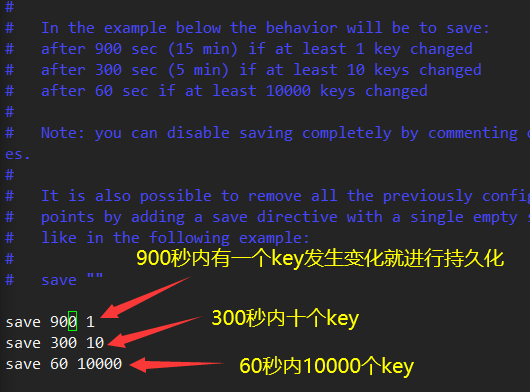

## NoSQL

NoSQL指的是Not Only SQL，泛指**非关系型数据库**。

去掉了关系型数据库的关系型应用。==数据之间没有关系，这样就非常容易扩展==。

NoSQL数据库都具有非常高的读写性能，尤其在大数据量下，表现优秀。能够进行缓存或者减少服务器的压力。

NoSQL使用键值对进行存储。

**NoSQL不适用的场景**：需要事务支持的场景、基于sql的结构化查询存储，处理复杂的关系，需要即席查询的场景。


### 典型的NoSQL

1. Memcache：很早出现的NoSQL数据库。不支持持久化，且支持的类型单一，一般作为缓存数据库辅助持久化的数据库。
2. redis：几乎覆盖了Memcache的绝大部分功能，支持持久化，支持多种数据结构，一般作为缓存数据库辅助持久化的数据库。
3. MongoDB：高性能、开源、模式自由的文档数据库。数据都在内存中。虽然是KV模式，但是对value提供了过丰富的查询功能。支持二进制数据库及大型对象。可以根据数据的特点替代RDBMS。


## redis启动与关闭

端口：6379

后台启动：`redis-server redis.conf所在的路径` 

进入redis：`redis-cli` 

redis关闭：`redis-cli shutdown` 


## Redis

redis默认使用16个库中的0号库。

redis是单线程+多路IO复用(类似于NIO)。


### 针对键的操作

```sql
#设置key
set key value

#查看所有key
keys *

#查看key是否存在
exists key

#删除key
del key
unlink key#异步

#设置key过期时间
expire key

#查看key还有多少秒过期
ttl key

#切换0库
select 0

#查看当前库key数量
dbsize 0

#清空当前库
flushdb 0

#清空全部库
flushall
```


### 基本数据类型

#### 字符串

二进制安全，一个字符串中**==最大存储value是512M==**。

```sql
#追加,返回追加后长度
append k1 xxx

#得到长度
strlen k1

#只有不存在时才能设置(不替换的设置)
setnx k1 xxx

#数字自增/自减,不加by默认增或减1
incr/decr(by) 2/3

#设置多个
mset k1 v1 k2 v2 k3 v3
mget k1 k2 k3
msetnx k1 v1 k2 v2 k3 v3

#substring包含两边
getrange k1 1 5
setrange k1 2 wsnd

#设置的同时设置过期时间
setex k1 60 v1

#取旧值的同时换成新值
getset k1 v1
```


#### 列表List

```sql
#左右插入
lpush/rpush k1 v1 v2 v3

#查(范围),0 -1表示所有值 
lrange k1 1 2

#左右出栈,键在值在，值空键无
lpop/rpop k1
lpoprpush k1 k2#组合使用,取出k1放入k2

#按照索引下标获得
lindex k1 2

#获得列表长度
llen k1

#在xxx前插入xx
linsert k1 before "xxx" "xx"

#从左删除多个value
lrem k2 2 "xxx"

#下标为index的值替换
lset k1 5 v
```


#### Set

底层是一个hash表，添加、删除、查找的操作都是O(1)。

```sql
sadd k1 v1 v2 v3
smembers k1
......
```


#### hash

redis的hash是一个string类型的field和value的映射表，特别适合用于存储对象。类似Java里面的Map<String,Object>。值是value和field的映射关系其中field和value类似于Object里的属性名和属性值。


#### zset

没有重复元素的字符串有序集合。

```sql
zadd topn 200 java 300 golang 400 c#


```


#### ？redis6其他的新数据

**Bitmaps** 

主要针对活跃用户量进行存储，节约空间。

* Bitmaps本身不是一种数据类型，实际上就是字符串，但是他可以对字符串的**位进行操作**。
* 可以把Bitmaps想象成一个以位为单位的数组，数组的每个单元**只能存储0和1**，数组的下标在Bitmaps中叫做偏移量。

**HyperLogLog ** 

用来做==基数统计==的算法，优点是在输入的元素的数量或者体积非常大时，计算基数所需的空间总是固定并且很小的。

自动去重，并支持计数和合并。

**Geospatial** 

**元素的二维坐标**。针对经纬度和地理位置的操作。


### 案例

验证码失效：生成的验证码可以放到redis中，设置过期时间120秒。

判断验证码是否一致：从redis获取验证码和输入的验证码进行比较。

每个手机每天只能发送三次：incr操作，每次发送后+1，大于2后不能发送。

---


## redis的发布订阅

一种消息通信的方式，发布者发送消息，订阅者接收消息。发布者可能有多个频道，订阅者能订阅若干个频道。只有发布者在订阅者订阅的频道上发布消息，订阅者才能拿到消息。

redis客户端可以订阅任意数量的频道。

```sql
#一个客户端订阅
SUBSCRIBE channel1

#另一个客户端发布
publish channel1 hello
```


## redis中的事务

redis的事务是一个单独的隔离操作：事务中的所有命令都会被**序列化、按顺序**的执行。事务在执行的过程中，不会被其他客户端发来的命令请求所打断。

事务的主要作用是串联多个操作**==防止其他命令插队==**。


事务操作的三个基本命令：

* multi：表示开启事务，把命令放入到队列中。类似于mysql中的**开启事务**。
* exec：执行命令，输入此命令，队列中的命令才会真正执行。类似于mysql中的**提交事务**。
* discard：放弃组队。**命令不执行**。

事务的<u>错误处理</u>：如果在**组队**过程中有某条命令出现错误，那么**整个队伍都不会执行**。如果在命令**执行**的过程中有某条命令出现了错误，那么整个队列只有**出现错误的命令不会被执行**。


### 事务的三特性

* 单独的隔离操作：事务中的命令都会序列化，按顺序执行。事务执行过程中，不会被其他客户端发送来的命令请求打断。
* 没有隔离级别的概念：队列中的命令==没有提交之前都不会被实际执行==，因为事务提交前任何指令都不会被实际执行。
* 不保证原子性：事务中如果有一条命令执行失败，其后的命令仍然会被执行，==没有回滚==。


### 事务冲突

eg：一共￥10000，一共三个命令同时发生(-1000，-3000，-8000)。但是10000不够，此时就发生了事务冲突。

解决方式：乐观锁和悲观锁。

* 悲观锁：给事务和事务操作的对象加锁，事务结束后释放锁。
* 乐观锁：不进行加锁，每次更新数据要把数据当前的版本号和自己最开始拿到数据的版本号进行对比，如果版本号不一致就不进行修改。==**redis就是利用这种机制实现事务的**==。

**redis使用乐观锁**：`WATCH key` 对某一个数据进行监视，此时对该数据的操作就开启了乐观锁。`UNWATCH`能够取消所有key的监视。如果EXEC或DISCARD先被执行了，该指令就不用执行了。 


### 案例：秒杀

1. 用户id和商品id的非空判断
2. 连接redis
3. 拼接key
   1. 库存key
   2. 秒杀成功用户key
4. 获取库存，如果等于空(redis中没有记录)表示秒杀还没有开始。
5. 判断用户是否重复秒杀(set中取用户成功秒杀的id)
6. 判断商品数量，如果等于0了表示商品被抢光了
7. 秒杀过程
   1. 库存减1
   2. 秒杀成功用户的添加

超时连接问题解决：使用jedis连接池(单例)。

超卖问题解决：使用watch和事务。

库存遗留问题：CAS失败的用户不会继续秒杀。解决：使用LUA脚本。


## Redis持久化

两种方式：RDB和AOF

### RDB

在指定的==时间间隔==内将内存中的数据集快照写入磁盘，也就是快照，它恢复时是将快照文件==直接读到内存==里。



如果300秒内超过十个key被更新，RDB方式会先把前10个key进行持久化。然后重新计数。


持久化：save表示手动持久化，其他线程会阻塞，不建议。bgsave表示自动持久化，会在后台异步操作，快照的同时还能响应其他客户端请求。


**==备份是如何进行的==**：redis单独创建一个子进程来进行持久化，先将数据写入到一个临时文件中，等持久化过程结束，在用这个临时文件替换上次持久化好的文件。整个过程中，主进程不进行任何IO操作，确保了高性能。

RDB在最后一次持久化的过程中可能会造成数据丢失：如果redis突然挂掉，这部分不会被持久化。

**RDB的恢复与备份** 

`dump.rdb`备份文件`dump.rdb.bak`。如果`dump.rdb`突然丢失，把备份的文件改一下名，放到原来的位置。开启redis，数据会自动进行加载。

**RDB的优点**：适合大规模的数据恢复；对数据完整性和一致性要求不高更适合使用；节省磁盘空间；恢复速度快。

**RDB的劣势**：内存中的数据被克隆了一份，需要消耗空间，数据庞大时还是比较消耗性能。最后一次快照后的所有修改可能会在redis意外down掉的时候丢失。


### AOF(Append Only File)

**AOF不记录读操作**。以日志的形式来记录每个写操作，将redis执行过的所有写指令记录下来，只允许追加文件但不可以修改文件。redis在启动的时候就会读取该文件然后重新构建数据。


AOF默认是不开启的(默认使用RDB)。如果RDB和AOF同时开启，系统默认使用AOF。

配置的位置`appendonly no` 改成yes表示开启AOF。


AOF的**备份恢复**：同RDB。

AOF的**异常恢复**：AOF读取的文件出现了错误，整个redis就无法启动。此时可以通过`/usr/local/bin/redis-check-aof--fix appendonly.aof`进行恢复。


**AOF的同步频率设置(redis.conf)** 

`appendfsync always/everysec/no` 每次写入都立刻计入/每秒同步/redis不主动同步，把同步时机交给操作系统


**Rewrite压缩** 

AOF采用文件追加方式，文件会越来越大。当AOF文件的大小超过所设定的阈值时，redis就会启动AOF文件的内容压缩。

重写会使用一个fork子进程，默认配置是文件大小大于64M+64M*100% = 128M时，redis会对AOF进行重写。同样是现在一个临时文件中重写，写完之后进行替换。


AOF的优点：备份机制更稳健，丢失数据的概率更低。可以处理误操作。

AOF的缺点：比RDB更占用磁盘(不止有数据还有操作)。备份恢复慢。


---


## redis的主从复制

主机数据更新后根据配置和策略，自动同步到备机的机制，主机以写为主，从机以读为主。一般一台主机配置多个从机。

功能：

* 读写分离：主机写从机读。
* 容灾快速恢复：一台从机挂了可以及时切换到其他从机进行读操作。


**步骤(一主两从)**：

1. 创建/myredis文件夹。

2. 复制redis.conf配置文件到文件夹中。

3. 配置一主两从，创建三个配置文件。

   1. 需要使用三个不同的端口号，比如6379，6380，6381。
   2. `redis6379.conf，redis6380.conf，redis6381.conf`。

4. 三个配置文件中写入内容

   1. ```sql
      include /myredis/redis.conf
      pidfile /var/run/redis_6379.pid
      port 6379
      dbfilename dumb6379.rdb
      ```

5. 从机上执行`slaveof 主机ip 主机端口号`实现主从。


**主从复制的特点** 

1. 从服务器重启后，就不是从服务器了，需要重新执行指令连接。
2. 从服务器可以获取主服务器所有的数据，哪怕是在自己没有连接时添加的数据。
3. 连接过程中主服务器挂掉了，从服务器也不会反客为主，依然是从服务器，但是他知道主服务器已经挂掉了。主服务器重启后依然是主服务器。


**主从复制的原理** 

1. 从服务器连接上主服务器之后，从服务器向主服务器发送进行数据同步的消息`一个sync命令`。
2. 主服务器接到从服务器发送过来的同步消息后，把自己的数据进行持久化成rdb文件，把rdb文件发送给从服务器。从服务器进行读取(全量复制)。
3. 每次主服务器进行写操作后，和从服务器进行数据同步(增量复制)。


**两种同步方式** 

* **薪火相传**：主服务器和一个从服务器同步，然后这个从服务器在和自己的从服务器同步。这样有一个缺点，如果一个从服务器挂了，后续的从服务器就不能被同步到。
  * 使用`slaveof xx(从机)`实现

* **反客为主**：主机宕机了，对从机使用`slaveof no one`，自己就能升级变成主机，其后面的slave不需要做任何修改。
* **==PLUS==** **哨兵模式**：反客为主的自动版，能够后台监控主机是否故障，如果主机故障了根据**投票数**自动将某个从库转换为主库。此时主库会把新的主库视为自己的主库，自己变成从库。
  * 选举的规则：
    * 1.选择优先级高的(可根据conf中的`slave(replica)-priority xx`来配置)。
    * 2.选择偏移量大的(和主机同步率高的)。
    * 3.选择runid(redis启动时随机生成的)最小的。


**哨兵模式**配置步骤：

1. 在自定义的/myredis目录下新建`sentinel.conf`文件，这里名字不能错。
2. 在创建的`sentinel.conf`里写入`sentinel monitor mymaster 127.0.0.1 6379 1`。
   1. 其中`mymaster`时为监控对象起的服务器名称，1表示至少有多少个哨兵同意迁移就执行，的数量。
3. 启动哨兵：`redis-sentinel sentinel-conf` 默认端口为26379。


---


## redis集群

无中心化集群：有若干台服务器，它们之前不像中心化的那样有一个统一的入口和代理。每一台服务器都可以作为集群的入口，它们之间也可以互相连通。无中心化集群的方式，大大减少了所需要的服务器数量。


redis集群实现了对redis的水平扩容，即启动N个redis节点，将整个数据库分布存储在N个节点中，每个节点存储总数居的1/N。


### 集群的简单搭建

创建六个redis服务(3主3从)：6379、6380、6381、6389、6390、6391。

首先需要删除持久化数据RDB文件。

**步骤** 

1. 修改每个redis服务的配置，除了公共部分和端口号部分、RDB文件名配置部分。还需要加上如下配置：

   1. ```sql
      cluster-enabled yes#打开集群
      cluster-config-file nodes-6379.conf#设定节点配置文件名
      cluster-node-timeout 15000#设定节点失联时间(毫秒)，超过该时间，集群会自动进行主从切换
      ```

2. 启动6个redis服务。进入redis的安装目录`/opt/redis-6.2.1/src`，在此目录下执行`redis-cli --cluster create --cluster-replicas 方式(1表示最简单) redis的socket(实际IP+端口)`。集群会自动创建好，如果接受此时的设定，输入yes完成集群的创建。

   1. 最简单的分配原则：尽量保证每个主数据库运行在不同的IP地址，每个从库和主库不在一个IP地址上。

**slots**：一个redis集群中包含16384个插槽(hash slot)，数据库中的每个键都属于这16384个插槽的其中一个。redis集群中的主机会分配插槽的一部分。新增key时，会计算这个key属于哪个范围，然后加入相应的redis主机中。

**集群的连接**：`redis-cli -c -p 端口号`，使用任何一个主服务器的端口号都可以连接redis。

**查看集群信息**：`cluster nodes`。

**集群操作**：

* 在一个集群中添加数据，可能会添加到其他的redis服务，这时当前的redis服务就会被切换。
* 集群不能直接使用`mset`，除非是以组的形式。
* 查看某个键的插槽值：`cluster keyslot xxx`。
* 查询插槽中的值，只能看自己插槽中的：`cluster countkeysinsolt 插槽值`。插槽值后加上数量，就能返回插槽中相应数量的值。

故障恢复：如果某一段插槽(某个集群)的主机和从机都挂掉。整个集群是否挂掉取决于redis.conf配置文件中的`cluster-require-full-coverage`的值是yes还是no。


---


## redis实际问题解决

### 缓存穿透

应用服务器压力变大，由于有大量的数据请求，缓存的命中率就会降低，大**部分请求会直接去数据库中查询数据(缓存中查不到)**，大量请求导致数据库崩溃。这就是缓存穿透。

**原因**：redis查询不到数据库；出现了很多非正常的url访问。

**解决**：

* 对空值做缓存(数据库中查不到数据也进行缓存)，设置较短的过期时间。
* 设置可以访问的名单：使用bitmaps类型定义一个名单，名单id作为偏移量。每次访问和里面的id作比较，如果id不在里面不允许访问。
* 采用布隆过滤器：底层就是一个bitmaps。
* 进行实时监控。


### 缓存击穿

数据库访问压力瞬时增加，但是redis没有出现大量key过期的现象。原因可能是redis中的某个**key过期，且这个key恰恰是热门访问的key**，导致数据库崩溃。

**解决**：

* 预先设置热门数据，加大这些热门数据key的时长。
* 实时调整。
* 使用锁：
  * 缓存失效时不立即去数据库。
  * 先使用缓存工具的某些带成功操作返回值的操作去set一个mutex key。
  * 操作返回成功时，再进行数据库的操作，并回设缓存，最后删除mutex key。
  * 操作返回失败，说明有线程在访问数据库，当前线程休眠一段时间再直接取缓存(别的线程完成回设)。


### 缓存雪崩

在极少的时间段内，查询==**大量key都集中过期**==。数据库压力变大，然后崩溃。

**解决**：

* 构建多级缓存架构。

* 使用锁或者队列，效率极低。

* 设置过期标志更新缓存：记录当前缓存数据是否过期(设置提前量)，如果过期会触发通知另外的线程去后台更新实际key的缓存。

* 将缓存失效的时间分散开：设置一个随机数，使得各个key失效的时间分散开(比如1~5分钟)。

* 在业务线程发现缓存数据失效后（缓存数据被淘汰），**通过消息队列发送一条消息通知后台线程更新缓存**，后台线程收到消息后，在更新缓存前可以判断缓存是否存在，存在就不执行更新缓存操作；不存在就读取数据库数据，并将数据加载到缓存。这种方式相比第一种方式缓存的更新会更及时，用户体验也比较好。

  在业务刚上线的时候，我们最好提前把数据缓起来，而不是等待用户访问才来触发缓存构建，这就是所谓的**缓存预热**，后台更新缓存的机制刚好也适合干这个事情。


### redis的分布式锁

通俗描述：整个集群分布式系统中，对某一个集群子系统加锁，对其他的系统都同样有效(不同的集群访问同步代码块使用的锁)。也就是作用于整个集群分布式的锁。

**实现**：

* 基于数据库
* 基于redis
* 基于zookeeper
* ............


#### redis实现

* 设置值的时候使用`setnx`设置，返回1则表示设置成功了，如果返回0，表示当前key存在，也就是说**其他线程已经占有了分布式锁**，因此需要等待。此时会上一把锁。上锁后直到设置的key被删除前，不能再次使用`setnx`设置。==key是锁的唯一标识==，按业务来决定命名。比如想要给一种商品的秒杀活动加锁，可以给key命名为 “lock_sale_商品ID” 。value可以是一个随机的UUID。
  * **锁超时**：为了防止由于**获得锁的线程挂掉导致锁一直没有释放**，设置锁的过期时间：`expire k 10`防止饿死。
  * 上锁之后突然出现异常，无法设置过期时间了，可以在**上锁的同时设置过期时间**：`set k1 v1 nx ex 12`。
* **释放锁**：释放锁使用`del`进行。当前线程使用释放锁的命令完成对锁的释放，以便其他的线程可以进入。

问题解决：

* **误删**：a给自己上锁然后**卡顿(执行的很慢)**，锁到期自动释放。b获得锁，此时a恢复执行操作后手动释放锁。会把b的锁误删了。
  * 可以使用uuid防止误删。释放锁之前**比较一下uuid，不是自己的uuid不进行释放**。比如可以使用当前线程ID作为value，保证唯一性。
  * **保证删除的原子性**。a刚比较完uuid，正要释放锁的时候锁到期了，自动释放。b又拿到了锁，又被a释放了。
    * 可以使用LUA脚本，保证原子性。
    * 使用redis事务，包括WATCH乐观锁。
* **出现并发的可能性**：为了阻止同一时间有两个线程在访问代码段。可以让获得锁的线程开启一个**守护线程**，用来给快要过期的锁**续航**。当锁快要过期，但是线程还没有执行完，守护线程会把锁续命一段时间。线程执行完任务后，会显示关闭守护线程。==(redission)==。


