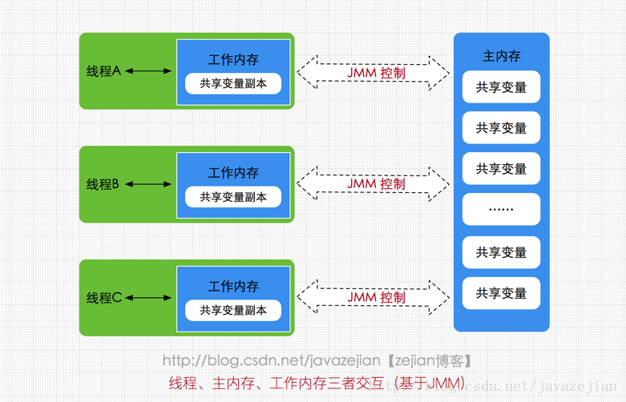
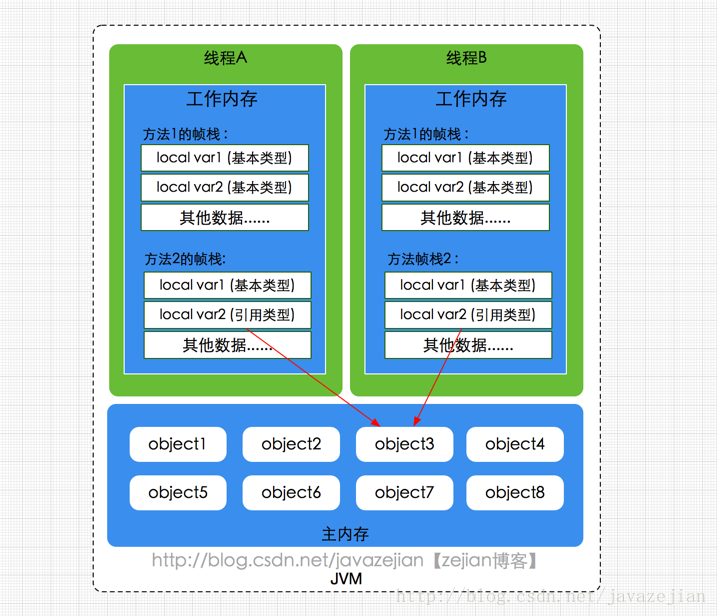

# CPU缓存模型

CPU缓存是为了解决CPU处理速度和内存处理速度不对等的问题。

**CPU Cache 缓存的是内存数据用于解决 CPU 处理速度和内存不匹配的问题，内存缓存的是硬盘数据用于解决硬盘访问速度过慢的问题**。

工作方式：先复制一份数据到CPU Cache中，当CPU需要用到的时候就可以直接读取数据，当运算完成后，再将运算得到的数据写回主存中。

---

# Java内存模型(JMM)

本身并不存在，描述的是一组规则或者规范，通过这组规范定义了程序中各个变量的访问方式。

Java内存模型规定所有变量都存储在主内存，所有的线程都可以访问。但线程对变量的操作(读取赋值等)必须在==工作内存==中运行。将变量从主内存拷贝到自己的工作内存空间，然后对变量进行操作，操作完成后再将变量写回主内存。

如果两个线程同时调用了同一个对象的同一个方法，那么两条线程将要操作的数据拷贝到自己的工作内存中，执行完成后才刷新到主存。

多线程的执行最终都会映射到硬件处理器上进行执行。但是Java内存模型对内存的划分对于硬件内存并没有任何影响。

线程安全问题：两个线程在工作内存中对同一个变量的副本分别进行读写操作。一个线程读取到的是==另一个线程更新过的数据==还是==原来的数据==，这一点是不确定的，这就是线程安全问题。

解决方案：JMM

三个特性：

* 原子性：一个操作不可中断，即使是多线程的环境下，一个操作一旦开始就不会被其他线程影响。
  * 指令重排：计算机在执行程序时，为了提高性能，编译器和处理器的常常会对指令做重排。
* 可见性：一个线程修改了某个共享变量的值，其他的线程是否能够马上得知这个修改的值。
* 有序性：多线程的代码不一定是按照指令顺序执行的，因为会发生指令重排的情况。

解决方式：synchronized、volatile、happens-before。

## happens-before

JMM定义的2个操作之间的偏序关系：如果操作A线性发生于操作B，则A产生的影响(共享变量的修改、发送消息、调用方法等)能够被操作B观察到。

==如果两个操作满足happens-before原则，就不需要进行同步操作==。

happens-before原则主要包括：

- 程序次序规则(Program Order Rule)：在同一个线程中，按照程序代码顺序，书写在前面的操作先行发生于书写在后面的操纵。准确的说是程序的控制流顺序，考虑分支和循环等。
- 管理锁定规则(Monitor Lock Rule)：一个unlock操作先行发生于后面（时间上的顺序）对同一个锁的lock操作。
- volatile变量规则(Volatile Variable Rule)：对一个volatile变量的写操作先行发生于后面（时间上的顺序）对该变量的读操作。
- 线程启动规则(Thread Start Rule)：Thread对象的start()方法先行发生于此线程的每一个动作。
- 线程终止规则(Thread Termination Rule)：线程的所有操作都先行发生于对此线程的终止检测，可以通过`Thread.join()`方法结束、`Thread.isAlive()`的返回值等手段检测到线程已经终止执行。
- 线程中断规则(Thread Interruption Rule)：对线程interrupt()方法的调用先行发生于被中断线程的代码检测到中断时事件的发生。`Thread.interrupted()`可以检测是否有中断发生。
- 对象终结规则(Finilizer Rule)：一个对象的初始化完成（构造函数执行结束）先行发生于它的finalize()的开始。
- 传递性(Transitivity)：如果操作A 先行发生于操作B，操作B 先行发生于操作C，那么可以得出A 先行发生于操作C。

---

# volatile

作用

* 保证被volatile修饰的共享变量对所有线程总数是可见的，也就是当==一个线程修改了一个被volatile修饰的共享变量的值，新增总数可以被其他线程立即得知==。
* 禁止指令重排序。

## volatile可见性

被`volatile`修饰的变量对所有线程总数立即可见的，对`volatile`变量的所有写操作总是能立刻反应到其他线程中。

但是修饰的变量运算操作在多线程环境下并不保证安全性。多个线程同时对它写操作，会出现线程安全问题。

当写一个volatile变量时，JMM会把该线程对应的==工作内存中的共享变量值刷新到主内存中==，当读取一个volatile变量时，JMM会把该线程对应的==工作内存置为无效，那么该线程将只能从主内存中重新读取共享变量==。volatile变量正是通过这种写-读方式实现对其他线程可见。

