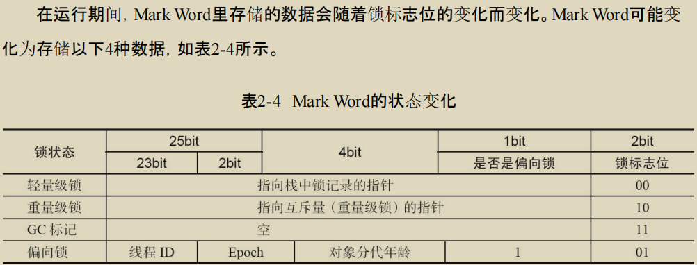
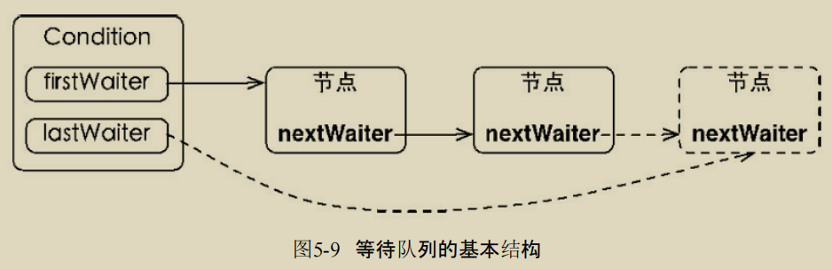

## 并发编程的挑战

并发执行并不一定比串行执行速度快，对于线程来说，存在线程的创建和上下文切换的开销。

**减少上下文切换**：无锁并发编程、CAS算法、使用最少线程、使用协程。

* 无锁并发编程：使用一些办法来避免使用锁，如将数据ID按照Hash算法取模分段，不同线程处理不同的数据。
* 协程：在单线程里实现多任务的调度，维持多个任务间的切换。


**避免死锁的几个常见方法**：

* 避免一个线程同时获取多个锁。
* 避免一个线程在锁内同时占用多个资源，尽量保证每个锁只占用一个资源。
* 尝试使用定时锁，使用`lock.tryLock(timeout)`来替代使用内部锁机制。


### 资源限制的挑战

资源限制：进行并发编程时，程序的执行速度受限于计算机硬件资源或软件资源。

引发的问题：并发执行的代码段因为受限于资源，仍然在串行执行，这时候程序反而会执行的更慢。

**解决资源受限的问题**：对于硬件资源限制，可以考虑使用**集群并行执行程序**(让程序在多机上运行)。对于软件资源限制，考虑使用资源池将资源复用。


## 并发底层原理

Java中使用的并发机制依赖于JVM的实现和CPU的指令。

### volatile

volatile是轻量级的synchronized，他在多级器开发中保证了共享变量的可见性。它比synchronized的使用和执行成本更低，因为它不会引起线程上下文的切换和调度。

硬件层面上的实现：对于volatile修饰的共享变量，修改时JVM就会将这个变量所在缓存行的数据**写回到系统内存**。每个处理器检查自己缓存的值是不是过期了，当处理器发现自己缓存行对应的内存地址被修改，会**重新读取**。 


### Synchronized

JVM基于进入和退出Monitor对象来实现**方法同步**和**代码块同步**。代码块同步是使用`monitorenter`和`monitorexit`指令实现，指令在编译后插入到同步代码块的开始位置和结束位置。任何对象都有一个monitor与之关联，且一个monitor被持有后将处于锁定状态，线程执行到`monitorenter`指令的时候，就会尝试获取对象所对应的monitor的所有权，尝试获得对象的锁。

synchronized用的锁是存在Java对象头里的。Java对象头中保存该对象的**锁状态和锁的标志位**。



**锁的升级**：Java为了减少获得锁和释放锁带来的性能损耗，引入了**偏向锁**和**轻量级锁**。锁一共有四种状态，会随着竞争情况逐渐升级，但是升级后**==不能降级==**。

#### 偏向锁

锁总是由同一线程多次获得。这种情况下为了让线程获得锁的代价更低，引入了偏向锁。一个线程获得锁时，在**对象头和栈帧中的锁记录里存储**锁偏向的**==线程==ID**，以后这个线程在进入和退出同步块的时候不需要进行CAS操作来加锁或者解锁，只需要**测试对象头的MarkWord里面是否存储着指向当前线程的偏向锁**。成功表示获得了锁，失败需要使用CAS。

出现竞争才会释放偏向锁，偏向锁的撤销需要等待全局安全点。首先需要检查持有偏向锁的对象是否还活着，否就需要把对象头设置成无锁状态。

#### 轻量级锁

线程在执行同步块之前，JVM会先在当前==线程的栈帧中==创建用于存储**锁记录**的空间，并将对象头中的MarkWord复制到锁记录中。然后线程尝试使用CAS将对象头中的MarkWord替换为指向锁记录的指针。成功则当前线程获得锁，失败则采用自旋的方式获得锁。

轻量级锁释放时，同样使用CAS将MarkWord替换回到对象头。如果成功表示没有竞争发生，失败表示当前锁存在竞争，锁会膨胀成重量级锁。

为了避免无用的自旋，一旦锁升级为重量级锁，就不会恢复到轻量级锁的状态。


### 原子操作的实现原理

CPU处理器使用基于对缓存加锁或总线加锁的方式来实现多处理器之间的原子操作。处理器保证从系统内存中读取或者写入一个字节是原子的。

Java中可以通过锁和循环CAS的方式来实现原子操作(循环直到CAS成功)。


**原子操作的三大问题**：

* ABA问题：一个值原来是A，变成B又变回了A，这时候CAS检查会发现它的值没有发生变化，实际上是变化了。
  * 解决方法：使用一个版本号，每次变量更新把他加1，A→B→A就会变成A1→B2→A3。
* 循环时间长开销大：自旋CAS如果一直不成功就会一直循环，会给CPU带来非常大的开销。
* 只能保证一个共享变量的原子操作：对多个共享变量操作时，循环CAS无法保证操作的原子性。
  * 解决方法：使用锁机制；把多个共享变量合并成一个共享变量来操作。

**使用锁机制实现原子操作**：锁机制保证了只有获得锁的线程才能操作锁定的内存区域。除了偏向锁，JVM实现锁的方式都用了循环CAS(获取锁和释放锁)。


---


## Java内存模型

Java的并发采用的是共享内存模型，线程之间的通信总是隐式的进行，整个通信过程对程序员完全透明。

### 抽象概念

在Java中，所有实例域、静态域和数组元素都存储在堆内存中，堆内存在线程之间共享。

Java线程之间的通信由Java内存模型（简称为JMM）控制，线程之间的共享变量存储在**主内存**中，每个线程都有一个**私有的本地内存**，本地内存中存储了该线程以读/写共享变量的副本。


**指令的重排序**：执行程序时为了提高性能编译器和处理器常常会对指令做重排序。

指令的重排序可能会导致多线程程序出现**内存可见性问题**。

JMM通过禁止**特定类型的编译器重排序**和**处理器重排序**，为程序员提供一致的内存可见性保证。

现代处理器使用写缓冲区**临时保存向内存写入的数据**。写缓冲区可以避免由于处理器停顿下来等待向内存写入数据而产生的延迟。**但是==写缓冲区仅对自己的处理器可见==，这会导致处理器对内存的读/写操作的执行顺序，不一定与内存实际发生的读/写操作顺序一致**。


### happens-before 

**定义**：happens-before用于指定两个操作之间的**执行顺序**，这两个操作可以在一个线程内，也可以是不同的线程。因此JMM可以通过该关系提供跨线程的内存可见性保证。

* 如果一个操作happens-before另一个操作，那么第一个操作的执行结果将对第二个操作可见，而且第一个操作的执行顺序排在第二个操作之前。
* 两个操作之间具有happens-before的关系，并不意味着他们执行的顺序一定要有先后。happens-before仅仅要求前一个操作对后一个操作可见，且前一个操作按顺序排在第二个操作之前。


JMM最核心的概念。JMM设计的时候目标就是要在<u>为程序员提供足够强的内存可见性</u>和<u>对编译器、处理器的限制尽可能放松</u>之间找到一个平衡点。

JMM要求编译器和处理器必须禁止会改变执行结果的重排序，而对于不会改变程序执行结果的重排序不做要求。

happens-before关系本质上和as-if-serial是一回事。

一个happens-before规则对应于一个或多个编译器和处理器**==重排序规则==**。


#### happens-before规则

```html
1.程序顺序规则：一个线程中的每个操作，happens-before于该线程中的任意后续操作。
2.监视器锁规则：对一个锁的解锁，happens-before于随后对这个锁的加锁。
3.volatile变量规则：对一个volatile域的写，happens-before于任意后续对这个volatile域的读。
4.传递性：如果A happens-before B，且B happens-before C，那么A happens-before C。
5.start()规则：如果线程A执行操作ThreadB.start()（启动线程B），那么A线程的 ThreadB.start()操作happens-before于线程B中的任意操作。
6.join()规则：如果线程A执行操作ThreadB.join()并成功返回，那么线程B中的任意操作 happens-before于线程A从ThreadB.join()操作成功返回
```


### 重排序

编译器和处理器为了优化程序性能而对指令序列进行重新排序的一种手段。编译器和处理器不会改变存在数据依赖性关系的两个操作的执行顺序。

**数据依赖性**：两个操作访问同一个变量，且这两个操作之间有一个为写操作，就称这两个操作之间存在数据依赖性。

**as-if-serial**：不管怎么重排序，(单线程)程序的执行结果不能被改变。as-if-serial语义把单线程程序保护了起来。

**在多线程中**，对存在控制依赖的操作重排序，可能会改变程序的执行结果。


**顺序一致性内存模型**：一个线程中的所有操作必须按照程序的顺序来执行；每个操作都必须原子执行且立刻对所有线程可见。如果程序的执行结果和顺序一致内存模型执行结果相同，那么程序就是正确同步的。

对于该模型，当多个线程并发执行时，图中的开关装置能把所有线程的所有内存读/写操作串行化，所有的操作之间具有全序关系。

**在JMM中，无法得到顺序一致性模型的单线程操作按顺序执行和所有线程可见的保证**。也不保证对64位的变量的写操作具有原子性。


**总线**：在计算机中数据通过总线在处理器和内存之间传递。每次处理器和内存之间的数据传递都是通过一系列步骤来完成的，称为总线事务。

在一个处理器执行总线事务期间，总线会禁止其他处理器和IO设备执行内存的读/写。


### volatile

对于volatile变量来说，锁的happens-before规则保证释放锁和获取所的两个线程之间的内存可见性。一个volatile变量的读，总是能看到任意线程对这个volatile变量最后的写入。

volatile变量自身具有可见性和原子性(对任意单个volatile变量的读写具有原子性)。

**volatile写**：把自己本地内存中的值刷新到主内存。

**volatile读**：先把本地内存中的值置为无效，再从主内存读取共享变量。


**volatile内存语义的实现**：为了实现volatile内存语义，JMM会限制重排序。编译器在生成字节码时，会在指令序列中插入内存屏障来禁止特定类型的处理器重排序。

**当第二个操作是volatile写时，不管第一个操作是什么，都不能重排序**。这个规则确保volatile写之前的操作不会被编译器重排序到volatile写之后。

**当第一个操作是volatile读时，不管第二个操作是什么，都不能重排序**。这个规则确保volatile读之后的操作不会被编译器重排序到volatile读之前

**当第一个操作是volatile写，第二个操作是volatile读，不能重排序**。


**内存屏障**：为了实现volatile的内存语义，编译器在生成字节码的时候，会在指令序列中插入内存屏障来**禁止特定类型的处理器重排序**。

基于保守策略的JMM内存屏障插入策略：在每个volatile写操作的前面插入一个`StoreStore`屏障；在每个volatile写操作的后面插入一个`StoreLoad`屏障；在每个volatile读操作的后面插入一个`LoadLoad`屏障；在每个volatile读操作的后面插入一个`LoadStore`屏障。


---


## Java中的锁(JUC)

### Lock

提供了与synchronized类似的功能，能够在使用时显示地获取锁和释放锁。

提供synchronized不具备的特性：尝试获取锁、获取锁的过程能够被中断、超时返回。


### 队列同步器AQS

用来构建锁或者其他同步组件的基础框架，它使用了一个int成员变量表示**同步状态**，通过内置的FIFO队列来完成资源获取线程的排队工作。

子类通过继承同步器并实现它的抽象方法来管理同步状态，在抽象方法的实现过程中免不了要对同步状态进行更改，这时就需要使用同步器提供的3 个方法（`getState()`、`setState(int newState)`和`compareAndSetState(int expect,int update)`）来进行操 作，因为它们能够保证状态的改变是安全的。

**实现**：

同步队列：等待一个同步状态的所有线程组成的一个FIFO的双向队列。队列中的节点保存获取同步状态失败的线程引用、等待状态以及前驱和后继节点。


没有成功获取同步状态的线程会成为节点加入队列的尾部。同步器提供了一个基于CAS的设置尾节点的方法。

**独占式同步状态**：

* 获取锁：调用acquire方法获取同步状态，对中断不敏感。先用自定义同步器实现的tryAcquire获取同步状态，如果失败就构造节点，加入同步队列尾部，最后调用acquireQueued方法，使得该节点以**死循环的方式获取同步状态**。当前驱节点是头节点的时候，就表示能够尝试获取同步状态了。
* 释放锁：调用同步器的release方法，释放同步状态，同时唤醒后继结点。

**共享式同步状态获取**：

* 获取锁：调用同步器的acquireShared方法可以共享式的获取同步状态。先调用tryAcquireShared尝试获取，**如果返回值小于0，表示获失败**，需要使用doAcquireShared方法进行自旋。在死循环中不断获取前驱，当前驱是头节点，再次调用tryAcquireShared获取。成功获取到同步状态并退出自旋的条件是tryAcquireShared方法返回值大于等于0。
* 释放锁：释放同步状态后，会唤醒后续等待的节点。与独占式的区别在于该方法需要确保同步状态线程安全释放，一般通过循环和CAS来保证。


**可重入锁(ReentrantLock)**：允许已经获取锁的线程再次获取锁，因此在acquire中需要判断线程是否是获取锁的线程，获取锁时需要将state+1，表示重入一次，释放时同样需要-1。只有state重新回到0，表示无锁占用，释放的方法才能返回true。

**公平与否**：针对获取锁而言，如果一个锁是公平的，那么锁的获取顺序就应该符合请求的绝对时间顺序FIFO。公平锁与非公平锁相比，多了一个判断条件：当前同步队列的当前节点之前**是否有前驱节点**，有则需要等待。


**读写锁**：读过程时可以有多个读线程访问，写过程只能有一个线程。需要维护一对锁：读锁和写锁。

？？？？


**Condition接口**：提供了类似于Object的监视器(wait、notify)方法，与Lock配合可以实现等待/通知模式。

定义了等待/通知两种类型的方法，当前线程调用这些方法时，需要提前获取到Condition对象关联的Lock锁。Condition是依赖于Lock对象的。获取一个Condition必须通过Lock的`newCondition() `方法。

**实现**：ConditionObject是AQS的内部类，因为Condition的操作需要**==获取相关的锁==**，所以作为同步器的内部类也较为合理。每一个Condition对象都包含一个队列(**等待队列**)，该队列是Condition对象实现等待/通知功能的关键。



1. **等待队列**：一个FIFO队列，每个节点都包含了一个等待线程引用。如果一个线程调用了await方法，就会释放锁并加入到等待队列中，进入等待状态。
   1. 一个Lock上可以有多个等待队列。Condition实例能够访问同步器提供的方法，相当于每个Condition都有所属同步器的引用。
2. **await** ：Condition的方法，会使得当前线程进入等待队列并**==释放锁==**，线程状态变成等待状态。当从await方法返回时，当前线程一定获取了Condition相关联的锁。
   1. 如果从队列（同步队列和等待队列）的角度看`await()`方法，当调用`await()`方法时，相当于**同步队列**的首节点（获取了锁的节点）移动到Condition的**等待队列**中。 
   2. 等待队列中的节点被唤醒，相应的线程就会尝试获取同步状态。
3. **signal** ：由condition调用，唤醒在它的**等待队列**中的首节点，并将这个节点加入**同步队列**并使用LockSupport唤醒节点中的线程。调用这个方法必须获取锁，否则会抛出异常。
   1. 被唤醒的线程将从await方法中的**while循环中退出**，进而调用同步器的acquireQueued方法加入到获取同步状态的竞争中。成功获取同步状态后，被唤醒的线程从先前调用的await方法返回，成功获取锁。
4. Condition的`signalAll()`方法，相当于对等待队列中的每个节点均执行一次signal()方法，效果就是将等待队列中所有节点全部移动到同步队列中，并唤醒每个节点的线程。

