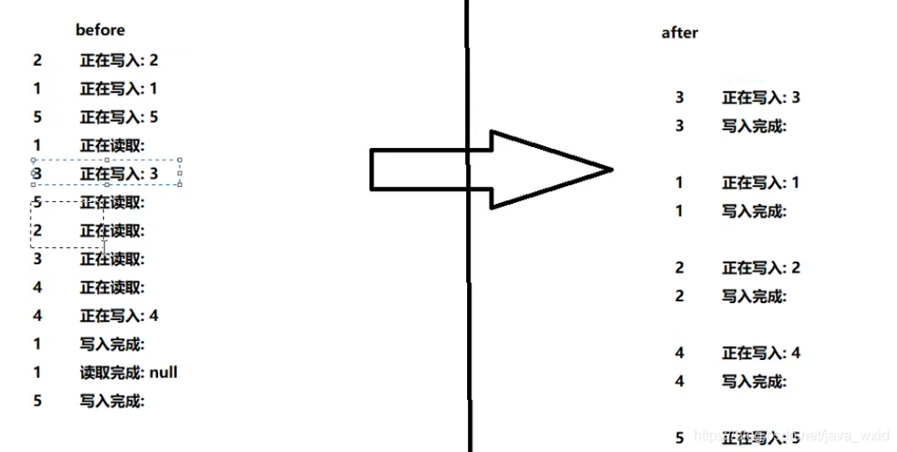

## 公平锁和非公平锁

公平锁指的是多个线程按照申请锁的顺序来获取锁。

非公平锁指的是不按照顺序。非公平锁一上来就直接尝试占有锁，如果尝试失败，就再次采用类似公平锁的方式。

非公平锁的优点在于吞吐量比公平锁大。


## 可重入锁和递归锁

可重入锁，也叫做递归锁。指的是同一线程外层函数获得锁后，==内层函数仍然能够获取锁的代码==。

也就是说获得锁的方法调用其他需要获得锁的方法不会被阻塞。


`ReentrantLock`就是一把可重用锁。

```java
public void sendSMS(){
        //加几把就要解锁几次
        lock.lock();
        lock.lock();
        try {
            System.out.println(Thread.currentThread().getName()+"\t 发短信");
            sendEmail();
        } finally {
            lock.unlock();
            lock.unlock();
        }
}
```


## 自旋锁和自适应自旋

自旋锁指的是尝试获取锁的线程(如果没有获取到)不会立即阻塞，而是采用==循环的方式去尝试获取锁==。


好处：减少上下文的消耗，但是会消耗CPU。

示例：循环使用CAS。


自适应自旋：设置了自旋的最大次数，如果达到了这个次数但还是没有获得锁，则退出死循环。


## 读写锁

### 独占锁

指的是，该锁一次只能被一个线程持有。比如可重用锁和Synchronized，都是独占锁。

共享锁：指的是该锁可以被多个线程所持有。


读写锁`ReentrantReadWriteLock`：该锁的读锁是共享锁，而写锁是独占锁。

读锁的共享锁可保证并发读是非常高效的，读写、写读、写写的过程是互斥的。


在读和写的例子中，不能用`ReentrantLock`代替读写锁，因为该锁无法实现读之间的共享。




## 悲观锁和乐观锁

悲观锁指的是，每次拿数据的时候都认为别人会修改。因此自己拿到锁后就会上锁，不让其他线程使用。

乐观锁指的是，每次拿数据的时候都认为别人不会修改，所以不会上锁。在修改数据时会判断别人有没有更新数据，如果别人更新了自己就会放弃这一次修改。==可以使用版本号和CAS实现==。CAS一般是一个自旋操作。


### 乐观锁的缺点

#### ABA

一个变量最开始读取时是A，在准备修改时，检测到其仍然是A。此时不能认为它没有被修改过。它可能被修改为其他值后被改回来。

### 循环时间长开销大

### 只能保证一个共享变量的原子操作

CAS只对一个变量有效，但是可以使用原子引用类，把多个对象放在一个对象里来实现。


## 分布式锁


## 偏向锁状态、轻量级锁状态、重量级锁状态。

Synchronized的一种状态。

加锁的方式：

* 把synchronized修饰的对象的markword复制到==访问同步块的线程的锁记录==中。
* 通过CAS修改markword的地址为线程的锁记录地址。


### 偏向锁

锁会偏向于某一个线程。他会偏向于第一个访问的线程，如果在运行过程中，同步锁只有一个线程访问，不存在多线程争用的情况，就会给线程加一个偏向锁。如果在运行的过程中，遇到了其他线程抢占锁，则持有偏向锁的线程会被挂起，JVM会消除它身上的偏向锁，将锁恢复到标准的轻量级锁。

轻量级锁中，如果有重入的情况，每次进入仍需要修改markword；如果是只有一个线程，就可以使用偏向锁：第一次CAS的时候把markword修改为当前线程ID，之后每次重入就进行比较，如果是同一个线程就不进行markword的修改了。

**重偏向锁**：对象被加了偏向锁，且被不同的线程访问，但是没有出现竞争，不会取消偏向锁的状态。而是直接重置修改mw中的线程ID。


### 轻量级锁

在偏向锁的情况下，有线程加入竞争的时候就会升级成轻量级锁。

**使用**：如果一个对象虽然有多个线程访问，但是访问的时间是错开的，使用轻量级锁就足够。如果出现竞争就会继续膨胀成为重量级锁。


### 重量级锁

当一个线程修改markword的地址时，发现已经是其他线程的锁记录地址了，就表示发生了冲突，需要膨胀成重量级锁。

膨胀成重量级锁后，markword会被修改为一个**重量级指针**，这个指针能够在占用对象的线程解锁的时候，去唤醒其他的有竞争关系的线程。