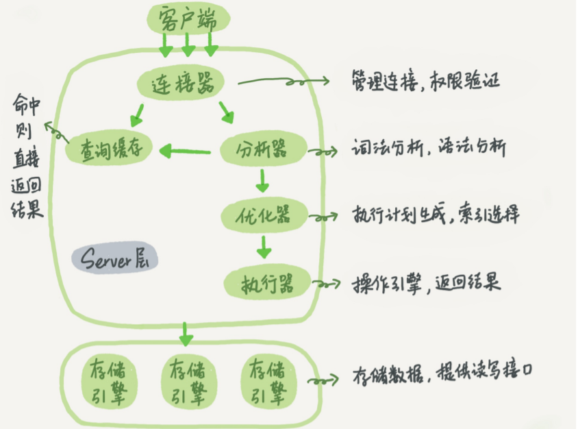

## 三大日志

主要包括错误日志、查询日志、慢查询日志、事务日志、二进制日志几大类。

三大日志：binlog、redo log、undo log。

### bin log归档日志

是逻辑日志，**记录的是语句的原始逻辑**，代表什么意思，属于Server层。

只要发生了表数据更新，都会产生bin log日志，MySQL的数据备份、主从复制等离不开bin log，需要依靠bin log来同步数据，保证数据的一致性。

**写入时机**：事务执行的过程中，先把日志写到binlog cache，**事务提交**的时候，再把binlog cache写到binlog文件中。**一个事务的binlog不能被拆开**，不论事务多大也要一次性写入binlog cache。

同样需要刷盘，事务提交时先写到page cache中，执行fsync时，才将数据持久化到磁盘。

`binlog`（归档日志）保证了`MySQL`集群架构的数据一致性。


### redo log重做日志

InnoDB独有，他让MySQL拥有了崩溃恢复的能力。

`MySQL` 实例挂了或宕机了，重启时，`InnoDB`存储引擎会使用`redo log`恢复数据，保证数据的持久性与完整性。

一些概念：

* redo log buffer：内存中的日志缓冲。
* redo log file：磁盘上的日志文件。
* 缓冲池：临时存放**真正的数据**文件。
* os buffer ：操作系统的内核缓冲空间(文件系统的缓存)。

MySQL中数据以页为单位(B+树的一页)，查询记录得到的页会放入一个**缓冲池**中。

* 后续的查询都会先去缓冲池中查找，没有命中再去磁盘。

* 更新数据也优先更新缓冲池。

**在某个数据页上做了什么修改**，都会被记录到redo log缓存中，接着**刷盘**到redo log里。默认每次事务提交时进行刷盘，可以设置。

要写入到磁盘上的log file中，还要经过操作系统内核空间的os buffer，调用fsync()的作用就是将OS buffer中的日志刷到磁盘上的log file中。

另外，`InnoDB` 存储引擎有一个后台线程，每隔`1` 秒，就会把 `redo log buffer` 中的内容写到文件系统缓存（`page cache`），然后调用 `fsync` 刷盘。


### undo log

在 MySQL 中，恢复机制是通过 **回滚日志（undo log）** 实现的，所有事务进行的修改都会先记录到这个回滚日志中，然后再执行相关的操作。如果执行过程中遇到异常的话，我们直接利用 **回滚日志** 中的信息将数据回滚到修改之前的样子即可！并且，回滚日志会先于数据持久化到磁盘上。这样就保证了即使遇到数据库突然宕机等情况，当用户再次启动数据库的时候，数据库还能够通过查询回滚日志来回滚将之前未完成的事务。

**==undo log记录的是逻辑上的操作(每一行的操作)的反向==**，如果对数据delete，undo log记录的是insert。当执行rollback时，就可以从undo log中的逻辑记录读取到相应的内容并进行回滚。

**有时候应用到行版本控制的时候，也是通过undo log来实现的：当读取的某一行被其他事务锁定时，它可以从undo log中分析出该行记录以前的数据是什么，从而提供该行版本信息，让用户实现非锁定一致性读取**。

在事务提交的时候，会将该事务对应的undo log放入到删除列表中，未来通过purge来删除。并且提交事务时，还会判断undo log分配的页是否可以重用，如果可以重用，则会分配给后面来的事务，避免为每个独立的事务分配独立的undo log页而浪费存储空间和性能。


### 日志的写入顺序

`group commit`：为了提高性能，通常会将有关联性的**多个数据修改操作放在一个事务中**，这样可以避免对每个修改操作都执行完整的持久化操作。这种方式，可以看作是人为的组提交(group commit)。除了将多个操作组合在一个事务中，记录binlog的操作也可以按组的思想进行优化：**将多个事务涉及到的binlog一次性flush**，而不是每次flush一个binlog。

MySQL5.6以前：当事务提交后，MySQL收到信号进入commit prepare阶段，随后**==先写内存中的二进制日志(binlog)==**，写完二进制日志后相当于确定了commit操作；**==然后开始写内存中的事务日志(undo/redo log)==**。最后进行刷盘。

因为要保证二进制日志和事务日志的==一致性==，在提交后的prepare阶段会启用一个`prepare_commit_mutex`锁来保证它们的顺序性和一致性。但这样会导致开启二进制日志后group commmit失效，特别是在主从复制结构中，几乎都会开启二进制日志。


MySQL5.6的改进：提交事务时，在存储引擎层的上一层结构中会将事务**按序放入一个队列**。第一个事务称为leader，其他称为follower。

分为三个阶段：flush、sync、commit。

* flush：写入每个日志的二进制日志。(多积累几个事务的binlog，然后一起进入sync阶段)。
* sync：将二进制日志刷盘。如果有多个，一起刷盘(binary log group commit)。
* commit：leader根据顺序调用存储引擎层事务的提交(写相应的事务日志)。


## InnoDB中MVCC的实现

快照读(普通读)：单纯的SELECT语句。

快照读的执行方式是生成ReadView，利用MVCC的方式来读取。

==当前读==(锁定读)：**==读取的是最新版本，并且需要先获取对应记录的锁==**。如lock in share mode/for update/update、delete、insert等。

当前读是通过next-key锁来实现的。

**隐藏字段**：InnoDB存储引擎为**每行数据**添加了三个隐藏字段：

* DB_TRX_ID：最后一次插入或修改该条数据的事务id。delete也视为更新，只不过记录头会被标记为已删除。
* DB_ROLL_PTR：回滚指针，指向该行的`undo log`。如果改行未更新就不能回滚(undo log 为空)。
* DB_ROW_ID：如果没有设置主键且该表没有唯一非空索引时，`InnoDB` 会使用该 id 来生成聚簇索引。


**ReadView**：主要包含当前系统中还有哪些**==活跃==**的事务。

* 被访问的行的trx_id小于ReadView中的最小事务id，说明**生成该版本的事务早就提交**，可以访问。
* 。。。。大于最大值，说明**该版本的事务在生成 ReadView 后才生成**，所以该版本不可以被当前事务访问。
* 如果在它们之间，就需要查看ReadView中有没有相同的id，如果在，说明**创建 ReadView 时生成该版本的事务还是活跃的**，该版本不可以被访问；如果不在，说明**创建 ReadView 时生成该版本的事务已经被提交**，该版本可以被访问。

读已提交：==**每次查询开始时都会生成一个独立的 ReadView**==，不会读取到未提交且正活跃的事务，解决了脏读。

读可重复：==**在事务开始后第一次读取数据时生成一个ReadView**==，这样重复读取数据也不会变，解决了虚读(不可重复度)。


**undo_log**：用于事务回滚将数据恢复；用于MVCC读取之前的版本数据。**分为两种： `insert undo log` 和 `update undo log`**。


### MVCC+Next-key-Lock防止幻读

`InnoDB`存储引擎在 **RR读可重复** 级别下通过 `MVCC`和 `Next-key Lock` 来解决幻读问题。

* 只会在事务开启后的第一次查询生成ReadView。**之后做的更新都对当前事务不可见**，从而实现了可重复读和防止幻读。
* InnoDB使用Next-key Lock来防止幻读。当执行当前读时，会锁定查询范围的间隙，防止其他事务在查询范围内插入数据。


## 一条SQL语句是如何执行的

**MySQL的Server层**：包含了以上组件，跨存储引擎的功能(存储过程、触发器、视图等)都在这一层实现。

- **连接器：**身份认证和权限相关(登录 MySQL 的时候)，负责用户登录数据库，身份验证等操作。
- **查询缓存：**执行查询语句的时候，会先查询缓存，缓存以key-value的形式缓存在内存中。如果命中了缓存就会直接返回，没有命中则继续往下走，完成以后也会把结果缓存起来。在真正执行缓存查询的时候还是会校验用户的权限，是否有该表的查询条件（MySQL 8.0 版本后移除，因为这个功能不太实用）。
  - MySQL 查询不建议使用缓存，因为查询缓存失效在实际业务场景中可能会非常频繁，假如你对一个表更新的话，这个表上的所有的查询缓存都会被清空。对于不经常更新的数据来说，使用缓存还是可以的。
- **分析器：** 没有命中缓存的话，SQL 语句就会经过分析器，分析器说白了就是要先看你的 SQL 语句要干嘛，再检查你的 SQL 语句语法是否正确。一般分析步骤为：词法分析→语法分析。
- **优化器：**按照 MySQL 认为最优的方案去执行。比如多个索引的时候该如何选择索引，多表查询的时候如何选择关联顺序等。
- **执行器：**执行语句，然后从存储引擎返回数据。首先执行前会**校验**该用户有没有权限，如果没有权限，就会返回错误信息，如果有权限，就会去调用引擎的接口，返回接口执行的结果。

**存储引擎**：负责数据的存储与读取，采用可以替换的插件式架构，支持InnoDB、MyISAM、Memory等多个存储引擎，其中InnoDB引擎有自有的日志模块redolog模块。




### 更新语句的执行(Update)

```sql
update tb_student A set A.age='19' where A.name=' 张三 ';
```

查询的时候会沿着查询的流程，在更新数据的时候就需要**引入日志模块**。MySQL自带**binlog归档日志**，InnoDB还自带了一个日志模块**redo log重做日志**。

流程如下(以InnoDB模式来讨论)：

* 先查询到数据。
* 拿到数据，修改age，然后调用引擎API接口，写入这一行数据。InnoDB把数据保存在内存中，同时记录redo log。redo log进入prepare状态，并通知执行器，执行完成，随时可以提交。
* 执行器收到通知后记录binlog，然后调用引擎接口，提交redo log为提交状态。
* 更新完成。


**为什么同时使用两个日志模块**：MySQL自带的引擎是MyISAM，并没有redo log。这就导致会没有crash-safe(数据库异常重启，数据不丢失)的能力，binlog日志只能用来归档。

**为什么binlog需要在redo log的准备和提交过程中间**：

- **先写 redo log 直接提交，然后写 binlog**，假设写完 redo log 后，机器挂了，binlog 日志没有被写入，那么机器重启后，这台机器会通过 redo log 恢复数据，但是这个时候 binlog 并没有记录该数据，后续进行机器备份的时候，就会丢失这一条数据，同时主从同步也会丢失这一条数据。
- **先写 binlog，然后写 redo log**，假设写完了 binlog，机器异常重启了，由于没有 redo log，本机是无法恢复这一条记录的，但是 binlog 又有记录，那么和上面同样的道理，就会产生数据不一致的情况。


在做Crash recovery时，分为以下3种情况：

* binlog有记录，redolog状态commit
  * 正常完成的事务，不需要恢复
* binlog有记录，redolog状态prepare
  * 在binlog写完提交事务之前的crash
  * 恢复操作：提交事务。（因为之前没有提交）
* binlog无记录，redolog状态prepare
  * 在binlog写完之前的crash
  * 恢复操作：回滚事务（因为crash时并没有成功写入数据库）


## MySQL的锁问题

### 全局锁

使用全局锁会让**整个数据库都处于只读状态**，线程执行数据的更改和表结构的更改，都会被阻塞。

`flush tables with read lock`。

应用场景：主要应用于做全库逻辑备份，这样在备份数据期间，不会因为数据或表结构的更新，出现备份文件的数据与预期的不一样。

### 表锁&行锁

一般在执行 DDL 语句时，譬如 **ALTER TABLE** 就会对整个表进行加锁。

两者都分为读锁和写锁，常见的增删改语句会自动对操作的数据行加写锁。

### 表级锁

<font color=blue>**表锁**</font>：表锁除了会限制别的线程读写，也会限制本线程接下来的读写操作(共享锁阻塞读，独占锁全阻塞)。

<font color=blue>**元数据锁MDL**</font>：**不需要显示使用**，对数据库表进行操作的时候会自动给表加上MDL。在**事务提交之后**会被释放。

* 对表CRUD的时候，加的是MDL读锁。
* 对表做结构变更操作的时候，加的是MDL写锁。

<font color=blue>**意向锁**</font>：对表中的数据执行插入、更新、删除操作的时候，需要先对表加上【意向独占锁】，然后对该记录加独占锁。

意向锁不会与行级的共享锁和独占锁发生冲突，意向锁之间也不会发生冲突。**==意向锁只会和表锁发生冲突，意向锁的目的是为了快速判断表里是否有记录被加锁==**。

```sql
//先在表上加上意向共享锁，然后对读取的记录加共享锁
select ... lock in share mode;

//先表上加上意向独占锁，然后对读取的记录加独占锁
select ... for update;
```

<font color=blue>**AUTO-INC锁**</font>：属于表级别的锁。对于含有自增字段的表，再插入数据的时候加锁，插入完成后立即释放。

一个事务在持有 AUTO-INC 锁的过程中，其他事务的如果要向该表插入语句都会被阻塞，从而保证插入数据时，被 `AUTO_INCREMENT` 修饰的字段的值是连续递增的。因此会对大量数据进行插入的时候会影响性能，因为另一个事务中的插入会被阻塞。


### 行锁种类

行锁根据场景的不同又可以进一步细分，在 MySQL 的源码里，定义了四种类型的行锁，如下：

- LOCK_ORDINARY：也称为 **Next-Key Lock**，<font style="background:yellow"> **锁一条记录及其之前的间隙** </font>，这是 RR 隔离级别用的最多的锁，从名字也能看出来；
- LOCK_GAP：间隙锁，锁两个记录之间的 GAP，防止记录插入；
- LOCK_REC_NOT_GAP：只锁记录；
- ~~LOCK_INSERT_INTENSION：插入意向 GAP 锁，插入记录时使用，是 LOCK_GAP 的一种特例~~。


#### 行锁加锁情况

查询语句前提是for update，如果不加就是快照读，使用MVCC而不加锁。

对记录加锁时，**加锁的基本单位是 next-key lock(==当前值和当前值的前一个索引之间的间隙==)**，但是，next-key lock 在一些场景下会退化成记录锁或间隙锁。

* 唯一索引<font color=blue>**等值**</font>查询：记录存在→退化成记录锁，记录不存在→退化成间隙锁。
* 唯一索引<font color=blue>**范围**</font>查询：范围查找会在第一个记录之后继续找**==存在的==**记录，然后加一个next-key-lock，再**根据这个后一个的记录**考虑这个锁要不要退化。(前后索引都加！但是如果存在记录，前锁会退化)
* 非唯一索引<font color=blue>**等值**</font>查询：记录存在→前(next-key)后(间隙锁)都加，记录不存在→加入一个next-key锁后退化为间隙锁。
* 非唯一索引<font color=blue>**范围**</font>查询：前后都加next-key lock，不退化。


根据模式，锁可以分为以下：

- LOCK_IS：读意向锁；
- LOCK_IX：写意向锁；
- LOCK_S：读锁；
- LOCK_X：写锁；
- LOCK_AUTO_INC：自增锁；

IS（读意向）、IX（写意向）只会应用在表锁上，方便表锁和行锁之间的冲突检测。LOCK_AUTO_INC 是一种特殊的表锁。

当事务试图读或写某一条记录时，会**先在==表上==加上意向锁**，然后才在要操作的记录上加上读锁或写锁。这样判断表中是否有记录加锁就很简单了，**只要看下表上是否有意向锁就行了**。==意向锁之间是不会产生冲突的==，也不和 AUTO_INC 表锁冲突，它**只会阻塞表级读锁或表级写锁**，另外，意向锁也不会和行锁冲突，行锁只会和行锁冲突。

AUTO_INC 锁又叫自增锁，是一种特殊类型的表锁，当插入的表中有自增列（AUTO_INCREMENT）的时候可能会遇到。当插入表中有自增列时，数据库需要自动生成自增值，在生成之前，它会先为该表加 AUTO_INC 表锁，其他事务的插入操作阻塞，这样保证生成的自增值肯定是唯一的。AUTO_INC 锁具有如下特点：

- AUTO_INC 锁互不兼容；
- 自增锁在 INSERT 语句执行结束时释放，这样可以提高并发插入的性能。
- 自增值一旦分配了就会 +1，如果事务回滚，自增值也不会减回去，所以自增值可能会出现中断的情况。


### 细说MySQL锁类型(行锁)

#### 记录锁（Record Locks）

最简单的行锁，在更新的记录上加锁。如果 SQL 语句无法使用索引时会走主索引实现全表扫描，这个时候 MySQL 会给整张表的所有数据行加记录锁。

#### 间隙锁（Gap Locks）

一种加在两个索引之间的锁，或者加在第一个索引之前，或最后一个索引之后的间隙。有时候又称为范围锁（Range Locks），这个范围可以跨一个索引记录，多个索引记录，甚至是空的。使用间隙锁可以防止其他事务在这个范围内插入或修改记录，保证两次读取这个范围内的记录不会变，从而不会出现幻读现象。

间隙锁和间隙锁之间是互不冲突的，间隙锁唯一的作用就是为了防止其他事务的插入。

#### Next-Key Locks

记录锁和间隙锁的组合，它指的是加在某条记录以及这条记录前面间隙上的锁。

一般涉及主键索引的会使用间隙锁，二级索引使用next-key locks。

#### 插入意向锁

一种特殊的间隙锁。这个锁虽然也叫意向锁，但是和上面介绍的表级意向锁是两个完全不同的概念。插入意向锁和插入意向锁之间互不冲突，所以**可以在同一个间隙中有多个事务同时插入不同索引的记录**。

插入意向锁只会和间隙锁或 Next-key 锁冲突。


### 锁全表

进行更新操作的时候where字段没加索引，就会锁全表。


### 死锁

场景：两个事务同时插入数据，需要对数据进行**幂等性校验**，所以要先查询是否存在(select for update)。如果两个事务都执行完这条语句后，开始插入，就会一直阻塞(**每个事务都在等对方释放锁**)。属于插入意向锁和间隙锁的冲突。


## MySQL的前缀索引

语句

```sql
alter table XXX add index indexName(Attr(n))
```


前缀索引会在字段中提取定长的前缀字符，因此占用的空间更少。

缺点：前缀索引可能会增加记录扫描的次数。如果数据的前n个字符的区分度不大，前缀索引就会在第一个满足条件的数据后一直顺序扫描，直到找到符合条件的所有数据。

**使用前缀索引，定义好长度，就可以节省空间又不用额外增加太多的查询成本**。

前缀索引对覆盖索引的影响：无法使用覆盖索引。


数据前缀区分度不高时的对策：

* 倒序存储：一些数据(如身份证号)前缀区分度不高，而后缀区分度高，可以采用这种方式。
  * `select filed_list from t where id_card = reverse('input_id_card')`
* 采用hash字段：在表中加入一个新的属性，每次插入新纪录的时候，使用某种hash函数得到校验码并填充到这个字段中。
