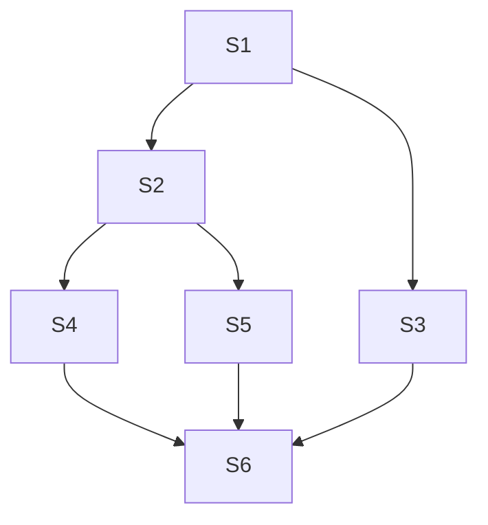

## 进程与线程的概念

==进程==：系统进行资源分配和调度的一个基本单位。

PCB：进程控制块。PCB描述了进程的基本情况和运行状态，进而控制和管理进程。创建进程和撤销进程，都是对进程相对应的PCB进行操作。PCB是进程存在的唯一标志，一个进程实体是由**程序段、数据段和PCB三个部分组成的**。

==线程==：独立调度的基本单位，可以理解为是一种轻量级的进程，它是一个基本的CPU执行单元。线程自己本身只有少量必要的资源，一个进程中可以有多个线程，而他们是共享进程资源的。

#### 进程与线程的区别

Ⅰ 拥有资源

进程是资源分配的基本单位，但是线程不拥有资源，线程可以访问隶属进程的资源。

Ⅱ 调度

线程是独立调度的基本单位，在同一进程中，线程的切换不会引起进程切换，从一个进程中的线程切换到另一个进程中的线程时，会引起进程切换。

Ⅲ 系统开销

由于创建或撤销进程时，系统都要为之分配或回收资源，如内存空间、I/O 设备等，==所付出的开销远大于创建或撤销线程时的开销==。类似地，在进行进程切换时，涉及当前执行进程 CPU 环境的保存及新调度进程 CPU 环境的设置，而线程切换时只需保存和设置少量寄存器内容，==开销很小==。

Ⅳ 通信方面

线程间可以通过直接读写同一进程中的数据进行通信，但是==进程通信需要借助 IPC(进程间通信)==。


#### 进程的控制

任何进程都是在操作系统内核的支持下运行的，是与内核密切相关的。

- 创建：允许父进程创建子进程，子进程可以继承父进程的资源。撤销父进程时必须撤销所有的子进程。
  - 过程：分配唯一一个进程标识号，申请PCB；分配资源，资源不足就阻塞；初始化PCB，初始化一些标志信息和控制信息，设置优先级；插入就绪队列等待运行。
- 终止：正常结束、发生异常事件导致异常结束、操作员或操作系统干预。
  - 过程：检索PCB读取状态，处于执行状态就立即停止，将处理机资源分给其他进程；终止其子孙进程；归还资源；删除PCB。
- 阻塞：进程自身的主动行为，由于期望的资源或操作没达到。
  - 过程：找到对应的PCB；状态转换为阻塞态；PCB插入等待队列，处理机资源调度给其他进程。
- 唤醒：被阻塞进程期望的事件出现，有关进程调用唤醒原语将其唤醒。
  - 过程：找到PCB；将其从等待队列移出，换为就绪态；插入就绪队列等待运行。
- 切换：一个进程切换到另一个进程运行。进程切换是在内核的支持下实现的。一般先有进程的调度，然后才有进程的切换。
  - 过程：==保存处理机上下文==；更新PCB信息；把PCB移入相应的队列(就绪or阻塞)；选择另一个进行执行，更新它的PCB；更新内存管理的数据结构；恢复处理机上下文。


#### 进程的组织

##### 进程控制块

PCB是进程存在的唯一标识，是进程实体的一部分。在进程的整个生命周期中，系统通过PCB对进程进行控制。

**包含的信息**

- ==进程描述信息==
  - 进程标识符：标志各个进程，每个进程有唯一的标识号。
  - 用户标识符：进程归属的用户，主要为共享和保护服务。
- ==进程控制和管理信息==
  - 进程当前状态：描述进程的**状态信息**，作为处理机分配调度的依据。
  - 进程优先级：描述进程抢占处理机的优先级，优先级高的时候可以获得处理机。
- ==资源分配清单==：说明**有关内存地址空间或虚拟机地址空间**的状况，所打开文件的列表和所使用的输入/输出**设备信息**。
- ==处理机相关信息==：处理机中各个寄存器的值。进程被切换时**处理机的状态信息**都要保存在PCB中，以便之后能够恢复执行。


##### 程序段

能被进程调度程序调度到CPU执行的程序代码段。一个代码段能被多个进程运行。

##### 数据段

一个进程的数据段，可以进程对应的程序加工处理的原始数据，也可以是程序执行时产生的中间或最终结果。


#### 进程的通信

1. 共享存储：进程之间存在一块可直接访问的共享空间，通过对这空间进行读写来进行信息交换。一般要使用同步互斥工具(如PV操作)。
2. 消息传递：进程间的数据交换以格式化的消息(Message)为单位。其中又分为直接通信(直接发送到接收进程的消息缓冲队列)和间接通信(发送到中间实体等接收进程去接收)。
3. 管道通信：使用管道(共享文件)，向其提供输入的发送进程，以字符流的形式将大量的数据写入。接收进程则读取。管道机制必须提供以下三方面的协调能力：互斥、同步、确定对方存在。**从管道中读取是一次性操作，数据一旦读取就直接抛弃**。管道只能使用半双工传输。

[详见]: https://www.jianshu.com/p/c1015f5ffa74


### 进程的状态


运行态：进程正在处理机上运行。

就绪态：进程获得处理机以外的一切资源，等待被调度。

阻塞态：进程等待某一事件而暂停运行(如等待某资源可用)，这种情况即使处理机可用，进程也不能运行。资源不包括CPU时间，如果缺少CPU时间就会是就绪态。

创建态：进程创建，但未就绪。创建一个进程需要申请一个PCB，填写控制和管理进程的信息，然后系统分配其运行所需的资源。完毕后进入就绪状态。

结束态：进程从系统中消失。可能是正常结束或其他原因中断退出运行。

---


## 处理机调度

多道程序系统中，处理机的数目一般少于进程的数量，因此会出现进程争用处理机的情况。

处理机调度是从就绪队列中按照一定的算法选择一个进程并将处理机分配，以实现进程并发执行。


### 调度的层次

一个作业从提交开始直到完成，往往要经历三级调度：作业调度、中级调度、==进程调度==。

1. 作业调度：又称高级调度，主要是从外存上后备状态的作业中挑选一个或多个<u>作业</u>分配内存、IO设备等必要资源。并建立相应的进程，送入就绪队列，使它们能够竞争处理机。
2. 中级调度：又称内存调度，作用是提高利用率和内存吞吐量。将暂时不能运行的进程调至外存等待(==挂起态==)。当它们具备条件时(或是内存够宽松)又把它们挂回就绪队列(==就绪态==)。
3. 进程调度：又称低级调度，从就绪队列中选取一个进程分配处理机。频率最高，一般几十毫秒一次。


###  进程调度

不能进行进程调度与切换的情况：

1. 在处理中断的过程中。
2. 进程在操作系统内核程序临界区中(上锁了不能切换)。
3. 其他需要完全屏蔽中断的原子操作过程中。

#### 进程调度方式

非剥夺调度方式(非抢占方式)：当一个进程执行时，即使有更重要的进程进入就绪队列，仍让当前进程继续执行直到其完成或阻塞。

剥夺调度方式：有更重要的进程进入就绪队列时直接抢占处理机，让它运行。


#### 一些术语

系统吞吐量：单位时间内CPU完成作业的数量

周转时间：从作业提交到作业完成的时间

等待时间：进程处于等待处理机的时间之和

响应时间：从用户提交请求到系统首次产生响应所用的时间

#### ==进程调度算法(批处理系统环境)==

目标是保证吞吐量和周转时间。

##### 先来先服务FIFS

根据请求的顺序进行调度。

有利于长作业，但不利于短作业，因为短作业必须一直等待前面的长作业执行完毕才能执行，而长作业又需要执行很长时间，造成了短作业等待时间过长。

##### 短作业优先SJF

按照运行时间最短的顺序进行调度。

长作业有可能会饿死，处于一直等待短作业执行完毕的状态。因为如果一直有短作业到来，那么长作业永远得不到调度。

##### 最短剩余时间优先SRTN

最短作业优先的抢占式版本。当一个新作业到达时，整个运行时间与==当前进程剩余最短时间==比较，对更短的那一方进行调度。

#### 进程调度算法(交互式系统)

目标是快速进行响应。

##### 时间片轮转

本着FIFS的原则，每个进程运行指定的时间片。运行完就发出==时钟中断==，把当前进程调入队尾，同时运行下一个进程。

时间片轮转算法的效率和时间片的大小有很大关系：

- 因为进程切换都要保存进程的信息并且载入新进程的信息，如果时间片太小，会导致进程切换得太频繁，在进程切换上就会花过多时间。
- 而如果时间片过长，那么实时性就不能得到保证。

##### 优先级调度

每个进行分配一个优先级，按照优先级进行调度。

优先级调度也分为抢占式和非抢占式。

为了防止低优先级的进程等不到调度，可以随着时间的推移==增加等待进程的优先级==。

##### ==多级反馈队列调度算法==

是时间片轮转调度算法和优先级调度算法的综合。主要思想是**动态的调整进程优先级和时间片大小**，兼顾多方面系统目标。

主要思想：①设置多个就绪队列，为每个队列赋予逐渐降低的优先级；②各个队列赋予不同长度的时间片，优先级越低，时间片越大；③进程先在高优先级的队列中按照**FIFS**等待并执行时间片的时间，随后如果没有执行完就下放到下一级队列末尾。④高优先级的队列为空时(全部执行完)，处理机才会执行下一级队列。


---


## 进程同步

为了协调进程之间的相互制约关系，而引入。

### 一些概念

#### 临界资源

一次仅仅允许一个进程使用的资源。对于临界资源的访问必须互斥的进行。

四个部分：

进入区：检查进程能否进入临界区；阻止其他进程进入临界区。

临界区：进程中访问临界资源的那段代码。

退出区：将正在访问临界区的标志清除。

剩余区：代码的其余部分。

```shell
do{
	entry section;//进入区
	critical section;//临界区
	exit section;//退出区
	remainder section;//剩余区
}while(true)
```

#### 同步与互斥

同步：多个进程因为合作产生的直接制约关系，使得进程有一定的先后执行关系。

互斥：多个进程同一时刻只有一个进程能进入临界区。


### 实现临界区互斥的方法

#### 软件实现

基本思路是设置标志来标明是否有进程在临界区中。

##### ①单标志法

设置一个整形变量来决定哪一个进程进入临界区。进程在退出区会修改该变量让其他进程能够进入临界区。

缺点：该算法只能保证进程必须要交替进入临界区，否则某个进程不进入临界区，其他的进程就都没有办法进入临界区了。

##### ②双标志法先检查

每个进程访问临界区资源时先检查其是否被访问，是就等待。设置一个数据flag[i]，表示第i个进程是否正在临界区。

缺点：会出现同时进入临界区的情况，因为检查和赋值存在时间间隙，可能双方都检查到true。

##### ③双标志法后检查

先将自己的flag[i]设置为true，再检查其他进程的flag。

缺点：可能会都不进入临界区。

##### ④Peterson's Algorithm

在③的基础上，新增变量turn表示不允许哪个进程访问临界区。每个进程先设置自己的标志后设置turn，再进行检查( 判断条件是flag[i]为真且turn也是i )。这样turn总会等于i和j其中一个，所以总有且只有一个进程能够进入临界区。


#### 硬件实现

##### ①中断屏蔽法

一个进程在临界区中时，禁止一切中断的发生(确保不会发生进程切换)。

缺点：限制了处理机，执行的效率明显降低。

##### ？②硬件指令法

TestAndSet指令：读出指定标志后把他设置为真。

Swap指令：交换两个字节的内容。


### 信号量

一个整形变量，只能被执行两个原语(不可分割)wait(S)和signal(S)。也记为P操作和V操作。

- P操作：如果信号量大于0，执行-1操作；信号量等于0时，当前进程睡眠，等待信号量大于0。
- V操作：对信号量执行+1操作，唤醒睡眠的进程让其完成P操作。


信号量只取0或1：互斥量Mutex，此时0表示临界区已经加锁，1表示临界区解锁。

```c
typedef int semaphore;
semaphore mutex = 1;
void P1() {
    down(&mutex);
    // 临界区
    up(&mutex);
}

void P2() {
    down(&mutex);
    // 临界区
    up(&mutex);
}
```

#### 记录型信号量

需要一个用于代表资源数目的整形变量value，再增加一个进程链表L，用于链接所有等待该资源的进程。

wait()：当前申请的资源数量--，如果小于0，表示无可用资源，当前进程只能等待(插入链表)。

signal()：当前占用的资源数量++，如果还是小于等于0，表示队列中有进程在等待，就要手动从链表中唤醒一个进程。


#### 信号量实现进程同步

```c
semaphore S = 0;
P1(){
    x;
    V(S);//告诉进程P2，语句x已经完成
}

P2(){
    P(S);//检查语句x是否完成，非完成就阻塞
    y;
}
```

#### 信号量实现进程互斥

互斥：不同进程对同一信号量进行PV操作。

使用P(S)对临界资源加锁，V(S)解锁。每个进程访问临界资源时要先加锁，如果资源已经被锁住，就会进入阻塞。访问完毕后解锁。

#### 信号量实现前驱关系



为保证上图所示的前驱关系，比如S1→S3和S1→S2，需要两个信号量a1和a2，S1执行完后就唤醒它们，这样就能保证顺序。

---


### 管程

保证进程互斥，无序程序员自己操作。同时提供条件变量，可以灵活实现进程同步。

在信号量机制中，PV操作过于分散且大量，管理起来十分麻烦。

> define：利用一个共享的数据结构表示共享资源，把对这个数据结构的操作定义成是一组过程(P、V)。这种数据结构以及对这种数据结构实施操作的一组过程组成的管理程序，称为==管程==。

管程的组成：

- 名称
- 某种结构
- 对该数据结构能够做的操作(P、V)
- 设置初始值的语句


> 每次仅仅允许一个进程进入管程，从而实现进程互斥。如果多个进程同时调用管程的ta(--)，gb(++)，只有某个进程运行完它调用的过程后，下个进程才能开始运行它调用的过程。也就是说，各个进程只能串行执行管程内的过程。这就保证了互斥访问。


#### 条件变量

进程在管程中如果被阻塞，其他进程将无法进入管程。将阻塞的原因称为条件变量`condition`。通常有多个条件变量(进程被阻塞的原因有多个)，==每个条件变量保存有一个等待队列==，记录因为它而阻塞的进程。

对条件变量的操作：wait和signal

`x.wait`：条件不满足时，进程调用x.wait将自己插入x的等待队列，释放管程。

`x.signal`：x的条件发生变化，则调用x.signal，唤醒一个因为x条件阻塞的进程。

```pascal
//定义
monitor Demo{
    共享数据结构 S;
    condition x;
	init_code(){...}
	take_away(){
		if(S<=0) x.wait(); //资源不够，阻塞
		//分配资源
	}
    give_back(){
    	//归还资源
    	if(exit(wait_proccess)) x.signal;//有等待的进程则唤醒
    }
}
```


#### 条件变量于信号量

相似：条件变量的wait和signal类似于信号量的PV操作。

不同：条件变量没有值，仅仅实现排队等待功能；信号量的值反应了剩余的资源数，在管程中，剩余资源数用共享数据结构记录。

---


### 经典同步问题

#### 1.生产者消费者问题

使用两个信号量控制生产和消费，如果已经满了就不能生产，如果为空就不能消费。同时还使用mutex来实现进程之间的互斥。

```c
//使用full和empty两个信号量分别控制生产和消费。
semaphore mutex = 1;
semaphore empty = 0;
semaphore full = n;
producer(){
    while(1){
        produce an item in nextp;//生产数据
        p(empty);
        p(mutex);
        add nextp to buffer;
        v(mutex);
        v(full);
    }
}
consumer(){
    while(1){
        p(full);
        p(mutex);
        remove an item from buffer;
        v(mutex);
        v(empty);
        consume the item;//消费数据
    }
}
```

p(mutex)和p(full)或p(empty)的顺序不能颠倒，如果缓冲区为空，消费者p(mutex)后会一直阻塞，导致其他进程都不能操作了，就会出现死锁。

##### 1.5水果盘子问题

dad和mon都只能对盘子进行p，对各自的水果进行v，son和daughter只能对自己的水果进行p，对盘子进行v。


#### 2.读者-写者问题

多个读者能够同时进行读，但只能有一个作者再写，而且写的过程中不允许其他任何的读者和作者。

```c
int count = 0;//记录当前读者的数量
semaphore mutex = 1;//读者访问count互斥,实际上是没有互斥的。
semaphore rw = 1;//读者和作者互斥

/*
写者仅仅对rw进行pv操作。
读者先对mutex进行p，如果此时count=0(第一个读者)，对rw进行p。进入临界区后count++表示读者数量+1。随后直接释放mutex，开始读取。
读取完成后，count--，如果这是最后一个读者，要唤醒写者。
*/
```

读者较多时，写者可能会饿死。此时我们应该让写进程优先

```c
semaphore w = 1;//用于实现写优先
//写者，和读者对count进行操作时，都要先p(w)，结束后最后要v(w)
```

这样读写进程有了一样的优先级。这样写进程就只会等待前面的读进程执行完毕，而不是一直礼让后续所有读进程。


#### 3.哲学家进餐问题


5名哲学家与左右邻居对它们中间的筷子的访问是互斥关系。

```c
semaphore chopstick[5] = {1,1,1,1,1};//信号量数组
semaphore mutex = 1;//取筷子的信号量，同时只能有一名哲学家取筷子，防止出现一名哲学家只取到一个筷子，吃不了放不下，出现死锁的情况
Pi(){//第i个哲学家的进程
    do{
        P(mutex);
        P(chopstick[i]);
        P(chopstick[(i+1)%5]);
        V(mutex);//取完筷子放下信号量
        eat;
        V(chopstick[i]);
        V(chopstick[(i+1)%5]);
        think;
    }while(1);
}
```


---


## 死锁


多个进程因为竞争而造成的一种僵局。

### ==死锁的必要条件(同时满足)==

- 互斥：每个资源要么已经分配给了一个进程，要么就是可用的。
- 占有和等待：已经得到了某个资源的进程可以再请求新的资源，如果请求不到就会阻塞，同时不释放已有资源。
- 不可抢占：已经分配给一个进程的资源不能强制性地被抢占，它只能被占有它的进程显式地释放。
- 环路等待：有两个或者两个以上的进程组成一条环路，该环路中的每个进程都在等待下一个进程所占有的资源。


### 死锁的处理方法

#### 死锁预防

破坏死锁的四个条件之一。

- 破坏互斥条件：例如假脱机打印机技术允许若干个进程同时输出，唯一真正请求物理打印机的进程是打印机守护进程。
- 破坏占有和等待条件：一种实现方式是规定所有进程在开始执行前请求所需要的全部资源。
- 破坏不可抢占条件
- 破坏环路等待：给资源统一编号，进程只能按编号顺序来请求资源。

#### 死锁避免

防止系统进入不安全状态。

##### 1.安全状态


abcde是一个进程的不同状态。has表示已拥有的资源，max表示还需要的资源，如果资源够了就会执行完毕并释放所有的资源。

如果没有死锁发生，并且即使所有进程突然请求对资源的最大需求，也仍然存在某种==**调度次序**==能够使得每一个进程运行完毕，则称该状态是安全的。

##### 2.银行家算法

判断是否会进入不安全状态的算法，如果判断会进入，就拒绝请求；否则予以分配。


###### 2.5多个资源的银行家算法


E：总资源

P：已经分配的资源

A：可用资源

检查一个状态是否安全的算法如下：

- 查找右边的矩阵是否存在一行小于等于向量 A。**如果不存在这样的行，那么系统将会发生死锁，状态是不安全的**。
- 假若找到这样一行，将该进程标记为终止，并将其已分配资源加到 A 中。
- 重复以上两步，直到所有进程都标记为终止，则状态时安全的。

如果一个状态不是安全的，需要拒绝进入这个状态。


#### 死锁的检测和解除

每种一个资源的死锁检测：通过检测有向图是否存在环来判断是否出现死锁。

每种多个资源的死锁检测：类似于下文银行家算法。

死锁恢复：资源剥夺(挂起死锁进程并抢占它的资源，分配给其他死锁进程)、撤销进程(强制撤销部分甚至全部死锁进程，获得它们的资源，可以按照进程优先级进行撤销)、进程回退(让一至多个进程回退到足以回避死锁的地步)。

#### 鸵鸟策略

一枪不开，忽略死锁。
