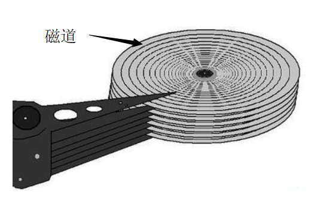

# 文件系统基础

以计算机硬盘为载体的存储在计算机上的信息集合，可以是文本文档、图片、程序等。大多数应用程序的输入都是通过文件来实现的，其输出也保存在文件里。

组成：一块存储空间(主要是空间中的数据)；分类和索引的信息；关于访问权限的信息。

用户通过文件系统建立文件、提供应用程序的输入输出，对资源进行管理。

**文件的结构**

1. 数据项。文件系统中最低级的数据组织形式。分为基本数据项(描述一个对象的某种属性等，是最小逻辑数据单位)和组合数据项。
2. 记录。一组相关数据项的集合。
3. 文件。一组相关信息的集合。分为记录式(一组相似记录)文件和流式(无结构)文件。

实际上关于文件没有过于严格的定义。

文件的属性：名称、标识符、类型、位置、大小、保护、时间和用户标识

文件的打开：系统调用open，根据文件名搜索目录，并将目录条目复制到打开文件表。若请求得到允许，进程就能打开文件。open通常返回一个指向打开文件表中的一个条目的指针。通过使用该指针进行所有的I/O操作。

> open调用完成后，操作系统对文件的任何操作都不再需要文件名，只需要open返回的指针。

# 磁盘组织与管理

磁盘：表面涂有磁性物质的金属组成的圆形盘片，通过一个称为==磁头==的导体线圈从磁盘中存取数据。读写期间，磁头不动，磁盘旋转。

磁盘的数据存放在磁道中(磁盘上的一组同心圆)，磁道又能划分为若干个扇区(**所有**扇区相等大小)。

**扇区就是磁盘可寻址的最小存储单位**。

文件实际上存放在磁盘当中，操作系统接受用户的命令后，经过一系列的检验访问权限和寻址过程，都会到达磁盘，控制磁盘把数据信息读出或修改。

**磁盘的结构**：多个**盘片**用于存储数据，都绕着中心的主轴转动。有一个机械臂杆，通常是一个组合臂，有多个**磁头臂**组成。每个磁头臂上边都有一个**磁头**，用来在磁盘上读写数据。一般磁头停留在起始区，起始区没有数据。

**磁盘的读取**：磁盘不支持随机访问，只能让盘面绕着主轴转动，把相应地址的位置转动到磁头上，然后再进行数据的读取。

## ==磁盘调度算法==

磁盘读写操作的时间：

* 寻道时间：将磁头移动到指定磁道所需要的时间。
* 旋转延迟时间：磁头定位到扇区需要花的时间。
* 传输时间：从磁盘读出或向磁盘写入的时间。

**常见的磁盘调度算法**：

**1.先来先服务FCFS** 

根据进程请求访问磁盘的先后顺序进行调度。

**2.最短寻找时间优先SSTF** 

选择调度处理的磁道是与当前磁头所在磁道距离最近的磁道，以便使得每次寻找的时间最短(贪心)。该算法会产生“饥饿”现象，距离磁头较远的磁道的申请可能会被无限延期。

**3.扫描算法SCAN(电梯调度算法)** 

选择当前磁头==移动方向上==的最近的请求作为下一次服务对象。移动规律与电梯类似。

**需要知道磁头移动的方向**。

服务完成后需要移动到最外侧的磁头才能改变方向向内侧移动。

**4.循环扫描算法(C-SCAN)** 

在扫描算法的基础上，磁头移动到某一边的最远的请求，完成后移动到最远端就**==返回==**(回到起始端，比如最右端移动到最左端)，然后重新开始服务。

**扫描/循环扫描算法的改进：Look算法和C-Look算法**

不需移动到最远端，只需移动到当前方向的最后一个服务即可返回或者改变方向。

对于C-Look算法，不需要返回到起始端，只需要返回到距离起始端最近的请求的磁道处理请求即可。

### 减少磁盘延迟时间

由于磁盘读取完一个扇区后不能立即读取下一个扇区，因此可以对磁盘进行交错编号、错位命名。

交错编号：对于逻辑上连续的扇区，可以让它们在物理上相隔一个扇区，这样可以让磁盘有足够的时间来cd，从而不读取它们中间的那个扇区，等磁头cd完毕，就直接读取的是逻辑上的下一个扇区了。

错位命名：相邻盘面的同一个位置的扇区的编号不同。

## 磁盘的管理

磁盘初始化：分成扇区以便磁盘控制器能够进行读和写操作(低级格式化/物理分区)、

