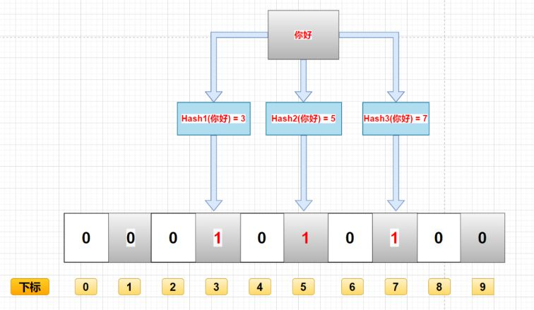

## 布隆过滤器

组成上是一个二进制向量和一系列随机映射函数。

二进制向量：一个类似于数组的结构，里面元素的值不是0就是1，每一个元素都对应了一个下标，其实就是一个哈希函数映射后得到的结果。

映射函数：hash函数，把输入的数据转化成其他的形式。

**数据的存入过程**：一个数据需要经过一系列的哈希映射，得到多个映射的值，随后去二进制向量中找到相应的下标，把他们修改成1，表示这个数据已存入。

**数据的查询过程**：对于查询的数据，通过哈希映射，去查询相应的下标是否为1，如果都为1，就表示该数据存在。

**数据的删除过程**：通常不能删除布隆过滤器里的数据。

**优点**：存储的是二进制数据，占用的空间很小；插入和查询的速度很快，时间复杂度是O(n)；保密性很好。

**缺点**：不同的数据可能得到相同的hash值，下标仍然是1，存在误判；删除十分困难，可能会一连删多个数据。

**布隆过滤器说某个元素存在，小概率会误判。布隆过滤器说某个元素不在，那么这个元素一定不在**。

