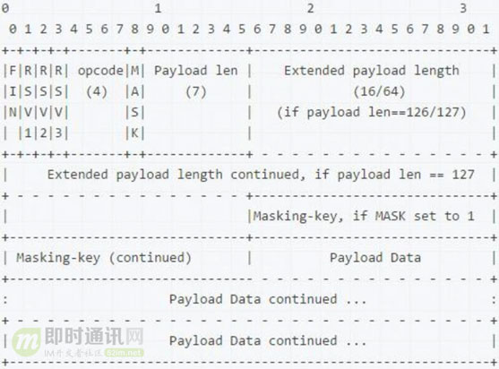

MAC地址的局限性：如果两台电脑不在同一个子网络，就无法知道对方的MAC地址，必须通过网关gateway转发。

"动态IP地址"，指计算机开机后，会自动分配到一个IP地址，不用人为设定。它使用的协议叫做DHCP协议。


## 我们在读写Socket时，究竟在读写什么？

当客户端和服务器使用TCP协议进行通信时，客户端封装一个请求对象req，将请求对象req序列化成字节数组，然后==通过套接字socket将字节数组发送到服务器==，==服务器通过套接字socket读取到字节数组==，再反序列化成请求对象req，进行处理。

**==我们平时用到的套接字其实只是一个引用(一个对象ID)，这个套接字对象实际上是放在操作系统内核中==**。这个套接字对象内部有两个重要的缓冲结构，一个是读缓冲(read buffer)，一个是写缓冲(write buffer)，它们都是有限大小的数组结构。

当我们对客户端的socket写入字节数组时(序列化后的请求消息对象req)，是将字节数组拷贝到内核区套接字对象的write buffer中，内核网络模块会有**单独的线程负责不停地将write buffer的数据拷贝到网卡硬件**，网卡硬件再将数据送到网线，经过一些列路由器交换机，最终送达服务器的网卡硬件中。

注意到write buffer空间都是有限的，所以如果应用程序往套接字里写的太快，这个空间是会满的。一旦满了，写操作就会阻塞，直到这个空间有足够的位置腾出来。

当写缓冲的内容拷贝到网卡后，是不会立即从写缓冲中将这些拷贝的内容移除的，而要**等待对方的ack过来之后才会移除**。如果网络状况不好，ack迟迟不过来，写缓冲很快就会满的。


## 在客户端连接成功时，有几个socket存在？

创建ServerSocket后，内核会创建一个 socket。这个 socket 既可以拿来监听客户连接，也可以连接远端的服务。ServerSocket是用来监听客户连接的。

客户端创建一个Socket，同样的，内核也创建一个 socket实例。Socket会对它执行connect，发起对服务端的连接。

服务端的主机在收到这个 SYN 后，会创建一个新的 socket，这个新创建的 socket 跟客户端继续执行三次握手过程。三次握手完成后，我们执行的 `serverSocket.accept()` 会返回一个 Socket 实例，这个 socket 就是上一步内核自动帮我们创建的。

**所以说：**在一个客户端连接的情况下，其实有3个 socket。


## NAT

NAT名字很准确，网络地址转换，就是替换IP报文头部的地址信息。通常部署在一个组织的网络出口位置，<font color=blue>**通过将内部网络IP地址替换为出口的IP地址**</font>。

10.0.0.0-10.255.255.255；172.16.0.0-172.31.255.255；192.168.0.0-192.168.255.255。这三个范围分别处于A,B,C类的地址段，**不向特定的用户分配**，被IANA作为私有地址保留。**==仅能在内部使用，不能作为全球路由地址==**。

**对于一个封闭的组织，如果网络不连接到Internet，就可以使用这些地址而不用向IANA提出申请**。

对于有Internet访问需求而内部又使用私有地址的网络，就要在组织的出口位置部署NAT网关，在报文离开私网进入Internet时，将源IP替换为公网地址，**==通常是出口设备的接口地址==**。依据这种模型，数量庞大的内网主机就不再需要公有IP地址了。


### NAT的关键点

- 网络被分为私网和公网两个部分，NAT网关设置在私网到公网的路由出口位置，双向流量必须都要经过NAT网关；
- 网络访问**只能先由私网侧发起**，公网无法主动访问私网主机；
- NAT网关在两个访问方向上完成两次地址的转换或翻译，出方向做源信息替换，入方向做目的信息替换；
- NAT网关的存在对通信双方是保持透明的；
- NAT网关为了实现双向翻译的功能，需要**维护一张关联表**，把会话的信息保存下来。


### NAT的弊端

* 破坏了IP的端到端通信(P2P)的能力(网络访问只能先由私网侧发起，公网无法主动访问私网主机)。
* NAT使IP会话的保持时效变短(NAT网关会进行老化操作)。
* NAT在实现上将多个内部主机发出的连接复用到一个IP上，这就使依赖IP进行主机跟踪的机制都失效了。因为NAT隐蔽了通信的一端，把简单的事情复杂化了。
* NAT工作机制依赖于修改IP包头的信息，这会妨碍一些安全协议的工作。因为NAT篡改了IP地址、传输层端口号和校验和，这会导致认证协议彻底不能工作，因为认证目的就是要保证这些信息在传输过程中没有变化。


### NAT穿越技术(P2P穿越)

反向链接技术**(通信双方中只有一方位于NAT设备之后)**：双方都连接到同一台服务器上的情况下，不位于NAT设备后的客户端通过服务器给对方发送一个请求，**请求对方反过来连接自己**。这样在NAT设备上就会建立起关于这个连接的相关表项，使A和B之间能够正常通信，从而建立起它们之间的TCP连接。


**基于UDP的P2P打洞技术** 

通过**中间服务器**的协助在各自的NAT网关上建立相关的表项，使P2P连接的双方发送的报文能够直接**穿透**对方的NAT网关，从而实现P2P客户端互连。如果两台位于NAT设备后面的P2P客户端希望在自己的NAT网关上打个洞，那么他们需要一个协助者——集中服务器**(==设置在公网上==，客户端通过它了解对方的信息)**，并且还需要一种用于打洞的Session建立机制(向集中服务器发送自己的登录消息，通过集中服务器知晓对方的内网IP外网IP二元组)。

打洞：客户端知道对方的IP后，**向对方的外网IP发送消息**，这就是打洞的过程。发往对方的消息包会在自己的NAT设备上**建立一个会话**(外网和内网IP的映射)。一旦AB都向对方的NAT设备在外网上的地址二元组发送了数据包，就打开了AB之间的洞。转而开始真正的P2P传输。


**基于TCP的P2P打洞技术** 

TCP协议的“打洞”从协议层来看是与UDP非常相似的。只要NAT设备支持的话，基于TCP的P2P技术的健壮性将比基于UDP技术的更强一些，因为TCP协议的状态机给出了一种标准的方法来精确的获取某个TCP session的生命期，而UDP协议则无法做到这一点。

TCP的套接字通常**仅允许建立1对1的响应**，即应用程序在将一个套接字绑定到本地的一个端口以后，任何试图将第二个套接字绑定到该端口的操作都会失败。为了让TCP“打洞”能够顺利工作，我们需要使用一个本地的TCP端口来**监听来自外部的TCP连接，同时建立多个向外的TCP连接**。幸运的是，所有的主流操作系统都能够支持特殊的TCP套接字参数，通常叫做“SO_REUSEADDR”，该参数允许应用程序将多个套接字绑定到本地的一个地址二元组（只要所有要绑定的套接字都设置了SO_REUSEADDR参数即可）。BSD系统引入了SO_REUSEPORT参数，该参数用于区分端口重用还是地址重用，在这样的系统里面，上述所有的参数必须都设置才行。


## UDP的连接性和负载均衡

### UDP的连接性

~~分为绑定和不绑定~~。

UDP是基于用户数据报的，只要数据包准备好就应该调用一次send或sendto进行发包，当然包的大小完全由应用层逻辑决定的。

进行UDP通信的时候，如果首先调用connect绑定对端Endpoint_S的后，那么就可以直接调用send来给对端Endpoint_S发送UDP数据包了。用户在connect之后，内核会永久维护一个存储对端Endpoint_S的地址信息的数据结构，内核不再需要分配/删除这些数据结构，只需要查找就可以了，从而减少了数据的拷贝。这样对于connect方而言，该UDP通信**在内核已经维护这一个“连接”了**，那么在通信的整个过程中，内核都能随时追踪到这个“连接”。

当一个 UDP socket 去 connect 一个远端 Endpoint_S 时，并没有发送任何的数据包，其效果**仅仅是在本地建立了一个五元组映射，对应到一个对端**，该映射的作用正是为了和 UDP 带外的 ICMP 控制通道捆绑在一起，使得 UDP socket 的接口含义更加丰满。内核协议栈就维护了一个从源到目的地的单向连接，当下层有ICMP(对于非IP协议，可以是其它机制)错误信息返回时，**内核协议栈就能够准确知道该错误是由哪个用户socket产生的**，这样就能准确将错误转发给上层应用了。

对于一个无“连接”的UDP，sendto系统调用后，内核在将数据包发送出去后，**就释放了存储对端Endpoint_S的地址等信息的数据结构了，这样在下层的协议有错误返回的时候，内核已经无法追踪到源socket了**。


## 字节序和大小端

字节序就是指数据在内存中**存放的顺序**，当字节数大于1时需要考虑。

大端字节序：高位字节排放在内存的低地址端，低位字节排放在内存的高地址端(这是**人类读写数值的方法**)。

小端字节序：低位字节排放在内存的低地址端，高位字节排放在内存的高地址端。

0x1234567的大端字节序和小段字节序分别为：01 | 23 | 45 | 67和67 | 45 | 23 | 01。


**为什么存在大小端字节序**：计算机中**电路优先处理低位字节，效率比较高**，因为计算机都是从低位开始的，所以计算机内部处理都是小端字节序。而人类人类读写数值的方法，习惯用大端字节序，所以除了计算机的内部处，其他的场理合都是大端字节序，比如：网络传输和文件储存时都是用的大端字节序。


**什么是网络字节序**：网络字节序就是大端字节序。

同型号计算机上写的程序，在相同的系统上面运行总归是没有问题。但计算机网络的出现让大小端问题变的复杂化了，因为每个计算机都有自己的主机字节序。

TCP/IP协议规定使用**大端**字节序作为网络字节序。

主机字节序转换为网络字节序：TCP/IP协议要求发送端发送的第一个字节是高位字节；而在发送端发送数据时，发送的第一个字节是该数值在内存中的起始地址处对应的那个字节。通信时的这种常用的操作，Socket API这一层，一般都提供了封装好的转换函数，方便程序员使用。


## WebSocket

WebSocket的目标是在一个单独的持久连接上提供**全双工、双向通信**。在Javascript创建了WebSocket之后，会有一个HTTP请求发送到浏览器以发起连接。在取得服务器响应后，建立的连接会将HTTP升级从HTTP协议交换为WebSocket协议。

由于WebSocket使用**==自定义的协议==**，所以URL模式也略有不同。未加密的连接不再是http://，而是ws://;加密的连接也不是https://，而是wss://。在使用WebSocket URL时，必须带着这个模式，因为将来还有可能支持其他的模式。

使用自定义协议而非HTTP协议的好处是，能够在客户端和服务器之间发送<font color=blue>**非常少量的数据**</font>，而**不必担心HTTP那样字节级的开销**。由于传递的数据包很小，所以WebSocket非常适合移动应用。

### WebSocket复用了HTTP的握手通道

HTTP的握手通道指的是每次建立的TCP通信通道。在Javascript创建了WebSocket之后，会有一个HTTP请求发送到浏览器以发起连接，然后服务端响应，这就是“握手“的过程。具体如下：

* 建立HTTP协议：完成数据交互后就释放通道→短连接。
* 升级到WebSocket协议：复用HTTP协议的握手通道(**自己维持需要服务端消耗大量资源**)，建立持久连接。

**HTTP协议升级成WebSocket协议**：客户端发起协议升级请求，根据`Connection:Upgrade、Upgrade:websocket、Sec-WebSocket-Version: 13、Sec-WebSocket-Key:UdTUf90CC561cQXn4n5XRg== ：`等http标头来进行升级。


### WebSocket的帧和数据分片传输

HTTP协议是基于TCP实现的，HTTP发送数据也是分包转发的，就是将大数据根据报文形式分割成一小块一小块发送到服务端，服务端接收到客户端发送的报文后，再将小块的数据拼接组装。websocket协议也是**==通过分片打包数据进行转发的==**，不过**==策略上和HTTP的分包不一样==**。

websocket发送数据的基本单位：帧(frame)。



FIN：为1时表示这是消息的最后一个分片。websocket中客户端发送数据分片是有序的，FIN能保证所有消息完整发送到服务端。


### WebSocket保持连接和心跳检测

```go
package main

import (
   "net/http"
   "time"
	"github.com/gorilla/websocket"
)

var (
    //完成握手操作
    upgrade = websocket.Upgrader{
       //允许跨域(一般来讲,websocket都是独立部署的)
       CheckOrigin:func(r *http.Request) bool {
            return true
       },
    }
)

func wsHandler(w http.ResponseWriter, r *http.Request) {
   var (
         conn *websocket.Conn
         err error
         data []byte
   )
   //服务端对客户端的http请求(升级为websocket协议)进行应答，应答之后，协议升级为websocket，http建立连接时的tcp三次握手将保持。
   if conn, err = upgrade.Upgrade(w, r, nil); err != nil {
        return
   }

//启动一个协程，每隔1s向客户端发送一次心跳消息
go func() {
    var (
        err error
    )
    for {
        if err = conn.WriteMessage(websocket.TextMessage, []byte("heartbeat")); err != nil {
            return
        }
        time.Sleep(1 * time.Second)
    }
}()

   //得到websocket的长链接之后,就可以对客户端传递的数据进行操作了
   for {
         //通过websocket长链接读到的数据可以是text文本数据，也可以是二进制Binary
        if _, data, err = conn.ReadMessage(); err != nil {
            goto ERR
     }
     if err = conn.WriteMessage(websocket.TextMessage, data); err != nil {
         goto ERR
     }
   }
ERR:
    //出错之后，关闭socket连接
    conn.Close()
}

func main() {
    http.HandleFunc("/ws", wsHandler)
    http.ListenAndServe("0.0.0.0:7777", nil)
}
```

