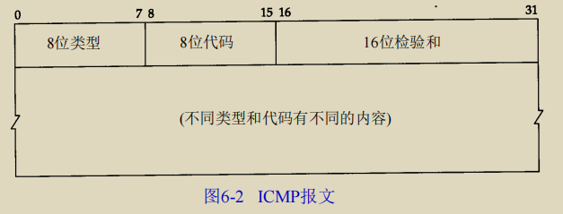

### 术语

**结点(node)**：网络中的结点，可以是计算机、集线器、交换机或路由器等。

**链路(link)**：从一个结点到另一个结点的一段==物理==线路，中间没有其他的结点。

**ISP**：因特网服务提供者。(PC→ISP→Internet)

**IXP**：互联网交换点。主要作用就是允许两个网络直接相连并交换分组，而不需要再通过第三个网络来转发分组。

**RFC(Request For Comments)**：请求评议，包含了关于Internet几乎所有重要的文字资料。

**广域网WAN(Wide Area Network)**：通过路由器来连接，覆盖范围大。他的任务是通过长距离运送主机发送的数据。发送介质主要是利用电话线或者光纤。

**城域网MAN(Metropolitan)**：用来将多个局域网进行互连。

**局域网LAN(Local Area Network)**：某一区域内由多台计算机互联成的计算机组。局域网可以实现文件管理、应用软件共享、打印机共享等功能。学校或企业拥有多个互连的局域网。

个人局域网PAN：在个人工作的地方把属于个人使用的电子设备用无线技术连接起来的网络。

**分组(packet)**：又称为包，因特网传送的数据单元。由首部header和数据段组成。

**存储转发(store and forward)**：路由器收到一个分组，先检查分组是否正确，并过滤掉冲突包错误。确定包正确后，取出目的地址，通过查找表找到想要发送的输出端口地址，然乎将包发出去。

带宽(bandwidth)：在计算机网络中，表示在单位时间内从网络中的某一点到零一点所能通过的“最高数据率”。表示网络的通信线路所能传送数据的能力。单位是比特/秒。

吞吐量(throughput)：表示在单位时间安内通过某个网络(或信道、接口)的数据量。更经常的用于对现实世界中的网络的一种测量。

### 重要知识点

1. 计算机网络把许多计算机连接在一起，而互联网把许多网络连接在一起，是网络的网络。
2. internet是通用名词，泛指多个计算机网络相互连接而成的网络。Internet是全球最大的，开放的，由众多网络相互连接而成的特定的互联网，并采用 TCP/IP 协议作为通信规则。
3. <u>**路由器是实现分组交换的关键构件**，其任务是==转发==收到的分组</u>。这是网络核心部分最重要的功能。分组交换采用==存储转发技术==，把一个**报文**(整块数据)分成几个分组后再进行发送。<u>发送报文之前，先把较长的报文划分为一个个过呢个小的等长数据段，在每个数据段的前面加上首部，就构成了一个分组(又称为包)</u>。分组是在互联网中传送的数据单元。
4. 计算机网络采用的通信方式是客户--服务器方式(C/S方式)和对等连接方式(P2P方式)。
5. 客户和服务器都是指通信中所涉及的应用进程。
6. 计算机网络最常用的性能指标：**速率**，**带宽**，**吞吐量**，**时延(发送时延，处理时延，排队时延)**，**时延带宽积**，**往返时间和信道利用率**。
7. 网络协议即协议，是为网络中的数据交换而建立的规则。计算机网络的各层以及其协议的集合，称为网络的体系结构。

## 计算机网络的五层体系结构

### 物理层(Physical Layer)

#### 2.1基本术语

1.数据(data)：运送消息的实体

2.信号(signal)：数据的电气的或电磁的表现。或者说信号是适合在传输介质上传输的对象。

3.码元(code)：在使用时间域（或简称为时域）的波形来表示数字信号时，代表不同离散数值的基本波形。比如使用2进制编码时，有两种码元：0和1。

4.**单工simplex**(传输的双方只能有一个方向的通信)、**半双工half duplex**(通信的双方都可以发送信息，但不能双方同时发送或同时接收)、**全双工full duplex**(通信的双方可以同时发送和接收信息)。

5.**失真**：接受到的信号和发送的不同，有磨损和衰减。影响因素有：

1. 码元传输速率
2. 信号传输距离
3. 噪声干扰数量
4. 传输媒体质量

6.奈氏准则：在任何信道中，码元的传输效率有上限，传输速率超过这个上限就会出现严重的码间串扰问题，使接收端对码元的判决成为不可能。

7.香农定理：在带宽受限且有噪声的信道中，为了不产生误差，信息的数据传输速率有上限值。

8.基带信号(baseband signal) : 来自信源的信号。指**没有经过调制**的数字信号或模拟信号。

9.带通(频带)信号(bandpass signal)：把基带信号**经过载波调制后**，把信号的频率范围搬移到较高的频段以便在信道中传输(即仅在一段频率范围内能够通过信道)，这里调制过后的信号就是带通信号。
10.调制(modulation) : 对信号源的信息进行处理后**加到载波信号**上，使其变为适合在信道传输的形式的过程。调制有基带调制和带通调制之分。最基本的带通调制方法有调幅，调频和调相。还有更复杂的调制方法，如正交振幅调制。
11.信噪比(signal-to-noise ratio): 指信号的==平均功率==和噪声的==平均功率==之比，记为 S/N。信噪比(dB)=10*log10(S/N)。
12.信道复用(channel multiplexing) ：指多个用户共享同一个信道。(并不一定是同时)

13.比特率：单位时间内传送的比特数

14.波特率：单位时间内载波调制状态改变的次数(数字通信系统所传输的码元个数)。针对数据信号对载波的调制速率。

15.**复用(multiplexing)** ：共享信道的方法。

16.ADSL(Asymmetric Digital Subscriber Line)：非对称数字用户线。

17.光纤同轴混合网(HFC 网) :在目前覆盖范围很广的有线电视网的基础上开发的一种居民宽带接入网

#### 2.2重要知识点

1.物理层的主要任务就是==确定与传输媒体接口有关的一些特性==，如机械特性，电气特性，功能特性，过程特性。

2.通信的目的是**传送信息**。如语音，文字，图象等都是消息，数据时运送消息的实体。信号则是数据的电器或电磁的表现。

#### 2.3补充

物理层主要做的事就是**透明地传送比特流**。也可以描述为确定与传输媒体的接口的一些特性。物理层考虑的是怎样才能在连接各种计算机的传输媒体上传输数据比特流，而不是具体的传输媒体。

作用：屏蔽掉传输媒体和通信手段的差异。这样就可以使得数据链路层==只考虑完成本层的协议和服务==，而不必考虑网络的具体传输媒体和通信手段是什么。

##### 常用的信道复用技术

1.频分复用FDM：所有用户在同一时间占用不同的带宽资源。

2.时分复用TDM：所有用户在不同的时间内占用同样的频带宽度。

3.统计时分复用STDM：改进的时分复用，能够明显提高信道的利用率。

4.码分复用CDM：用户使用经过特殊挑选的不同码型，因此各用户之间不会造成干扰。这种系统发送的信号有很强的抗干扰能力，频谱类似于白噪声，不易被发现。

5.波分复用WDM：光的频分复用。

### 数据链路层

#### 基本术语

**链路(link)**：一个节点到另一个结点的一段物理链路。

**数据链路**：巴士线控制数据运输的协议的硬件和软件加到链路上就构成了数据链路。

**循环冗余校验==CRC==(Cyclic Redundancy Check)**：为了保证数据传输的可靠性，CRC是数据链路层广泛使用的一种检错技术。

基本思想：将传输的数据当作一个位数很长的数，将这个数除以另一个数。得到的余数作为校验数据附加到原数据后面。

帧(frame)：一个数据链路层的传输单元，由一个数据链路层首部和其携带的封包所组成协议数据单元。

MTU：最大传输单元。帧的数据部分的长度上限。

误码率：一段时间内传输错误的比特占所传输比特总数的比率。

**PPP**：点对点协议。即用户计算机和ISP进行通信时所使用的数据链路层协议。

**MAC地址**：译为媒体访问控制，或称为物理地址、硬件地址，用来==定义网络设备的位置==。一个主机有一个MAC地址，而每个网络位置会有一个专属于它的ip地址。

**网桥(bridge)**：一种用于数据链路层实现中继，连接两个或多个局域网的网络连接设备。

**交换机(switch)**：指的是一种通信系统中完成信息交换的设备。工作在数据链路层的交换机指的是交换式集线器，本质是一个多接口的网桥。

#### 重要知识点

1.数据链路层使用的主要是**点对点信道**和**广播信道**两种。

2.数据链路层传输的协议数据单元是帧。三个基本问题：*封装成帧*、*透明传输*、*差错检测*。

3.点对点协议PPP是数据链路层使用最多的一种协议，它的特点是：简单，只检测差错而不去纠正差错，不使用序号，也不进行流量控制，可同时支持多种网络层的协议。

4.帧检验序列FCS是添加在数据后面的冗余码。

5.PPPoE(以太网上的PPP协议)是为宽带上网的主机使用的链路层协议。

6.局域网的优点：具有广播功能，从一个站点可方便地访问全网；便于系统地扩展和逐渐演变；提高了系统地可靠性，可用性和生存性。

7.计算机与外接局域网通信需要通过适配器，又称为网络接口卡或网卡。

8.以太网采用地无连接地工作方式。

9.==以太网采用具有冲突检测地载波监听多点接入**CSMA/CD**协议。协议的特点是发送前先监听，边发送边监听，发现碰撞就立即停止发送。然后按照**退避算法**等待一段时间后再发送。==

10.以太网适配器具有过滤功能，只接受单播帧，广播帧和多播帧。

11.使用集线器可以在物理层扩展以太网。

### 网络层

#### 基本术语

1.虚电路Virtual Circuit：在两个终端设备地逻辑或物理接口之间通过建立的**双向地透明地传输通道**。虚电路表示这只是一条逻辑上地连接，分组都沿着这条逻辑链接按照==存储转发==地方式传送，而不是真正建立了一条物理连接。

2.**IP**：网际协议，是TCP/IP体系中两个最重要地协议之一，是TCP/IP体系结构网际层地核心。

#### 个人总结

------

IP数据报在被转发的过程中，数据链路层封装使用的MAC地址是不断改变的。

**ARP原理**：发送IP数据报时，先查看高速缓存有无目的IP，有就直接转换成MAC地址通过数据链路层发送。没有就广播，目的主机收到广播后自己发送自己的ARP分组(包含IP地址和MAC地址的映射)，源主机将他们写入ARP缓存，在发送。

**DHCP原理**：需要IP地址的主机启动时向DHCP服务器发送发现报文，DHCP服务器回答此报文(提供报文)，DHCP服务器先在数据库中查找该计算机的配置信息，若找到则返回。客户机收到后，如果接收，就向服务器请求IP地址，服务器则进行分配。若找不到则从服务器的IP地址池中取一个地址分配给该计算机。

**ICMP**(向源主机报告)：让主机或路由器来报告差错或者异常情况。ICMP报文作为数据报的数据，加上数据报的首部，组成IP数据报发送出去。

5种类型：

1. 终点不可达
2. 源点抑制(由于拥塞，数据报被丢弃)
3. 时间超过(路由器收到生存时间为0的数据报)
4. 参数问题(数据报首部有的等字段的值不正确)
5. 改变路由(重定向)(数据报可通过更好的路由发送)

不发送ICMP差错报告报文：

1. 对于本就是ICMP差错报告报文
2. 第一个分片的数据报片的所有后续数据报片
3. 具有组播地址的数据报
4. 具有特殊地址(127.0.0.0或0.0.0.0等)的数据报

**IPv6**主要体现

更长的地址，简化了IP分组头(只包含8个域)，更好地支持选项(一些以前必要的段现在变成了可选段)。

IPv6每四位用十六进制表示，并用冒号隔开。

分级：顶级、场点级、单个网络接口。

**IGMP**因特网组管理协议，能够通知本地网络上的路由器关于要接收发送给某个组播组的分组的愿望。当某台计算机加入组播组中，要向组播地址发送IGMP报文，表示自己要加入组播。组播路由器要周期性的探询主机以知道他们是否仍是组的成员，只要对某个组有一台主机响应，就认为这个组是活跃的。对不活跃的组将不再转发他们的成员关系。

组播路由选择：找出以源主机为节点的组播转发树。其中每个分组在每条链路上只转发一次。

在同一个网络上发送数据报不需要经过路由器。

路由器完成的主要功能有：分组转发(转发表查询，转发以及相关的队列管理和任务调度)、路由计算(基于路由协议的交互，完成路由表的计算)。

转发是指路由器把IP数据报从合适的端口转发出去，而路由选择涉及很多路由器按照复杂的算法，根据从各个相邻的路由器得到的关于网络拓扑变化情况，动态的改变所选择的路由，并构造出整个路由表。

---

### ==传输层==

----

1. **传输层的复用与分用** ：复用指发送方不同的进程都可以通过统一个运输层协议传送数据。分用指接收方的运输层在剥去报文的首部后能把这些数据正确的交付到目的应用进程。
2. **==端口==**：端口是传输层的服务访问点，作用类似于IP地址在网络层中的作用。端口的目的是为了确认对方机器是哪个进程在与自己进行交互，比如 MSN 和 QQ 的端口不同，如果没有端口就可能出现 QQ 进程和 MSN 交互错误。端口又称协议端口号。
3. **端口号**：长度为16bit，用来标识应用进程。端口号只具有本地意义，只标识本计算机应用层中的各进程，不同计算机中的相同端口号没有联系。
   1. 服务器端使用的端口号。
      1. 熟知端口号，0~1023，指派给TCP/IP最重要的一些应用程序。
      2. 登记端口号，1024~49151，供没有熟知端口号的应用程序使用，使用这一类端口号需要在IANA登记，防止重复。
   2. 客户端使用的端口号。
   3. 49152~65535。又称为短暂端口号，仅在客户进程运行时才动态选择。通信结束后就不复存在，可供其他客户进程以后使用。
4. 套接字：IP地址和端口号拼接而成，唯一的标识网络中一台主机和其上的一个应用进程。

与TCP相比，UDP不会引入建立连接的时延，一般能够支持更多客户机，分组首部开销小。常用于一次性传输较少数据的网络应用，如DNS、SNMP等。

**UDP校验**：计算校验和的时候要在UDP数据报之前增加12B的伪首部，UDP校验检查的是<u>*首部和数据*</u>部分，也是UDP数据报中的长度字段。

**TCP解决**：可靠、有序、无丢失、不重复。提供全双工，发送和接收的两端都设有缓存。TCP面向字节流，连接的端口是套接字或者插口。采用客户/服务器的方式建立连接，主动发起连接的成为客户，被动等待连接的称为服务器。

#### ==TCP连接建立(三次握手四次挥手)==

[(3条消息) 两张动图-彻底明白TCP的三次握手与四次挥手_qzcsu的博客-CSDN博客_三次握手四次挥手详解](https://blog.csdn.net/qzcsu/article/details/72861891)

#### TCP与UDP的区别

|     类型     |           UDP            |                 TCP                  |
| :----------: | :----------------------: | :----------------------------------: |
| 是否面向连接 |          无连接          |                  是                  |
|  传输可靠性  |          不可靠          |                 可靠                 |
|   传输形式   |        数据报文段        |                字节流                |
|   传输效率   |            快            |                  慢                  |
|   所需资源   |            少            |                  多                  |
|   应用场景   | 要求通信速度高(数据转换) | 要求通信数据可靠(文件传输，邮件传输) |
|   首部字节   |    8(由四个字段组成)     |                20-60                 |

#### ==TCP可靠传输==

TCP使用了校验、序号、确认和重传等机制来实现这一目的。

##### 序号

TCP首部的序号字段用来保证数据有序地提交给应用层。数据流中的每个字节都编上一个序号。

##### 停止等待协议

​		当发送窗口和接收窗口都等于1时，就是停止等待协议。发送端给接收端发送数据，等待接收端确认回复ACk，并停止发送新的数据包，开启计时器。数据包在计时器超时之前得到确认，那么计时器就会关闭，并发送下一个数据包。如果计时器超时，发送端就认为数据包丢失或被破坏，需要重新发送之前的数据包，说明数据包在得到确认之前，发送端需要存储数据包的副本。 停止等待协议是发出一个帧后得到确认才发下一个，降低了信道的利用率。

##### 		确认

​		TCP首部的确认号是期望收到对方的==下一个报文段的数据的第一个字节==的序号。TCP只确认数据流中至第一个丢失字节为止的字节。

##### 		重传

​		**1.超时** 

​		TCP每发送一个报文段就要设置一次计时器，计时器到期但还没收到确认报文段时，就要对这一数据进行重传。这种自动重传方式常称为自动重传请求 **ARQ**。连续 ARQ 协议可提高信道利用率。发送维持一个发送窗口，凡位于发送窗口内的分组可连续发送出去，而不需要等待对方确认。接收方一般采用累积确认，对按序到达的最后一个分组发送确认，表明到这个分组位置的所有分组都已经正确收到了。

​		采用自适应算法记录报文段的往返时间RTT，保留RTT的一个加权往返时间RTTs(随着RTT样本值的测量的变化而变化)。RTT应略大于RTTs但不能太大。

​		**2.冗余ACK** 

​		再次确认某个报文段的ACK，而发送方先前已经收到过该报文段的确认。接收端收到不符合序号的报文段就会发送冗余ACK给发送方，发送方收到过多这样的报文段后就会进行重传。

#### TCP流量控制

TCP提供一种基于滑动窗口协议的流量控制机制。传输层的窗口可以进行动态变化。

***接收方***根据自己的接收缓存大小，动态的调整发送方的窗口大小。称为**接收窗口rwnd**(调整TCP报文段首部中的窗口字段值)。

***发送方***根据网络的拥塞程度估计确定窗口，称为**拥塞窗口cwnd**，大小与网络的带宽和时延相关。

接收方通过确认报文段将自己的rwcd告诉发送方。

发送方将未确认的数据量控制在rwcd之内。窗口实际上取rwnd和cwnd的**最小值**。

#### TCP拥塞控制

防止过多的数据注入网络，保证网络中的路由器或链路不致过载。拥塞往往表现为通信时延的增加。

<u>与流量控制的区别</u>：它们都是通过控制发送端的发送速率来达到控制效果。拥塞控制是让网络能够承受现有的网络负荷，是一个全局性的过程，涉及主机路由器以及其他因素。流量控制是端到端的问题，要做的是抑制发送端的速率以便接收端来得及接收。

4种算法：慢开始、拥塞避免、快重传、快恢复。

##### 慢开始

指发送方开始时只发送一个报文段试探一下网络拥塞情况。TCP刚刚建立连接时，先令拥塞窗口cwnd=1(一个最大报文段长度)，随后每发送一个报文段，就把拥塞窗口扩大到原来的2倍，但不能超过ssthresh门限。直到一个规定的慢开始门限ssthresh，改用拥塞避免算法。

##### 拥塞避免

让拥塞窗口缓慢增大，每经过一个RTT就把拥塞窗口的大小增加1而不是加倍，以防止网络过早出现拥塞。

当cwnd>ssthresh时，使用拥塞避免算法。

<u>*无论是在上述哪个阶段，只要出选了拥塞，就要把ssthresh设置为当前速度的一半(不能小于2)。然后把cwnd重置为1，重新开始慢开始算法。*</u>

##### 快重传

发送方连续收到3个冗余ACK时，直接重传对方未收到的报文段，而不必等待重传计时器超时。

##### 快恢复

发生拥塞时，在拥塞避免算法的基础上，不把cwnd重置为1，而是直接设置为修改后的ssthresh，并开始缓慢增大。

##### 总结

<u>*在TCP建立连接和网络出现超时的时候，使用慢开始和拥塞避免算法。在发送方收到冗余ACK时，使用快重传和快恢复算法。*</u>

---

### ==应用层==

#### 客户/服务器模型(C/S)

有一个总是打开的主机称为服务器，服务于许多来自其他称为客户机的主机请求。

工作流程：

​		1.服务器处于接受请求状态。

​		2.客户机发出服务请求并等待接受结果。

​		3.服务器收到请求，分析请求得到适当结果，并发送给客户机。

常见应用：Web、文件传输协议FTP、远程登陆、电子邮件。

#### P2P模型

整个网络中的传输内容不再被保存在中心服务器上，每个节点都同时具有下载，上传的功能，权力和义务都是大体对等的。

每个结点既作为客户访问其他结点的资源，又作为服务器提供资源给其他结点访问。

P2P模型减轻了服务器的计算压力，消除了对某个服务器的完全依赖，大大提高了系统效率和资源利用率。

---

####  域名系统DNS

**因特网使用的命名系统，用来把便于人们记忆的具有特定含义的主机名转换为便于机器处理的IP地址。** 

协议运行在UDP上，采用53号端口。

##### 层次域名空间

采用层次树状结构的命名方法。

域名：唯一的层次结构名称。域还可以划分为子域，这样就形成了顶级域、二级域、三级域等。

每个域名由标号序列组成，而各标号用点.隔开。

顶级域名分为国家顶级域名(.cn等)、通用顶级域名(.com等)、基础结构域名。

##### 域名服务器

采用客户/服务型模型，域名到IP地址的解析时由运行在域名服务器上的程序完成的。一个服务器有自己的管辖范围，称为区。

每个区设置相应的权限域名服务器，用来保存该区中所有主机的域名到IP地址的映射。每个服务器还必须具有连向其他域名服务器的信息。

<u>没有一台域名服务器具有因特网上所有主机的映射，该映射分布在所有DNS上。</u>

###### 四种域名服务器

1.根域名服务器

​		最高层次，所有根域名服务器知道所有顶级域名服务器的IP地址。因特网上有13个根域名服务器。不管是哪个本地域名服务器，只要自己无法解析，首先求助于根域名服务器。

​		根域名服务器用来管辖顶级域。通常**只是告诉本地服务器下一步应该找哪个顶级域名服务器进行查询**。

2.顶级域名服务器

​		负责管理在该顶级域名服务器注册的所有二级域名。收到DNS的查询请求就给出相应的回答(结果或是下一步应当查找的域名服务器的IP地址)。

3.授权域名服务器

​		每台主机都要在授权域名服务器等级。一台主机最好至少有两个授权域名服务器。很多授权域名服务器都同时充当授权域名服务器和本地域名服务器。授权域名服务器能将其管辖的主机名转换为该主机的IP地址。

4.本地域名服务器。

​		主机发出DNS请求时，请求报文就发给该主机的本地域名服务器。

##### ==解析过程==

正向解析：域名→IP地址

方式：递归查询和递归与迭代的组合查询。

###### 递归查询

本地服务器只向根域名服务器查询一次，后面几次查询都是在递归在其他几个域名服务器之间进行。

###### ==迭代递归组合查询(常用)==

==本地主机向本地域名服务器查询采用递归查询==。如果服务器不知道查询域名的IP地址，那么就以DNS客户的身份向根域名服务器继续发起请求，而不是让主机自己进行下一步的查询。

==本地域名服务器向根域名服务器查询采用迭代查询==。根域名服务器会告诉本地服务器IP结果或者下一步应该查询的顶级域名服务器。然后让本地域名服务器向这个顶级域名服务器进行查询，而不是自己去查询(递归查询)。被查询的顶级域名服务器也执行同样的操作。最后由本地域名服务器把查询的结果返回给主机。

为了提高DNS查询效率，并减少因特网上的DNS查询数量，域名服务器中广泛的使用高速缓存。DNS服务器获得DNS查询结果时，将其缓存在高速缓存中。这样，当另一个相同的域名进行查询到该服务器时，就能直接返回结果。DNS服务器将在一段时间后丢弃高速缓存中的信息。

#### 文件传输协议FTP

提供交互式的访问，允许客户指明文件的类型与各式，并允许文件具有存取权限。

功能：提供不同主机系统的文件==传输==能力；以用户权限管理的方式提供用户对远程FTP服务器上的文件==管理==能力；以匿名FTP的方式提供公用文件==共享==的能力。

采用客户/服务器的方式，使用TCP可靠的传输服务。FTP服务器进程由两大部分组成：主进程负责接收新的请求，若干从属进程负责处理单个请求。

FTP服务器工作流程：

​		1.打开熟知端口21，使得客户进程能连上。

​		2.等待客户进程发连接请求。

​		3.启动从属进程来处理请求，处从属进程理完毕后停止。

​		4.回到等待状态。

##### 控制连接与数据连接

FTP使用两个并行的TCP连接，控制连接(端口号21)和数据连接(端口号20)。

1.控制连接用来传输控制信息(连接请求、传送请求等)，不用来传送文件。控制信息都以7位ASCII格式传送。在传输文件的时候也可以使用控制连接，因此控制连接在整个会话期间一直保持打开状态。

2.数据连接

​		控制进程收到FTP客户发来的请求后，建立数据传送进程和数据连接。数据连接用来连接客户端和服务器端的数据传送进程。数据传送进程完成文件的传送。完毕后关闭连接结束运行。

​		两种传输模式：==主动模式PORT和被动模式PASV==。

1. PORT的工作原理：连接21端口后要读取数据时，客户端随机开放一个端口，发送命令PORT告知服务器。服务器收到命令和端口号后，通过20端口和客户端开放的端口连接发送数据。
2. PASV工作原理：客户端仅仅发送PASV命令，端口由服务器来开启，并传输数据。

##### 主要用到的 FTP 命令

FTP 每个命令都有 3 到 4 个字母组成，命令后面跟参数，用空格分开。每个命令都以 "\r\n"结束。

要下载或上传一个文件，首先要登入 FTP 服务器，然后发送命令，最后退出。这个过程中，主要用到的命令有 USER、PASS、SIZE、REST、CWD、RETR、PASV、PORT、QUIT。

USER: 指定用户名。通常是控制连接后第一个发出的命令。“USER gaoleyi\r\n”： 用户名为gaoleyi 登录。

PASS: 指定用户密码。该命令紧跟 USER 命令后。“PASS gaoleyi\r\n”：密码为 gaoleyi。

SIZE: 从服务器上返回指定文件的大小。“SIZE file.txt\r\n”：如果 file.txt 文件存在，则返回该文件的大小。

CWD: 改变工作目录。如：“CWD dirname\r\n”。

PASV: 让服务器在数据端口监听，进入被动模式。如：“PASV\r\n”。

PORT: 告诉 FTP 服务器客户端监听的端口号，让 FTP 服务器采用主动模式连接客户端。如：“PORT h1,h2,h3,h4,p1,p2”。

RETR: 下载文件。“RETR file.txt \r\n”：下载文件 file.txt。

STOR: 上传文件。“STOR file.txt\r\n”：上传文件 file.txt。

REST: 该命令并不传送文件，而是略过指定点后的数据。此命令后应该跟其它要求文件传输的 FTP 命令。“REST 100\r\n”：重新指定文件传送的偏移量为 100 字节。

QUIT: 关闭与服务器的连接。

##### FTP 响应码

客户端发送 FTP 命令后，服务器返回响应码。

响应码用三位数字编码表示：

第一个数字给出了命令状态的一般性指示，比如响应成功、失败或不完整。

第二个数字是响应类型的分类，如 2 代表跟连接有关的响应，3 代表用户认证。

第三个数字提供了更加详细的信息。

----第一个数字的含义如下：

1 表示服务器正确接收信息，还未处理。

2 表示服务器已经正确处理信息。

3 表示服务器正确接收信息，正在处理。

4 表示信息暂时错误。

5 表示信息永久错误。

----第二个数字的含义如下：

0 表示语法。

1 表示系统状态和信息。

2 表示连接状态。

3 表示与用户认证有关的信息。

4 表示未定义。

5 表示与文件系统有关的信息。

**简单文件传输协议（TFTP）** ：TFTP（Trivial File Transfer Protocol,简单文件传输协议）是 TCP/IP 协议族中的一个用来在客户机与服务器之间进行简单文件传输的协议，提供不复杂、开销不大的文件传输服务。端口号为 69。

#### 电子邮件

一个电子邮件系统应该具有三个最主要的组成构件：用户代理(User Agent)、邮件服务器和电子邮件使用的协议(SMTP、POP3等)。

用户代理UA：用户与电子邮件系统的接口。用户代理至少应该具有撰写、显示和邮件处理的功能。通常情况下就是一个运行在PC上的程序，如Outlook，Foxmail等。

邮件服务器：功能是发送和接收邮件，同时还要向发信人报告邮件传送的情况。采用C/S方式工作，但必须要能够同时充当客户和服务器。(服务器收，客户端发)。

---

##### 电子邮件的收发过程

1.发信人写邮件，用户代理用==SMTP==把邮件传给发送端服务器。

2.发送端邮件服务器把邮件放入邮件缓存队列等待发送。

3.发送端邮件服务器的==SMTP==客户进程发现缓存中待发送的邮件，与接收方的==SMTP==服务器建立TCP连接，把邮件发送，发送完后关闭TCP连接。

4.接收端的==SMTP==服务器进程收到邮件后放入收件人的邮箱，等待其读取。

5.收信人收信，调用用户代理，使用POP3或IMAP协议将自己的邮件从接收端邮件服务器的用户邮箱中取回。

##### 电子邮件格式

分为信封和内容两大部分。邮件内容又分为首部和主体两大部分。

首部包含一些首部行，每个首部行由关键字跟冒号再跟值组成。最重要的关键字是to(收件人)和subject(邮件的主题)。还有个必填关键字是from，通常由系统自动填入。

##### MIME多用途网际邮件扩充

SMTP只能传送一定长度的ASCII码，且无法传送可执行文件及其他二进制对象。因此提出了MIME。

MIME增加了邮件主体的结构，并定义了传送非ASCII码的编码规则。

MIME主要包含：

​		1.5个新的邮件首部字段，包括MIME版本、内容描述、内容标识、传送编码和内容类型。

​		2.定义了许多邮件内容的格式，对多媒体电子邮件的表示方法进行了标准化。

​		3.定义了传送编码，可对任何内容格式进行转换，而不会被邮件系统改变。

用户↔MIME↔SMTP↔SMTP↔MIME↔用户

##### SMTP

简单邮件传输协议，控制两个相互通信的SMTP进程交换信息。使用==C/S==方式，负责发送邮件的就是SMTP客户，负责接收邮件的就是SMTP服务器。使用==TCP==连接，端口号为==25==。

*三个阶段*

1. 连接建立

   [^STEP]: 邮件发送到邮件缓存中后，STMP客户每隔一段时间对邮件缓存扫描一次。发现邮件，就用熟知端口号25与接收方的SMTP服务器建立TCP连接。建立后，接收方STML服务器发出220 Service ready。然后客户向服务器发送HELO命令，附上发送方主机名。

2. 邮件传送

   [^STEP]: 邮件的传送从MAIL命令开始，这个命令后面有发件人的地址(MAIL FROM:<<hoop@163.com>>)，如果STMP服务器准备好接收，则回答250 OK。接着客户端发送一个或多个RCPT命令(RCPT TO:<收件人地址>)，以弄清对方是否做好接收准备。每发送一个，都有相应的命令从STMP服务器返回，如250 OK或550 No such user here。获得OK回答后，客户端使用DATA命令，表示要开始传输邮件的内容。STMP则回复354 Start mail input; end with <CRLF>.<CRLF>。表示可以开始发送内容，并以<CRLF>.<CRLF>结束。

3. 连接释放

   [^DES]: 发送完毕后，STMP客户发送QUIT命令。SMTP返回221(服务关闭)，表示同意TCP释放。传送结束。

SMTP常用命令

| **命令**                       | **含义**                                                     |
| ------------------------------ | ------------------------------------------------------------ |
| HELO <domain> <CRLF>           | 向服务器标识用户身份发送者能欺骗、说谎，但一般情况下服务器都能检测到 |
| RCPT TO: <forward-path> <CRLF> | <forward-path>用来标志邮件接收者的地址，常用在MAIL FROM后，可以有多个RCPT TO |
| DATA <CRLF>                    | 将之后的数据作为数据发送，以<CRLF>.<CRLF>标志数据的结尾      |
| REST <CRLF>                    | 重置会话，当前传输被取消                                     |
| NOOP <CRLF>                    | 要求服务器返回OK应答，一般用作测试                           |
| QUIT <CRLF>                    | 结束会话                                                     |
| VRFY <string> <CRLF>           | 验证指定的邮箱是否存在，由于安全方面的原因，服务器大多禁止此命令 |
| EXPN <string> <CRLF>           | 验证给定的邮箱列表是否存在，由于安全方面的原因，服务器大多禁止此命令 |
| HELP <CRLF>                    | 查询服务器支持什么命令                                       |

SMTP常用响应

| 响应        | **含义**                         |
| ----------- | -------------------------------- |
| 501         | 参数格式错误                     |
| 502         | 命令不可实现                     |
| 503         | 错误的命令序列                   |
| 504         | 命令参数不可实现                 |
| 211         | 系统状态或系统帮助响应           |
| 214         | 帮助信息                         |
| 220<domain> | 服务器就绪                       |
| 221<domain> | 服务关闭                         |
| 421<domain> | 服务器未就绪，关闭传输信道       |
| 250         | 要求的邮件操作完成               |
| 251         | 用户非本地，将转发向             |
| 450         | 要求的邮件操作未完成，邮箱不可用 |
| 550         | 要求的邮件操作未完成，邮箱不可用 |
| 451         | 放弃要求的操作，处理过程中出错   |
| 551         | 用户非本地，请尝试               |
| 452         | 系统存储不足，要求的操作未执行   |
| 552         | 过量的存储分配，要求的操作未执行 |
| 553         | 邮箱名不可用，要求的操作未执行   |
| 354         | 开始邮件输入，以“.”结束          |
| 554         | 操作失败                         |

##### POP3和IMAP

POP邮局协议，是一个邮件读取协议。采用拉的方式，当用户读取邮件时，拉取用户邮箱中的邮件。

使用==C/S==工作方式，使用TCP，端口号为==110==。接收方运行POP客户端，发送方运行POP服务器程序。具有两种方式：下载并删除和下载并保留。

IMAP因特网报文存取协议，为用户提供创建文件夹，在不同文件夹之间移动邮件以及远程文件夹查询邮件等联机命令，且允许用户只读取报文的某些部分。

用户浏览器与邮件服务器之间发送接收采用HTTP协议，不同的邮件服务器之间发送或接收才使用SMTP。

#### WWW万维网

一个分布式、联机式的信息存储空间。在这个空间中，一样有用的事物有一个统一资源定位符(URL)标识。资源通过HTTP传送给使用者，使用者通过单机链接来获取资源。WWW 可以让 Web 客户端（常用浏览器）访问浏览 Web 服务器上的页面。

##### 组成

1. 统一资源定位符URL。负责标识www上的各种文档，并使每个文档再整个www的范围内具有唯一的标识符。
2. 超文本传输协议HTTP。一个应用层协议，使用TCP进行可靠传输。
3. 超文本标记语言HTML。一种文档标记语言，使用一些约定的标记对页面上的各种信息、格式进行描述。

##### URL的一般形式

URL相当于一个文件名再网络范围的扩展

形式：<协议>://<主机>:<端口>/<路径>

##### 工作流程

万维网以C/S方式工作。浏览器是在用户主机上的客户程序，万维网文档所驻留的主机则运行服务器程序。客户程序向服务器程序发出请求，服务器程序向客户程序送回客户所要的万维网文档。工作流程如下：

1）Web用户使用浏览器的指定URL与Web服务器建立连接，发送浏览请求。

2）Web服务器把URL转换为文件路径，并返回给Web浏览器。

3）通信完成，关闭连接。

#### 超文本传输协议HTTP

定义了浏览器(客户)怎样向万维网服务器请求万维网文档，以及服务器怎样把文档传送给浏览器。HTTP是面向事务的协议，它规定了在浏览器和服务器之间的请求和响应的格式与规则，是万维网上能够可靠的交换文件的重要基础。

##### HTTP的操作过程

每个www站点都有一个服务器进程，不断地监听TCP的端口80，监听到连接请求后就与浏览器件里TCP连接。然后客户向服务器发起请求，服务器返回Web页的必须信息。

HTTP的两类报文：请求报文和响应报文。

==具体过程==(用户单机鼠标过后)：

1）浏览器分析链接指向页面的URL。

2）浏览器向DNS请求解析URL的IP地址。

3）域名系统DNS解析出该URL所在服务器的IP地址。

4）浏览器与该服务器建立TCP链接(默认端口号80)。

5）浏览器发出HTTP请求：GET/chn/(页面)。

6）服务器通过HTTP响应把文件(页面)发送给浏览器。

7）释放TCP链接。

8）浏览器解析文件，并将Web页显示给用户。

##### HTTP的特点

*<u>HTTP使用TCP协议，但是本身是无连接的。双方在交换HTTP报文之前不需要建立HTTP连接。</u>*

HTTP是无状态的。同一个客户第二次访问同一个页面时，服务器的响应与第一次被访问时是相同的。这样简化了服务器的设计，使得服务器更容易更容易支持大量并发的HTTP请求。HTTP通常使用cookie来跟踪用户的活动。

###### cookie工作原理

用户浏览某个使用cookie的网站时，该网站服务器就为用户产生一个唯一的识别码。用户收到响应后就在它管理的特定Cookie文件中添加这个服务器的主机名和Cookie识别码。用户继续浏览这个网站时，会取出这个网站的识别码，并放入请求报文的cookie首部行。服务器根据请求报文中的cookie识别码就能从数据库中查询到该用户的活动记录。

---

HTTP既可以非持久连接，也可以持久连接(HTTP/1.1支持)

非持久连接指的是，每个网页元素对象的传输都需要单独建立一个TCP连接。每个对象引用都导致2*RTT的开销，使得www服务器的负担很重。

持久连接指的是，万维网服务器在发送响应后仍然保持这条连接，是同一个客户和该服务器可以继续在这条连接上传送后续的HTTP请求和响应报文。持久层又分为非流水线和流水线两种方式。非流水线中，客户要在收到前一个响应后才能发出下一个请求；流水线中，客户每次遇到一个对象引用就立即发出一个请求，因而客户可以逐个地连续发出对各个引用对象的请求。

##### HTTP报文结构

HTTP报文中的每个字段都是一些ASCII码串，并且每个字段的长度都是不确定的。

两类报文：请求报文和响应报文。

HTTP协议主要有三大部分组成：

- ``起始行``：描述请求或响应的基本信息；
- ``头部字段``：使用key-value的形式更详细的说明报文；
- ``消息正文``：实际传输的数据。

起始行和头部字段并称为==请求头==或==响应头==，消息正文也称为实体。一般header和body之间必须要有一个空行。

[^PS]: 最后一行(请求头部后)加上了一个回车换行符。

**1.起始行**

每个报文的起始行都是由三个字段组成：**方法**、**URL字段**和**HTTP**版本字段。

请求方法一般分为8种：

- ==GET 获取资源==，GET 方法用来请求访问已被 URI 识别的资源。经服务器端解析后返回；

- ==POST 传输实体==，虽然 GET 方法也可以传输主体信息，但是便于区分，我们一般不用 GET 传输实体信息，反而使用 POST 传输实体信息；

- PUT 传输文件，PUT 方法用来传输文件。就像 FTP 协议的文件上传一样，要求在请求报文的主体中包含文件内容，然后保存到请求 URI 指定的位置。

  `但是，鉴于 HTTP 的 PUT 方法自身不带验证机制，任何人都可以上传文件 , 存在安全性问题，因此一般的 Web 网站不使用该方法。若配合 Web 应用程序的验证机制，或架构设计采用REST（REpresentational State Transfer，表征状态转移）标准的同类 Web 网站，就可能会开放使用 PUT 方法。`

- HEAD 获得响应首部，HEAD 方法和 GET 方法一样，只是**不返回报文主体部分**。用于确认 URI 的有效性及资源更新的日期时间等。

- DELETE 删除文件，DELETE 方法用来删除文件，是与 PUT 相反的方法。DELETE 方法按请求 URI 删除指定的资源。

- OPTIONS 询问支持的方法，OPTIONS 方法用来查询针对请求 URI 指定的资源支持的方法。

- TRACE 追踪路径，TRACE 方法是让 Web 服务器端将之前的请求通信环回给客户端的方法。

- CONNECT 要求用隧道协议连接代理

  `CONNECT 方法要求在与代理服务器通信时建立隧道，实现用隧道协议进行 TCP 通信。主要使用 SSL（Secure Sockets Layer，安全套接层）和 TLS（Transport Layer Security，传输层安全）协议把通信内容加 密后经网络隧道传输。`

**2.请求头部**

HTTP 的请求标头分为四种： `通用标头`、`请求标头`、`响应标头` 和 `实体标头`。

<u>通用标头</u>由三个，分别是Date(时间)、Cache-Control(控制缓存)和Connection(决定是持久性连接keep-alive还是非持久性连接close)。

<u>实体标头</u>是描述消息正文内容的 HTTP 标头。实体标头用于 HTTP 请求和响应中。头部`Content-Length`主体大小、 `Content-Language`接受的语言、 `Content-Encoding`实体应用的编码 是实体头。

<u>请求标头</u>中的Host指明了服务器的域名，以及服务器监听的TCP端口号。如果没有给定端口号，会自动使用默认端口。Referer告诉服务器该网页是从哪个页面链接过来的。**Upgrade-Insecure-Requests**用来向服务器端发送信号，表示客户端优先选择加密及带有身份验证的响应。**If-Modified-Since**使得HTTP成为条件请求，如果在 `Last-Modified` 之后更新了服务器资源，那么服务器会响应200，如果在 `Last-Modified` 之后没有更新过资源，则返回 304。If-None-Match HTTP请求标头使请求成为条件请求。

<u>响应标头</u>
响应标头是可以在 HTTP 响应种使用的 HTTP 标头。并不是所有出现在响应中的标头都是响应标头。还有一些特殊的我们上面说过，有通用标头和实体标头也会出现在响应标头中，比如 Content-Length 就是一个实体标头，但是，在这种情况下，这些实体请求通常称为响应头。下面以一个例子为例和你探讨一下响应头

200 OK
Access-Control-Allow-Origin: *
Connection: Keep-Alive
Content-Encoding: gzip
Content-Type: text/html; charset=utf-8
Date: Mon, 18 Jul 2016 16:06:00 GMT
Etag: "c561c68d0ba92bbeb8b0f612a9199f722e3a621a"
Keep-Alive: timeout=5, max=997
Last-Modified: Mon, 18 Jul 2016 02:36:04 GMT
Server: Apache
Set-Cookie: mykey=myvalue; expires=Mon, 17-Jul-2017 16:06:00 GMT; Max-Age=31449600; Path=/; secure
Transfer-Encoding: chunked
Vary: Cookie, Accept-Encoding
x-frame-options: DENY

**响应状态码**

> 首先出现的应该就是 200 OK，这是 HTTP 响应标头的状态码，它表示着响应成功完成。
>
> 状态码	含义
> 200	成功响应
> 204	请求处理成功，但是没有资源可以返回
> 206	对资源某一部分进行响应，由Content-Range 指定范围的实体内容。

> 以 3xx 为开头的都表示需要进行附加操作以完成请求
>
> 状态码	含义
> 301	永久性重定向，该状态码表示请求的资源已经重新分配 URI，以后应该使用资源现有的 URI
> 302	临时性重定向。该状态码表示请求的资源已被分配了新的 URI，希望用户（本次）能使用新的 URI 访问。
> 303	该状态码表示由于请求对应的资源存在着另一个 URI，应使用 GET 方法定向获取请求的资源。
> 304	该状态码表示客户端发送附带条件的请求时，服务器端允许请求访问资源，但未满足条件的情况。
> 307	临时重定向。该状态码与 302 Found 有着相同的含义。

> 以 4xx 的响应结果表明客户端是发生错误的原因所在。
>
> 状态码	含义
> 400	该状态码表示请求报文中存在语法错误。当错误发生时，需修改请求的内容后再次发送请求。
> 401	该状态码表示发送的请求需要有通过 HTTP 认证（BASIC 认证、DIGEST 认证）的认证信息。
> 403	该状态码表明对请求资源的访问被服务器拒绝了。
> 404	该状态码表明服务器上无法找到请求的资源。

> 以 5xx 为开头的响应标头都表示服务器本身发生错误
>
> 状态码	含义
> 500	该状态码表明服务器端在执行请求时发生了错误。
> 503	该状态码表明服务器暂时处于超负载或正在进行停机维护，现在无法处理请求。

#### 其他

1. **代理服务器（Proxy Server）** ： 代理服务器（Proxy Server）是一种网络实体，它又称为万维网高速缓存。 代理服务器把最近的一些请求和响应暂存在本地磁盘中。当新请求到达时，若代理服务器发现这个请求与暂时存放的的请求相同，就返回暂存的响应，而不需要按 URL 的地址再次去互联网访问该资源。代理服务器可在客户端或服务器工作，也可以在中间系统工作。
2. **搜索引擎** :搜索引擎（Search Engine）是指根据一定的策略、运用特定的计算机程序从互联网上搜集信息，在对信息进行组织和处理后，为用户提供检索服务，将用户检索相关的信息展示给用户的系统。搜索引擎包括全文索引、目录索引、元搜索引擎、垂直搜索引擎、集合式搜索引擎、门户搜索引擎与免费链接列表等。
3. **垂直搜索引擎** ：垂直搜索引擎是针对某一个行业的专业搜索引擎，是搜索引擎的细分和延伸，是对网页库中的某类专门的信息进行一次整合，定向分字段抽取出需要的数据进行处理后再以某种形式返回给用户。垂直搜索是相对通用搜索引擎的信息量大、查询不准确、深度不够等提出来的新的搜索引擎服务模式，通过针对某一特定领域、某一特定人群或某一特定需求提供的有一定价值的信息和相关服务。其特点就是“专、精、深”，且具有行业色彩，相比较通用搜索引擎的海量信息无序化，垂直搜索引擎则显得更加专注、具体和深入。
4. **全文索引** :全文索引技术是目前搜索引擎的关键技术。试想在 1M 大小的文件中搜索一个词，可能需要几秒，在 100M 的文件中可能需要几十秒，如果在更大的文件中搜索那么就需要更大的系统开销，这样的开销是不现实的。所以在这样的矛盾下出现了全文索引技术，有时候有人叫倒排文档技术。
5. **目录索引** ：目录索引（ search index/directory)，顾名思义就是将网站分门别类地存放在相应的目录中，因此用户在查询信息时，可选择关键词搜索，也可按分类目录逐层查找。
6. **简单文件传输协议（TFTP）** ：TFTP（Trivial File Transfer Protocol,简单文件传输协议）是 TCP/IP 协议族中的一个用来在客户机与服务器之间进行简单文件传输的协议，提供不复杂、开销不大的文件传输服务。端口号为 69。
7. **远程终端协议（TELNET）** ：Telnet 协议是 TCP/IP 协议族中的一员，是 Internet 远程登陆服务的标准协议和主要方式。它为用户提供了在本地计算机上完成远程主机工作的能力。在终端使用者的电脑上使用 telnet 程序，用它连接到服务器。终端使用者可以在 telnet 程序中输入命令，这些命令会在服务器上运行，就像直接在服务器的控制台上输入一样。可以在本地就能控制服务器。要开始一个 telnet 会话，必须输入用户名和密码来登录服务器。Telnet 是常用的远程控制 Web 服务器的方法。

---

## 常见问题总结

OSI 模型全称为开放式通信系统互连参考模型，是国际标准化组织 ( ISO ) 提出的一个试图使各种计算机在世界范围内互连为网络的标准框架。 OSI 将计算机网络体系结构划分为七层，每一层实现各自的功能和协议，并完成与相邻层的接口通信。OSI 的服务定义详细说明了各层所提供的服务。某一层的服务就是该层及其下各层的一种能力，它通过接口提供给更高一层。各层所提供的服务与这些服务是怎么实现的无关。

**① 应用层**

应用层位于 OSI 参考模型的第七层，其作用是通过应用程序间的交互来完成特定的网络应用。该层协议定义了应用进程之间的交互规则，通过不同的应用层协议为不同的网络应用提供服务。例如域名系统 DNS，支持万维网应用的 HTTP 协议，电子邮件系统采用的 SMTP 协议等。在应用层交互的数据单元我们称之为报文。

**② 表示层**

表示层的作用是**使通信的应用程序能够解释交换数据的含义**，其位于 OSI 参考模型的第六层，向上为应用层提供服务，向下接收来自会话层的服务。该层提供的服务主要包括数据压缩，数据加密以及数据描述。这使得应用程序不必担心在各台计算机中表示和存储的内部格式差异。

**③ 会话层**

会话层就是负责建立、管理和终止表示层实体之间的通信会话。该层提供了数据交换的定界和同步功能，包括了建立检查点和恢复方案的方法。

**④ 传输层**

传输层的主要任务是为两台主机进程之间的通信提供服务。应用程序利用该服务传送应用层报文。该服务并不针对某一特定的应用，多种应用可以使用同一个传输层服务。由于一台主机可同时运行多个线程，因此传输层有复用和分用的功能。所谓复用就是指多个应用层进程可同时使用下面传输层的服务，分用和复用相反，是传输层把收到的信息分别交付上面应用层中的相应进程。

**⑤ 网络层**

两台计算机之间传送数据时其通信链路往往不止一条，所传输的信息甚至可能经过很多通信子网。网络层的主要任务就是选择合适的网间路由和交换节点，确保数据按时成功传送。在发送数据时，网络层把传输层产生的报文或用户数据报封装成分组和包向下传输到数据链路层。在网络层使用的协议是无连接的网际协议（Internet Protocol）和许多路由协议，因此我们通常把该层简单地称为 IP 层。

**⑥ 数据链路层**

数据链路层通常也叫做链路层，在物理层和网络层之间。两台主机之间的数据传输，总是在一段一段的链路上传送的，这就需要使用专门的链路层协议。在两个相邻节点之间传送数据时，数据链路层将网络层交下来的 IP 数据报组装成帧，在两个相邻节点间的链路上传送帧。每一帧包括数据和必要的控制信息。通过控制信息我们可以知道一个帧的起止比特位置，此外，也能使接收端检测出所收到的帧有无差错，如果发现差错，数据链路层能够简单的丢弃掉这个帧，以避免继续占用网络资源。

**⑦ 物理层** 

作为 OSI 参考模型中最低的一层，物理层的作用是实现计算机节点之间比特流的透明传送，尽可能屏蔽掉具体传输介质和物理设备的差异。使其上面的数据链路层不必考虑网络的具体传输介质是什么。该层的主要任务是确定与传输媒体的接口的一些特性（机械特性、电气特性、功能特性，过程特性）。

---

TCP/IP 参考模型
面试高频指数：★★★★★
 OSI 七层模型在提出时的出发点是基于标准化的考虑，而没有考虑到具体的市场需求，使得该模型结构复杂，部分功能冗余，因而完全实现 OSI 参考模型的系统不多。而 TCP/IP 参考模型直接面向市场需求，实现起来也比较容易，因此在一经提出便得到了广泛的应用。基于 TCP/IP 的参考模型将协议分成四个层次，如上图所示，它们分别是：网络访问层、网际互联层、传输层、和应用层。

**① 应用层**

TCP/IP 模型将 OSI 参考模型中的会话层、表示层和应用层的功能合并到一个应用层实现，通过不同的应用层协议为不同的应用提供服务。例如：FTP、Telnet、DNS、SMTP 等。

**② 传输层**

该层对应于 OSI 参考模型的传输层，为上层实体提供源端到对端主机的通信功能。传输层定义了两个主要协议：传输控制协议（TCP）和用户数据报协议（UDP）。其中面向连接的 TCP 协议保证了数据的传输可靠性，面向无连接的 UDP 协议能够实现数据包简单、快速地传输。

**③ 网际互联层**

网际互联层对应 OSI 参考模型的网络层，主要负责相同或不同网络中计算机之间的通信。在网际互联层， IP 协议提供的是一个不可靠、无连接的数据报传递服务。该协议实现两个基本功能：寻址和分段。根据数据报报头中的目的地址将数据传送到目的地址，在这个过程中 IP 负责选择传送路线。除了 IP 协议外，该层另外两个主要协议是互联网组管理协议（IGMP）和互联网控制报文协议（ICMP）。

**④ 网络接入层**

网络接入层的功能对应于 OSI 参考模型中的物理层和数据链路层，它负责监视数据在主机和网络之间的交换。事实上，TCP/IP 并未真正描述这一层的实现，而由参与互连的各网络使用自己的物理层和数据链路层协议，然后与 TCP/IP 的网络接入层进行连接，因此具体的实现方法将随着网络类型的不同而有所差异。

### OSI 模型和 TCP/IP 模型异同比较

**不同点**

① OSI 采用的七层模型； TCP/IP 是四层结构。

② TCP/IP 参考模型没有对网络接口层进行细分，只是一些概念性的描述； OSI 参考模型对服务和协议做了明确的区分。

③ OSI 先有模型，后有协议规范，适合于描述各种网络；TCP/IP 是先有协议集然后建立模型，不适用于非 TCP/IP 网络。

④ TCP/IP 一开始就提出面向连接和无连接服务，而 OSI 一开始只强调面向连接服务，直到很晚才开始制定无连接的服务标准。

⑤ OSI 参考模型虽然被看好，但将网络划分为七层，实现起来较困难；相反，TCP/IP 参考模型虽然有许多不尽人意的地方，但作为一种简化的分层结构还是比较成功的。

### 为什么 TCP/IP 去除了表示层和会话层

由于会话层、表示层、应用层**都是在应用程序内部实现的，最终产出的是一个应用数据包，而应用程序之间是几乎无法实现代码的抽象共享的**，这也就造成 OSI 设想中的应用程序维度的分层是无法实现的，例如，我们几乎不会认为数据的压缩、加密算法算是一种协议，而会话的概念则更为抽象，难以用协议来进行描述，所以在后来的 TCP/IP 协议框架的设计中，便将表示层和会话层与应用层整合在一起，让整个过程更为清晰明了。

### 怎么知道 HTTP 的报文长度

#### 面试高频指数：★★☆☆☆

当响应消息中存在 Content-Length 字段时，我们可以直接根据这个值来判断数据是否接收完成，例如客户端向服务器请求一个静态页面或者一张图片时，服务器能够很清楚的知道请求内容的大小，因此可以通过消息首部字段 Content- Length 来告诉客户端需要接收多少数据，但是如果服务器预先不知道请求内容的大小，例如加载动态页面的时候，就需要使用 Transfer-Encoding: chunked 的方式来代替 Content-Length。

分块传输编码（Chunked transfer encoding）是 HTTP/1.1 中引入的一种数据传输机制，其允许 HTTP 由服务器发送给客户端的数据可以分成多个部分，当数据分解成一系列数据块发送时，服务器就可以发送数据而不需要预先知道发送内容的总大小，每一个分块包含十六进制的长度值和数据，最后一个分块长度值为0，表示实体结束，客户机可以以此为标志确认数据已经接收完毕。

### GET 和 POST 的区别

#### 面试高频指数：★★★★★

- get 提交的数据会放在 URL 之后，并且请求参数会被完整的保留在浏览器的记录里，由于参数直接暴露在 URL 中，可能会存在安全问题，因此往往用于获取资源信息。而 post 参数放在请求主体中，并且参数不会被保留，相比 get 方法，post 方法更安全，主要用于修改服务器上的资源。
- get 请求只支持 URL 编码，post 请求支持多种编码格式。
- get 只支持 ASCII 字符格式的参数，而 post 方法没有限制。
- get 提交的数据大小有限制（这里所说的限制是针对浏览器而言的），而 post 方法提交的数据没限制
- get 方式需要使用 Request.QueryString 来取得变量的值，而 post 方式通过 Request.Form 来获取。
- get 方法产生一个 TCP 数据包，post 方法产生两个（并不是所有的浏览器中都产生两个）。

HTTP 中的 GET 方法是通过 URL 传递数据的，而 URL 本身并没有对数据的长度进行限制，真正**限制 GET 长度的是浏览器**，例如 IE 浏览器对 URL 的最大限制为 2000多个字符，大概 2KB左右，并且这个长度不是只针对数据部分，而是针对整个 URL 而言，在这之中，不同的服务器同样影响 URL 的最大长度限制。因此对于特定的浏览器，GET的长度限制不同。

由于 POST 方法请求参数在请求主体中，理论上讲，post 方法是没有大小限制的，而真正起限制作用的是服务器处理程序的处理能力。

### HTTP 与 HTTPs 的工作方式【建立连接的过程】

#### 面试高频指数：★★★★☆

**HTTP**

HTTP（Hyper Text Transfer Protocol: 超文本传输协议） 是一种简单的请求 - 响应协议，被用于在 Web 浏览器和网站服务器之间传递消息。HTTP 使用 TCP（而不是 UDP）作为它的支撑运输层协议。其默认工作在 TCP 协议 80 端口，HTTP 客户机发起一个与服务器的 TCP 连接，一旦连接建立，浏览器和服务器进程就可以通过套接字接口访问 TCP。客户机从**套接字接口**发送 HTTP 请求报文和接收 HTTP 响应报文。类似地，服务器也是**从套接字接口**接收 HTTP 请求报文和发送 HTTP 响应报文。其通信内容以明文的方式发送，不通过任何方式的数据加密。当通信结束时，客户端与服务器关闭连接。

**HTTPS**

HTTPS（Hyper Text Transfer Protocol over Secure Socket Layer）是以安全为目标的 HTTP 协议，在 HTTP 的基础上通过传输加密和身份认证的方式保证了传输过程的安全性。其工作流程(==四次握手==)如下：

* 第一次
  * ① 客户端发起一个 HTTPS 请求，并连接到服务器的 443 端口，发送的信息主要包括自身所支持的算法列表和密钥长度等；
* 第二次
  * ② 服务端将自身所支持的所有加密算法与客户端的算法列表进行对比并选择一种支持的加密算法，然后将它和其它密钥组件一同发送给客户端。
  * ③ 服务器向客户端发送一个包含数字证书的报文，该数字证书中包含证书的颁发机构、过期时间、服务端的公钥等信息。
  * ④ 最后服务端发送一个完成报文通知客户端 SSL 的第一阶段已经协商完成。
* 第三次
  * ⑤ SSL 第一次协商完成后，客户端发送一个回应报文，报文中包含一个客户端生成的随机密码串，称为 pre_master_secre，并且该报文是经过证书中的公钥加密过的。
  * ⑥ 紧接着客户端会发送一个报文提示服务端在此之后的报文是采用pre_master_secre 加密的。
  * ⑦ 客户端向服务端发送一个 finish 报文，这次握手中包含第一次握手至今所有报文的整体校验值，最终协商是否完成取决于服务端能否成功解密。
* 第四次
  * ⑧ 服务端同样发送与第 ⑥ 步中相同作用的报文，已让客户端进行确认，最后发送 finish 报文告诉客户端自己能够正确解密报文。
  * 当服务端和客户端的 finish 报文交换完成之后，SSL 连接就算建立完成了，之后就进行和 HTTP 相同的通信过程，唯一不同的是在 HTTP 通信过程中并不是采用明文传输，而是采用对称加密的方式，其中对称密钥已经在 SSL 的建立过程中协商好了。

### HTTP 是不保存状态的协议,如何保存用户状态

#### 面试高频指数：★★★★☆

我们知道，假如某个特定的客户机在短时间内两次请求同一个对象，服务器并不会因为刚刚为该用户提供了该对象就不再做出反应，而是重新发送该对象，就像该服务器已经完全忘记不久之前所做过的是一样。因为一个 HTTP 服务器并不保存关于客户机的任何信息，所以我们说 HTTP 是一个无状态协议。

通常有两种解决方案：

**① 基于 Session 实现的会话保持**

在客户端第一次向服务器发送 HTTP 请求后，服务器会创建一个 Session 对象并将客户端的身份信息以键值对的形式存储下来，然后分配一个会话标识（SessionId）给客户端，这个会话标识一般保存在客户端 Cookie 中，之后每次该浏览器发送 HTTP 请求都会带上 Cookie 中的 SessionId 到服务器，服务器根据会话标识就可以将之前的状态信息与会话联系起来，从而实现会话保持。

优点：安全性高，因为状态信息保存在服务器端。

缺点：由于大型网站往往采用的是分布式服务器，浏览器发送的 HTTP 请求一般要先通过负载均衡器才能到达具体的后台服务器，倘若同一个浏览器两次 HTTP 请求分别落在不同的服务器上时，基于 Session 的方法就不能实现会话保持了。

【解决方法：采用中间件，例如 Redis，我们通过将 Session 的信息存储在 Redis 中，使得每个服务器都可以访问到之前的状态信息】

**② 基于 Cookie 实现的会话保持**

当服务器发送响应消息时，在 HTTP 响应头中设置 Set-Cookie 字段，用来存储客户端的状态信息。客户端解析出 HTTP 响应头中的字段信息，并根据其生命周期创建不同的 Cookie，这样一来每次浏览器发送 HTTP 请求的时候都会带上 Cookie 字段，从而实现状态保持。基于 Cookie 的会话保持与基于 Session 实现的会话保持最主要的区别是前者完全将会话状态信息存储在浏览器 Cookie 中。

优点：服务器不用保存状态信息， 减轻服务器存储压力，同时便于服务端做水平拓展。

缺点：该方式不够安全，因为状态信息存储在客户端，这意味着不能在会话中保存机密数据。除此之外，浏览器每次发起 HTTP 请求时都需要发送额外的 Cookie 到服务器端，会占用更多带宽。

**拓展：Cookie被禁用了怎么办？**

若遇到 Cookie 被禁用的情况，则可以通过重写 URL 的方式将会话标识放在 URL 的参数里，也可以实现会话保持。

### 状态码

#### 面试高频指数：★★★★☆

HTTP 状态码由三个十进制数字组成，第一个数字定义了状态码的类型，后两个并没有起到分类的作用。HTTP 状态码共有 5 种类型：

| 分类 | 分类描述                                                     |
| ---- | ------------------------------------------------------------ |
| 1XX  | 指示信息--表示请求正在处理                                   |
| 2XX  | 成功--表示请求已被成功处理完毕                               |
| 3XX  | 重定向--要完成的请求需要进行附加操作                         |
| 4XX  | 客户端错误--请求有语法错误或者请求无法实现，服务器无法处理请求 |
| 5XX  | 服务器端错误--服务器处理请求出现错误                         |

相应的 HTTP 状态码列表：

| 状态码 | 英文名称                        | 中文描述                                                     |
| ------ | ------------------------------- | ------------------------------------------------------------ |
| 100    | Continue                        | 继续。客户端继续处理请求                                     |
| 101    | Switching Protocol              | 切换协议。服务器根据客户端的请求切换到更高级的协议           |
| 200    | OK                              | 请求成功。请求所希望的响应头或数据体将随此响应返回           |
| 201    | Created                         | 请求以实现。并且有一个新的资源已经依据需求而建立             |
| 202    | Accepted                        | 请求已接受。已经接受请求，但还未处理完成                     |
| 203    | Non-Authoritative Information   | 非授权信息。请求成功。但返回的 meta 信息不在原始的服务器中，而是一个副本。 |
| 204    | No Content                      | 无内容。服务器成功处理了请求，但不需要返回任何实体内容       |
| 205    | Reset Content                   | 重置内容。与 204 类似，不同点是返回此状态码的响应要求请求者重置文档视图 |
| 206    | Partial Content                 | 部分内容。服务器成功处理了部分 GET 请求                      |
| 300    | Multiple Choices                | 多种选择。被请求的资源有一系列可供选择的回馈信息，用户或浏览器能够自行选择一个首选地址进行重定向 |
| 301    | Moved Permanently               | 永久移动。请求的资源已被永久地移动到新 URI，返回信息会包含新的 URI，浏览器会自动定向到新 URI |
| 302    | Found                           | 临时移动。与 301 类似。但资源只是临时被移动，客户端应继续使用原有URI |
| 303    | See Other                       | 查看其它地址。与301类似。使用GET和POST请求查看               |
| 304    | Not Modified                    | 未修改。如果客户端发送了一个带条件的 GET 请求且该请求已被允许，而文档的内容（自上次访问以来或者根据请求的条件）并没有改变，则服务器应当返回这个状态码 |
| 305    | Use Proxy                       | 使用代理。被请求的资源必须通过指定的代理才能被访问           |
| 306    | Unused                          | 在最新版的规范中，306状态码已经不再被使用                    |
| 307    | Temporary Redirect              | 临时重定向。请求的资源现在临时从不同的URI 响应请求，与302类似 |
| 400    | Bad Request                     | 客户端请求的语法错误，服务器无法理解；请求的参数有误         |
| 401    | Unauthorized                    | 当前请求需要用户验证                                         |
| 402    | Payment Required                | 该状态码是为了将来可能的需求而预留的                         |
| 403    | Forbidden                       | 服务器已经理解请求，但是拒绝执行它                           |
| 404    | Not Found                       | 请求失败，请求所希望得到的资源未被在服务器上发现             |
| 405    | Method Not Allowed              | 客户端请求中的方法被禁止                                     |
| 406    | Not Acceptable                  | 请求的资源的内容特性无法满足请求头中的条件，因而无法生成响应实体 |
| 407    | Proxy Authentication Required   | 与401响应类似，只不过客户端必须在代理服务器上进行身份验证    |
| 408    | Request Time-out                | 请求超时。服务器等待客户端发送的请求时间过长，超时           |
| 409    | Conflict                        | 由于和被请求的资源的当前状态之间存在冲突，请求无法完成       |
| 410    | Gone                            | 被请求的资源在服务器上已经不再可用，而且没有任何已知的转发地址 |
| 411    | Length Required                 | 服务器拒绝在没有定义 Content-Length 头的情况下接受请求       |
| 412    | Precondition Failed             | 客户端请求信息的先决条件错误                                 |
| 413    | Request Entity Too Large        | 服务器拒绝处理当前请求，因为该请求提交的实体数据大小超过了服务器愿意或者能够处理的范围 |
| 414    | Request-URI Too Large           | 请求的 URI 长度超过了服务器能够解释的长度，因此服务器拒绝对该请求提供服务 |
| 415    | Unsupported Media Type          | 服务器无法处理请求附带的媒体格式                             |
| 416    | Requested range not satisfiable | 客户端请求的范围无效                                         |
| 417    | Expectation Failed              | 服务器无法满足Expect的请求头信息                             |
| 500    | Internal Server                 | 服务器遇到了一个未曾预料的状况，导致了它无法完成对请求的处理 |
| 501    | Not Implemented                 | 服务器不支持当前请求所需要的某个功能                         |
| 502    | Bad Gateway                     | 作为网关或者代理工作的服务器尝试执行请求时，从远程服务器接收到无效的响应 |
| 503    | Service Unavailable             | 由于临时的服务器维护或者过载，服务器当前无法处理请求，一段时间后可能恢复正常 |
| 504    | Gateway Time-out                | 充当网关或代理的服务器，未及时从远端服务器获取请求           |
| 505    | HTTP Version not supported      | 服务器不支持，或者拒绝支持在请求中使用的 HTTP 版本           |

### HTTP/1.1 和 HTTP/1.0 的区别

#### 面试高频指数：★★★☆☆

主要区别如下：

- **缓存处理**：在 HTTP/1.0 中主要使用 header 里的 if-modified-Since, Expries 来做缓存判断的标准。而 HTTP/1.1 请求头中添加了**==更多与缓存相关的字段==**，从而支持更为灵活的缓存策略，例如 Entity-tag, If-Unmodified-Since, If-Match, If-None-Match 等可供选择的缓存头来控制缓存策略。
- **节约带宽**： 当客户端请求某个资源时，HTTP/1.0 默认将该资源相关的整个对象传送给请求方，但很多时候可能客户端并不需要对象的所有信息。而在 HTTP/1.1 的请求头中引入了 **==range==** 头域，它允许只请求部分资源，其使得开发者可以多线程请求某一资源，从而充分的利用带宽资源，实现高效并发。
- **错误通知的管理**：HTTP/1.1 在 1.0 的基础上**==新增了 24 个错误状态响应码==**，例如 414 表示客户端请求中所包含的 URL 地址太长，以至于服务器无法处理；410 表示所请求的资源已经被永久删除。
- **Host 请求头**：早期 HTTP/1.0 中认为每台服务器都绑定一个唯一的 IP 地址并提供单一的服务，请求消息中的 URL 并没有传递主机名。而随着虚拟主机的出现，一台物理服务器上可以存在多个虚拟主机，并且它们共享同一个 IP 地址。为了支持虚拟主机，HTTP/1.1 中**==添加了 host 请求头==**，请求消息和响应消息中应声明这个字段，若请求消息中缺少该字段时服务端会响应一个 404 错误状态码。
- **长连接**：HTTP/1.0 默认浏览器和服务器之间保持短暂连接，浏览器的每次请求都需要与服务器建立一个 TCP 连接，服务器完成后立即断开 TCP 连接。HTTP/1.1 **==默认使用的是持久连接==**，其支持在同一个 TCP 请求中传送多个 HTTP 请求和响应。此之前的 HTTP 版本的默认连接都是使用非持久连接，如果想要在旧版本的 HTTP 协议上维持持久连接，则需要指定 Connection 的首部字段的值为 Keep-Alive。

### HTTP/1.X 和 HTTP/2.0 的区别

#### 面试高频指数：★★★☆☆

- 相比于 HTTP/1.X 的文本（字符串）传送， HTTP/2.0 采用**==二进制传送==**。客户端和服务器传输数据时把数据分成帧，帧组成了数据流，流具有流 ID 标识和优先级，通过优先级以及流依赖能够一定程度上解决关键请求被阻塞的问题。
- HTTP/2.0 支持多路复用。因为流 ID 的存在， **==通过同一个 HTTP 请求可以实现多个 HTTP 请求传输==**，客户端和服务器可以通过流 ID 来标识究竟是哪个流从而定位到是哪个 HTTP 请求。
- HTTP/2.0 **==头部压缩==**。HTTP/2.0 通过 gzip 和 compress 压缩头部然后再发送，同时通信双方会维护一张头信息表，所有字段都记录在这张表中，在每次 HTTP 传输时只需要传头字段在表中的索引即可，大大减小了重传次数和数据量。
- HTTP/2.0 **==支持服务器推送==**。 服务器在客户端未经请求许可的情况下，可预先向客户端推送需要的内容，客户端在退出服务时可通过发送复位相关的请求来取消服务端的推送。

### DNS 为什么用 UDP

#### 面试高频指数：★★☆☆☆

更正确的答案是 DNS 既使用 TCP 又使用 UDP。

当进行区域传送（主域名服务器向辅助域名服务器传送变化的那部分数据）时会使用 TCP，因为数据同步传送的数据量比一个请求和应答的数据量要多，而 TCP 允许的报文长度更长，因此为了保证数据的正确性，会使用基于可靠连接的 TCP。

当客户端向 DNS 服务器查询域名 ( 域名解析) 的时候，一般返回的内容不会超过 UDP 报文的最大长度，即 512 字节。用 UDP 传输时，不需要经过 TCP 三次握手的过程，从而大大提高了响应速度，但这要求域名解析器和域名服务器都必须自己处理超时和重传从而保证可靠性。

### socket() 套接字有哪些

#### 面试高频指数：★★★☆☆

套接字（Socket）是对网络中不同主机上的应用进程之间进行双向通信的端点的抽象，网络进程通信的一端就是一个套接字，不同主机上的进程便是通过套接字发送报文来进行通信。例如 TCP 用主机的 IP 地址 + 端口号作为 TCP 连接的端点，这个端点就叫做套接字。

套接字主要有以下三种类型：

- 流套接字（SOCK_STREAM）：流套接字基于 TCP 传输协议，主要用于提供面向连接、可靠的数据传输服务。由于 TCP 协议的特点，使用流套接字进行通信时能够保证数据无差错、无重复传送，并按顺序接收，通信双方不需要在程序中进行相应的处理。
- 数据报套接字（SOCK_DGRAM）：和流套接字不同，数据报套接字基于 UDP 传输协议，对应于无连接的 UDP 服务应用。该服务并不能保证数据传输的可靠性，也无法保证对端能够顺序接收到数据。此外，通信两端不需建立长时间的连接关系，当 UDP 客户端发送一个数据给服务器后，其可以通过同一个套接字给另一个服务器发送数据。当用 UDP 套接字时，丢包等问题需要在程序中进行处理。
- 原始套接字（SOCK_RAW）：由于流套接字和数据报套接字只能读取 TCP 和 UDP 协议的数据，当需要传送非传输层数据包（例如 Ping 命令时用的 ICMP 协议数据包）或者遇到操作系统无法处理的数据包时，此时就需要建立原始套接字来发送。

---

## ICMP

被认为是IP层的一个组成部分，传递**差错报文**以及其他需要注意的信息。

通常被IP层或更高层协议(TCP或UDP)使用。一些ICMP报文把差错报文返回给用户进程。

**==ICMP报文是在IP数据报内部被传输的==**。相当于是IP报文的数据内容。

所有报文的前四个字节都是一样的，类型字段表示当前报文是什么类型的(查询or报错)。某些ICMP报文还使用代码字段值来进一步描述不同的条件。

## NAT

NAT名字很准确，网络地址转换，就是替换IP报文头部的地址信息。通常部署在一个组织的网络出口位置，**通过将内部网络IP地址替换为出口的IP地址**。

10.0.0.0-10.255.255.255；172.16.0.0-172.31.255.255；192.168.0.0-192.168.255.255。这三个范围分别处于A,B,C类的地址段，**不向特定的用户分配**，被IANA作为私有地址保留。**==仅能在内部使用，不能作为全球路由地址==**。

**对于一个封闭的组织，如果网络不连接到Internet，就可以使用这些地址而不用向IANA提出申请**。

对于有Internet访问需求而内部又使用私有地址的网络，就要在组织的出口位置部署NAT网关，在报文离开私网进入Internet时，将源IP替换为公网地址，**==通常是出口设备的接口地址==**。依据这种模型，数量庞大的内网主机就不再需要公有IP地址了。

### NAT的弊端

* 破坏了IP的端到端通信的能力(网络访问只能先由私网侧发起，公网无法主动访问私网主机)。
* NAT使IP会话的保持时效变短。
* NAT在实现上将多个内部主机发出的连接复用到一个IP上，这就使依赖IP进行主机跟踪的机制都失效了。
* NAT工作机制依赖于修改IP包头的信息，这会妨碍一些安全协议的工作。

### NAT穿越技术？

